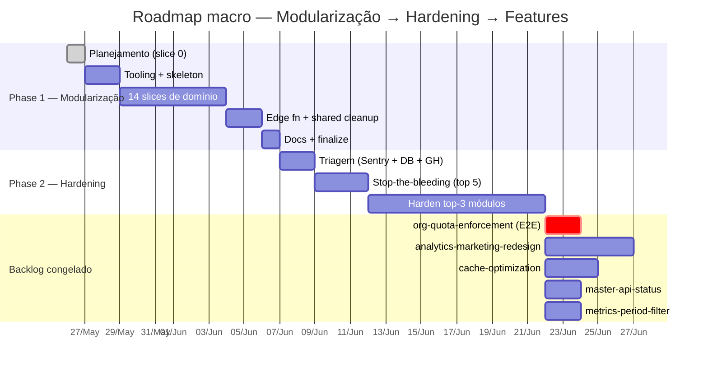

# Roadmap — Torque CRM

> ⚠️ **Este arquivo é histórico.** Ele descreve a Fase 1 (modularização), que **terminou em 2026-05-28**, e o hardening que vinha depois. Nada aqui foi remedido desde 26/05.
>
> O roadmap **vivo** é [`roadmap-virada-e-fatia-3.md`](./roadmap-virada-e-fatia-3.md) — a sprint da virada Leads↔Negócios e a fatia 3. Mantido separado de propósito: este aqui é a visão estratégica de 6 meses, aquele é a ordem de execução do que está na mão.

**Last updated:** 2026-05-26

## Visão estratégica (próximos 6 meses)

**Sequenciamento**: Modularização primeiro (pré-requisito físico do hardening). Hardening depois (testes/observability/fail-closed sobre fronteiras já estabelecidas). Backlog descongelado só pós-hardening.

**Disciplina durante feature grande** (ver `feedback_branch_discipline_during_feature.md`): só `feat/<projeto>/*` ou `hotfix/*`. Backlog congelado.

---

## Active

### Phase 1 — Modularização (in progress)

**Status:** slice 0 (planejamento) deployed em `feat/modularizacao/planejamento`. Aguarda aprovação CTO do ADR pra cortar slice 1.

**Escopo macro:** 18 slices, ~80h (~10 dias úteis 1 dev). Reorganizar `src/` em `src/modules/<bc>/` e `supabase/functions/` em `supabase/functions/<bc>/<fn>/`. Boundary enforced por ESLint + CI.

**SPEC:** [`.specs/features/modularizacao/SPEC.md`](../features/modularizacao/SPEC.md)
**ADR:** [`Obsidian/Segundo Cerebro/Claude Code — Torque CRM/04 — Decisões/ADR-2026-05-26-modularizacao-monolito-modular.md`](../../Obsidian/Segundo%20Cerebro/Claude%20Code%20—%20Torque%20CRM/04%20—%20Decisões/ADR-2026-05-26-modularizacao-monolito-modular.md)
**Foto As-Is:** [`Obsidian/Segundo Cerebro/Claude Code — Torque CRM/02 — Arquitetura/Arquitetura Atual — As-Is.md`](../../Obsidian/Segundo%20Cerebro/Claude%20Code%20—%20Torque%20CRM/02%20—%20Arquitetura/Arquitetura%20Atual%20—%20As-Is.md)
**Exit criteria:** 0 arquivos no root de `src/{components,hooks,pages}` + `supabase/functions/`. ESLint `boundaries` em error mode. CI verde. Bundle delta ±5%.

### Phase 2 — Hardening (queued, gated por Phase 1)

**Status:** specced, aguarda Phase 1 mergear em main.

**Escopo macro:** stop-the-bleeding (top 5 root causes) + harden top-3 módulos com 6 pillars. ~120h (~15 dias úteis 1 dev).

**Fontes de triagem:** `runtime_logs`, `dead_letter_events`, `workflow_executions` (status=failed), `pending_ai_actions` (status=failed), `conversations` (drift), Sentry 30d, GitHub issues abertos.

**6 pillars de hardening estrutural** (aplicados priorizados pelo ranking de dor):
1. **Test coverage** por módulo (absorve sprint "Coverage 70%" pausado)
2. **Fail-closed enforcement** em permissions/mutations
3. **Input validation Zod** nos boundaries (edge fn entry, form submit, webhook)
4. **Idempotency keys** em mutations críticas
5. **Observability por módulo** (Sentry tag `module:<bc>`, structured logs)
6. **RLS audit** + helpers SECURITY DEFINER (eliminar subqueries inline em policies)

**SPEC:** [`.specs/features/hardening/SPEC.md`](../features/hardening/SPEC.md)
**Exit criteria:** top 5 root causes com 0 ocorrências por 7 dias + 70% coverage nos top-3 módulos + Sentry tag por módulo ativo + CI gate de Zod nos boundaries.

### Coverage 70% — PAUSADO

Absorvido pela Phase 2 (pillar 1). Sprint atual: baseline 9.33% → 706 tests. Retoma como `feat/hardening/<modulo>-tests` por módulo priorizado.

### Automations Hardening — DEPLOYED PROD 2026-04-26

| Onda/Fase | Status | Notas |
|---|---|---|
| Onda 1 P0+P1+P2+P3 | ✅ **prod** | 47k+ erros eliminados, drift transfer 125→0 |
| Onda 2 backend (system_alerts + audit + perf) | ✅ **prod** | Telemetria fluindo |
| Onda 2 frontend (/master/automation-health) | ✅ **prod** | 7 tabs operacionais |
| Trilha 3.B B1 (17 funções extraídas) | ✅ **prod** | agent-engine 3314→2828 LOC |
| Trilha 3.B B2 (88 testes 100%) | ✅ **commited** | Coverage pure functions |
| Trilha 3.B B3 (feature flag v1/v2) | ✅ **prod** | UI master toggle |
| Trilha 3.A A1 (cols + RPCs conversor) | ✅ **prod** | additive only |
| Trilha 3.A A2 (shim dispatchers) | ✅ **prod** | sem dup risk |
| Trilha 3.A A3 (migration converteu 1 rule) | ✅ **prod** | 1 wrapper criado |
| Trilha 3.A A4 (cleanup) | ⏳ **+30d soak** | drop crons + tabelas legadas |
| Trilha 3.B B4 (piloto v2) | ⏳ **quando v2 divergir** | hoje v1==v2 |
| Trilha 3.B B5 (rollout 100%) | ⏳ **+60d após piloto** | — |

---

## Backlog congelado (descongela pós-Phase 2)

| Item | Status | Justificativa freeze |
|---|---|---|
| `org-quota-enforcement` | impl pronto, E2E pendente | freeze + agenda primeiro item pós-hardening |
| `agent-team-system` | operational | sem urgência |
| `analytics-marketing-redesign` | specced | sem urgência |
| `cache-optimization` | specced | sem urgência |
| `master-api-status` | specced | sem urgência |
| `metrics-period-filter` | specced | sem urgência |

---

## Done

- `org-quota-enforcement` — D004 + D005 (2026-04-09)
- `agent-team-system` — D006 (2026-04-13)
- `chat-onda-2a/2b/3/3-2` — multiple (2026-04 fases)
- `copilot-media-knowledge-base` — done
- `copilot-structured-prompt` — done
- `t2-t5-auth-rls-tests` — D003 trilha (in progress)
- `workflow-new-nodes` — done
- `api-documentation` — done
- `meta-chat-fase-0` — chat Messenger + Instagram em rota dedicada (2026-05-25)
- `human-pause-copilot` — pausa temporária automática (#457, 2026-05-25)
- `resolve-wait-response-br-mobile` — 9-prefix BR mobile (#461, 2026-05-26)
- `leads-reassign-permission` — seed feature row (#462, 2026-05-26)

---

## Roadmap notes

- Phase 1 (Modularização) é pré-requisito físico de Phase 2 (Hardening). Sem fronteiras, testes/observability vão pra estrutura errada e precisam ser reescritos.
- Phase 2 absorve sprint "Coverage 70%" pausado — testes vão direto pra estrutura modularizada.
- Pareto: top-3 módulos com mais dor absorvem ~80% do esforço de hardening. Restantes 11 ficam em backlog continuado, hardenizados sob demanda quando incidente aparecer.
- Hotfix durante Phase 1 ou Phase 2 segue protocolo (`feedback_hotfix_during_feature.md`): sai de main, mergeia em main, sync main→develop, rebase de slices em andamento.
- Backlog congelado descongela após Phase 2 mergear em main. `org-quota-enforcement` é prioridade 1 do descongelamento.
