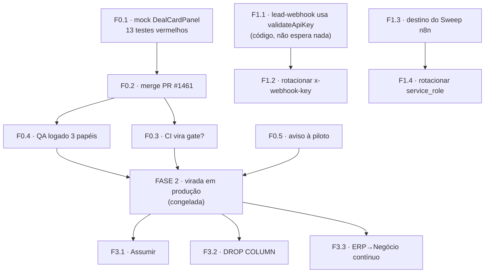

# Roadmap — da sprint da virada até a fatia 3

**Medido em 2026-08-07** contra prod `jsjsmuncfkbsbzqzqhfq`, `origin/develop` e o board SCRUM.
Companheiro de [`spec-virada-leads-negocios.md`](./spec-virada-leads-negocios.md), que continua sendo a receita passo-a-passo da Fase 2 — este arquivo é a ordem e as dependências entre as fases, não a substitui.

**Os outros dois roadmaps do repo, e por que os três coexistem:**

| Arquivo | Horizonte | Estado |
|---|---|---|
| [`docs/MASTER-ROADMAP-WORLD-CLASS.md`](../../docs/MASTER-ROADMAP-WORLD-CLASS.md) | produto — 47 gaps, 7 waves, meses | 08/05. ⚠️ A **Wave 1** ("Data Model Foundation — 0 tabelas Contact/Company/Deal/Activity") está vencida: `deals` é justamente o que esta sprint construiu. Não cita a virada. |
| [`ROADMAP.md`](./ROADMAP.md) | modularização + hardening | 26/05, histórico. A modularização terminou em 28/05. |
| **este arquivo** | execução do que está na mão | vivo |

Três arquivos é dois a mais do que o ideal, e o custo é real: escrevi este sem ter visto o MASTER-ROADMAP. Ficam separados porque respondem perguntas diferentes — *o que o produto quer ser* / *como o código foi reorganizado* / *o que falta entregar esta semana* — e fundi-los trocaria três documentos honestos por um documento longo que ninguém lê inteiro. Mas quem mexer em qualquer um **atualiza os ponteiros dos outros dois**, senão daqui a um mês são três fontes se contradizendo em silêncio.

> **Regra de uso.** Todo número aqui tem data porque todo número aqui envelhece — o ledger de prod ganhou 4 versões entre 06/08 e 07/08, de outra frente. **Remeça antes de cada fase.** Um roadmap com número stale não é um plano, é uma opinião com aparência de medição. Foi assim que a receita anterior chegou ao dia do apply dizendo "22 migrations" quando eram 41.

---

## 0. Onde estamos

| O quê | Medido 07/08 |
|---|---|
| Épico **SCRUM-43** | Fazendo — 5 histórias Feito, 2 Testando, 1 Fazendo, 2 A fazer |
| Código da sprint | **Completo**, exceto 1 regressão (F0.1 abaixo) |
| Migrations pendentes | **41** — 21 re-carimbos, 13 da virada, o resto de outras frentes |
| Ledger de prod | **64 versões** (a spec media 60 em 06/08) |
| Versões em prod sem arquivo no repo | **35** |
| Edge functions desatualizadas em prod | 30 de 30 |
| Orgs com a feature em produção | **0 de 98** |
| Cards do Jira feitos em código e parados no board | ~10 |

### A regra de escopo (CTO, 07/08)

**Tudo do épico SCRUM-43 fica na sprint 1. Nada é empurrado para uma sprint seguinte.** As fases deste arquivo (F0/F1/F2/F3) são **ordem de execução**, não recorte de sprint — ler "Fase 3" como "próxima sprint" foi o erro que este documento cometeu na primeira versão.

A conta da sprint, portanto, é sobre as **174 subtarefas** das dez histórias, não sobre um subconjunto:

| Etapa | Itens | Feito | % |
|---|---|---|---|
| Implementação em dev | 122 | 121 | ~99% |
| Passagem de dev para prod | 24 | 2 | ~8% |
| Testes em produção | 2 | 0 | 0% |
| **Decisões do CTO** (H10) | **26** | **0** | **0%** |
| **Sprint** | **174** | **123** | **~71%** |

A quarta linha é a que faltava. Uma versão anterior desta conta excluía as 26 da H10 e dava 83% — número mais bonito, obtido tirando trabalho da sprint em vez de fazendo. Decisão pendente é item de sprint como qualquer outro; a diferença é que o dono é o CTO, não o agente.

**A leitura que decide o resto:** a feature está 100% em `develop` e 0% em produção. Toda a Fase 2 é o transporte dessa distância, e ela está **congelada por decisão do CTO** (07/08). Enquanto o congelamento durar, a sprint não fecha — a H9 *é* "deploy em produção".

O que o congelamento **não** bloqueia: as Fases 0, 1-código e 3, que são inteiramente repositório.

---

## Dependências



---

## Fase 0 — fechar tudo que não é produção

Ordem importa só entre F0.1 e F0.2. O resto é paralelo.

### F0.1 · Destravar o PR #1461 — **o único item de código aberto da sprint**
**Dono:** agente · **Custo:** minutos · **Cards:** SCRUM-124

13 testes vermelhos em `pipe-whatsapp-agendar-move`, `pipe-confirmacao-compareceu-move` e `funnel-nav-switcher`. **Não é dívida herdada — é regressão desta branch**, provada: em `origin/develop` a mesma suíte passa 6/6.

Causa-raiz: o commit `9b351abb` trocou o import de `DealCardPanel` do caminho profundo para o barrel `@/modules/leads` — que é o certo pela convenção do repo. Os testes mockam o caminho profundo, então a página passa a resolver pelo mock do barrel, que não exporta o componente, e explode ao montar.

Correção: acrescentar `DealCardPanel` e `LeadCardPanel` ao mock de `@/modules/leads` nos três arquivos. **Gate:** as 3 suítes verdes.

### F0.2 · Mergear o PR #1461 em `develop`
**Dono:** CTO · **Cards:** fecha SCRUM-124 e SCRUM-126, destrava SCRUM-110

Rebase antes — a branch está 4 commits atrás de `develop`. É a última entrega de código da sprint.

### F0.3 · Decidir o que o CI significa
**Dono:** CTO · **Cards:** SCRUM-177

`main` e `develop` vermelhas: Unit, Integration, E2E e RLS pgTAP. Ou vira gate de verdade, ou fica escrito que o gate é o QA manual da F0.4. Sem meio-termo — **vermelho crônico tratado como ruído foi exatamente o que escondeu a regressão da F0.1 por dois dias.** Esse é o argumento, e ele já custou uma vez.

### F0.4 · QA logado com admin, membro e master separadamente
**Dono:** humano · **Cards:** SCRUM-172 · **Bloqueia a Fase 2**

O gate declarado do deploy, e o único não coberto por teste automatizado: a branch efêmera replica só o Postgres, e sem as edge functions o app não passa do boot. É justamente onde mora a correção de RLS de `deals` — multi-org e master.

Precisa de ambiente. Branch efêmera custa **$0,01344/hora** e **encerra na mesma sessão** (`delete_branch`); runbook em `runbook-validacao-local.md`.

### F0.5 · Avisar a piloto do salto nos stat cards
**Dono:** humano · **Cards:** SCRUM-128

Os três números do topo da lista de Leads passaram a contar a **organização**, não a página. Em toda org com mais de uma página eles vão ler maior. É a correção, não regressão — mas parece salto, e chega sem aviso como bug.

### F0.6 · Pôr o board de pé
**Dono:** quem tiver escrita no Jira · ~10 cards

Feitos em código, parados como "A fazer"/"Fazendo": **110, 123, 124, 125, 126, 127, 173, 174, 175, 202**. Corrigir também o corpo de **181** (não são 22 migrations, são 41) e fechar **182** (o `20270203000000` virou idempotente em `dc0c1b44`; a falha previsível hoje é outra, `20270728000000_meta_conversations.sql:24`).

> A sessão de 07/08 não tinha ferramenta de escrita no Jira — só `getTeamworkGraphContext`/`getTeamworkGraphObject`. O `docs/agents/issue-tracker.md` lista `editJiraIssue` e afins como o caminho de acesso; elas não estavam expostas. Ou o MCP volta completo, ou isto é trabalho manual.

---

## Fase 1 — os dois segredos

Não dependem da virada e **pioram esperando**. A parte de código pode andar com produção congelada; a rotação em si é botão do CTO.

### F1.1 · `lead-webhook` passa a usar `validateApiKey` — **código, libera agora**
**Dono:** agente · **Cards:** SCRUM-200

O ticket diz "rotacionar chave adivinhável", e isso subestima o conserto. O mecanismo por organização **já existe**: `_shared/auth.ts:325` resolve `tq_live_*` por hash SHA-256 na tabela `api_keys`, com escopo, rate-limit e `organization_id` **vindo da chave**. Só que `lead-webhook/index.ts:203` não chama isso — compara na mão contra `WEBHOOK_API_KEY` e lê `organization_id` do **corpo da requisição**.

Rotacionar sozinho troca um segredo global por outro segredo global, com o tenant continuando a vir do payload. O conserto é apontar para `validateApiKey`, emitir `tq_live_*` por org, migrar os chamadores e só então derrubar o fallback legado (`auth.ts:347`).

A chave global é compartilhada por **5** funções: `lead-webhook`, `partner-webhook`, `webhook-orchestrator`, `list-organizations` e o helper `validateWebhookApiKey`. Rotacionar sem inventário derruba as cinco juntas.

### F1.2 · Rotacionar o `x-webhook-key`
**Dono:** CTO · depois da F1.1 · 9.041 leads de 39 orgs em 30 dias passam por essa porta.

### F1.3 · Decidir o destino do Sweep n8n
**Dono:** CTO · **Cards:** SCRUM-198

`bUHokUwk8Brv4xNo` não é um nó — é o **workflow inteiro** "Milennials — Sweep Reunião → Agendado", ativo, 3 nós, `PATCH` direto em `pipeline_entries` a cada 3 minutos, fora de qualquer guarda.

### F1.4 · Rotacionar a `service_role` exposta
**Dono:** CTO · **Cards:** SCRUM-199 · **acoplado à F1.3**

A chave está em texto plano nos headers dos dois nós HTTP **daquele mesmo workflow**. `service_role` tem `rolbypassrls=true`: lê e escreve as 98 orgs com RLS desligada. **Se a F1.3 decide matar o Sweep, o SCRUM-199 morre junto** e a rotação vira higiene em vez de corrida. Ninguém tinha notado que são o mesmo objeto.

Antes de rotar: varrer a frota n8n (100+ workflows) atrás de quem mais carrega a chave. A spec §5 exige e ainda não foi feito.

---

## Fase 2 — a virada em produção · **congelada**

A sequência não muda, e a spec já a tem passo a passo com gate e reversão por passo. Em uma linha:

```
unlink → decidir a chave → 30 edge functions → n8n → repair dos 21 →
push dos 20 → limpeza DML cross-org → M6 → backfill M4 → carteira →
types + pontes → merge em main → flag na piloto
```

**As duas ordens que não invertem**, e o porquê de cada uma:

1. **As edge functions chegam antes das migrations.** A `20270730000050` derruba os dois unique, e o `.maybeSingle()` da versão velha do adapter vira **duplicador de card**; a `20270803000040` esvazia `pipe_whatsapp` no move, e a condição `stage` do workflow velho passa a ler vazio. Deployar depois é abrir uma janela em que automação de cliente escreve errado, calada.
2. **A limpeza cross-org cabe entre o schema e a trava.** Com o M6 no ar, todo `UPDATE` nas linhas sujas é recusado — inclusive o da própria limpeza. Fora de ordem, **1.091 cards ficam imóveis**.

**O que remedir no dia:** as 41 pendentes (o lote muda com o que outras frentes aplicarem), o ledger, os 363 pedidos da Carteira (o ERP sincroniza ao vivo) e o `git merge-tree` contra `main`.

**Buraco conhecido:** 12 das 13 migrations da virada não têm arquivo de rollback, e a `20270803000010` (`DROP COLUMN`) é irreversível sem restore. Os 5 de efeito destrutivo ganharam rollback no commit `a21d78b2` — os outros não. Rollback que ninguém rodou é rollback que não existe.

---

## Fase 3 — decisões abertas e fatia 3 (SCRUM-61, 26 subtarefas)

> **Fica na sprint 1. Decisão do CTO em 07/08.** Nada do épico SCRUM-43 sai para uma sprint seguinte: fase é ordem de execução, não recorte de sprint. A sprint fecha quando as 174 subtarefas fecharem.
>
> A versão anterior deste arquivo dizia "escopo de sprint própria, o card já diz que não cabe nesta" — repetindo o corpo do próprio SCRUM-61. Estava errado, e a medição mostra por quê: a H10 **não** é um bloco de trabalho futuro. Ela mistura decisões que travam o que já está em curso com tarefas que já estão sendo feitas. Empurrá-la inteira para a frente levaria junto trabalho da sprint 1 — o vazamento que a regra existe para impedir.

**Quatro itens que provam que a H10 não é "depois":**

| Card | Estado | Por que é desta sprint |
|---|---|---|
| SCRUM-207 | **Fazendo** | auditar os 6 fluxos n8n da piloto — pré-requisito da F2.4 (patch do n8n) |
| SCRUM-205 | A fazer | plano de rollback para depois do primeiro Negócio do piloto: "reversível só enquanto ninguém criar negócio novo". Expira no dia do deploy |
| SCRUM-206 | A fazer | fronteira com o dev do redesenho de funis — "os dois trabalhos tocam as mesmas 4 páginas" |
| SCRUM-201 | A fazer | o passo 5c, mover Negócio para funil customizado, que é do fluxo religado nesta sprint |

**A categoria que eu vinha escondendo:** pelo menos 11 das 26 subtarefas da H10 são **decisões do CTO**, não trabalho de código — D1 a D7 (`SCRUM-208` a `SCRUM-214`), o passo 5c, o destino da rota `/carteira`, o escopo restante da fusão com a Carteira, a fronteira com o dev. Decisão não é dev, não é transporte e não é teste em produção: é **entrada** dos três. Enquanto elas ficarem sem resposta, aparecem no board como "A fazer" e são lidas como trabalho parado, quando na verdade estão esperando você.

### F3.1 · O "Assumir"
A migration `20270730000020_leads_claim` já está escrita e pendente. Falta hook e UI.

### F3.2 · `DROP COLUMN leads.pipe_whatsapp`
**Cards:** SCRUM-222 · **o lado do app está pronto**

Os commits `af62f39e` e `109ec610` (07/08) tiraram do frontend o último escritor e o último leitor da coluna, e o gate de árvore em `tests/unit/pipe-whatsapp-espelho-sem-leitores.test.ts` agora reprova escrita **e** leitura, em `src/` e nas edge functions — com auto-teste que prova que ele falha quando a coluna volta.

Falta: escrever a migration do drop, e matar junto o gatilho `sync_pipeline_entry_to_lead_pipe_whatsapp`, que é quem alimenta o espelho.

### F3.3 · Caminho contínuo ERP → Negócio
Hoje a Carteira entra por backfill pontual. Vira fluxo.

### F3.4 · Celular abaixo de 768px
O que a fatia 3 acrescenta além do que já tem cobertura (`lead-mobile-card`, `lead-mobile-sort`, `cards-nunca-empilham`, e2e `14-mobile-pwa`).

### F3.5 · As 8 decisões abertas
D1 a D8 na §6 da spec. Duas travam trabalho: o card `dd91cd35` da Basic4u (único divergente da base inteira, e destrava 4.226 cards do M4 mais 68% da Carteira) e como os backfills rodam em prod (os dois runners recusam o ref de produção por desenho, sem escape, e a mensagem manda usar um caminho que não existe no repo).

---

## O que aborta

Vale para a Fase 2 e está na spec §3, repetido aqui porque é a parte que ninguém lê no dia:

- o `--dry-run` do push listar número diferente do medido na hora;
- o gate do M6 não imprimir `VALIDATION PASSED`;
- a verificação pós-apply achar **trava ≠ 0** — a fatia 2 não valeu e o backfill **não pode** rodar;
- qualquer edge function ficar fora de `ACTIVE`;
- `has_function_privilege('anon', 'public.abrir_negocio(...)', 'EXECUTE')` voltar `true`.
