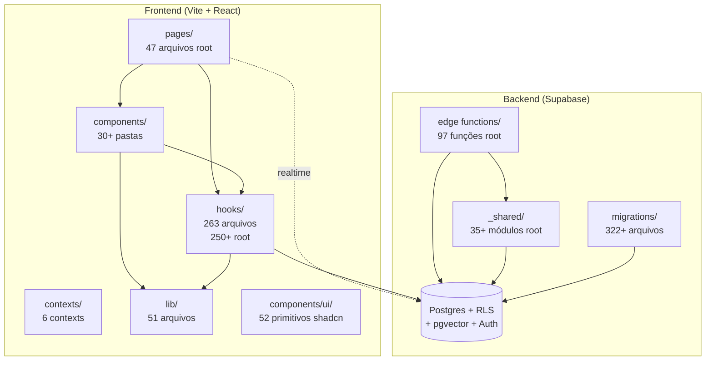
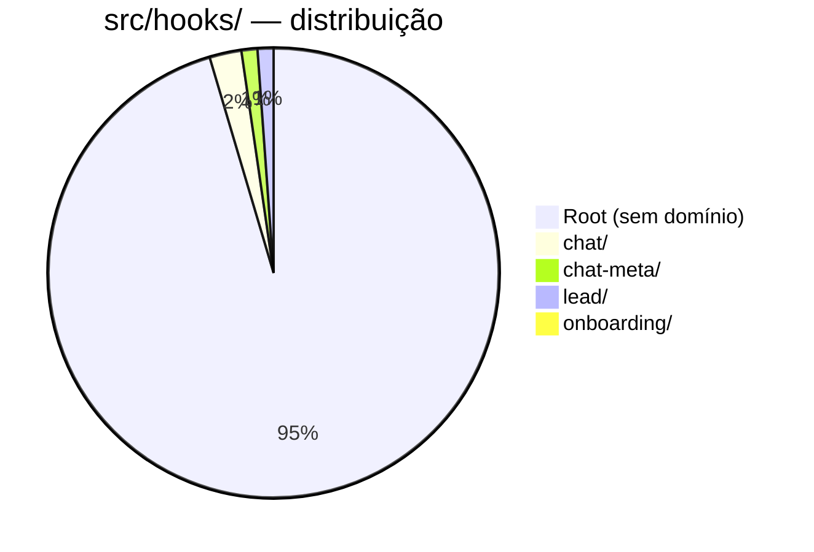
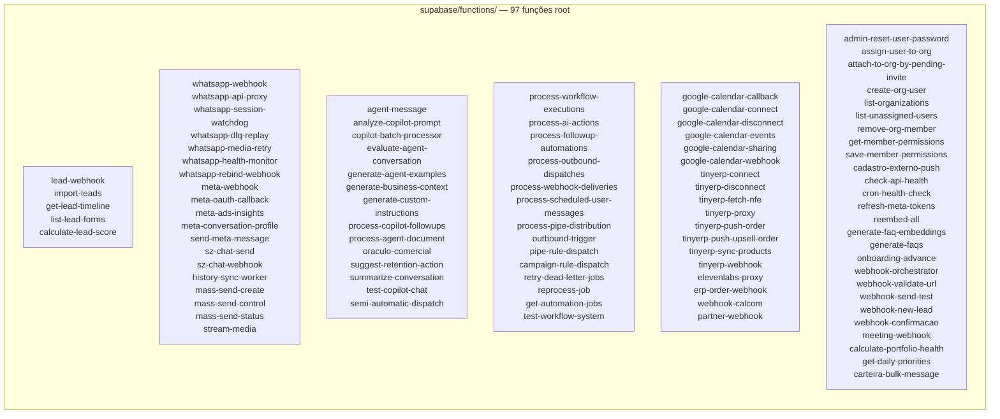
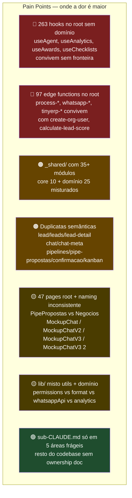

# Arquitetura Atual — Estado Físico (As-Is)

> Snapshot da estrutura física do código em **2026-05-26**, fundamentando o projeto de [[ADR-2026-05-26-modularizacao-monolito-modular|Modularização]].
> Foco em **como o código está organizado fisicamente** — não em comportamento ou domínio (esse já está em [[Visao Geral]] e `CONTEXT.md`).
> Números obtidos por inspeção direta (`find`/`ls`).

---

## TL;DR

Codebase organizado por **camada técnica** (`components/`, `hooks/`, `pages/`, `functions/`). Domínios atravessam essas camadas sem fronteira física. **263 hooks** soltos no root, **97 edge functions** soltas, **30+ pastas** de componentes com **duplicatas semânticas** (`lead/` + `leads/` + `lead-detail/`; `chat/` + `chat-meta/`).

CONTEXT.md já define 14 bounded contexts lógicos. A arquitetura física não os reflete. Resultado: blast radius alto, onboarding lento, AI agents sem âncora.

---

## 1. Visão de alto nível



**Cor de dor**: Pages/Components/Hooks/Edge funcionam mas estão **organizados por tipo, não por domínio**. Não há fronteira física que impeça `chat/` de importar `copilot/` (acontece pouco hoje, mas nada bloqueia).

---

## 2. Frontend — `src/` estrutura atual

### 2.1 Top 25 pastas de `src/components/` por arquivos


**Legenda**: 🔴 grande (>40) · 🟡 médio (15-40) · 🔵 pequeno (<15) · 🟣 **duplicata de domínio** · 🟢 cross-cutting (shadcn/utils)

### 2.2 Duplicatas semânticas detectadas

| Domínio | Pastas físicas | Status |
|---------|----------------|--------|
| **Lead** | `lead/`, `lead-detail/`, `leads/` | 3 pastas, mesmo BC |
| **Chat/Communication** | `chat/`, `chat-meta/` | 2 pastas, mesmo BC (Meta é só outro provider) |
| **Pipeline** | `pipelines/`, `pipe-propostas/`, `confirmacao/`, `kanban/` | 4 pastas, mesmo BC |
| **Campanhas** | `components/campanhas/`, `pages/campaigns/` | 2 nomes (pt/en) |
| **Upsell vs Carteira** | `upsell/`, `carteira/` | Carteira é evolução, upsell devia ser interno |

### 2.3 `src/hooks/` — 263 arquivos



**Dor**: 95% dos hooks (~250) estão no **root sem agrupamento**. Hook de campanha vive lado a lado de hook de copilot, de webhook, de gamification. Sem âncora de domínio.

Exemplos do root: `useAcoesDoDia.ts`, `useActivities.ts`, `useAgendaEvents.ts`, `useAgentDocuments.ts`, `useAgentMetrics.ts`, `useAnalytics*.ts` (8 variantes), `useApiKeys.ts`, `useApprovals.ts`, `useAutoFollowUp.ts`, `useAwards.ts`, `useBadges.ts`, `useBulkActions.ts`, `useCampanhas.ts`, `useCanDo.ts`, `useChecklists.ts`, `useCloserPerformance.ts`, `useCohortAnalysis.ts`, `useCommissions.ts`, `useCompetitions.ts`, ...

### 2.4 `src/pages/` — 47 arquivos root

```
Agenda.tsx              AtendimentoMeta.tsx     Auth.tsx
Automacoes.tsx          AutomacoesEditor.tsx    AutomacoesExecucoes.tsx
campaigns/              CampanhaDetail.tsx      Campanhas.tsx
ChatWhatsApp.tsx        ChecklistPage.tsx       Comissoes.tsx
Configuracoes.tsx       Copilot.tsx             CopilotMetrics.tsx
CustomPipeline.tsx      Dashboard.tsx           DashboardOutbound.tsx
Duplicates.tsx          Equipe.tsx              FunisHub.tsx
GestaoMetas.tsx         Landing.tsx             Leads.tsx
master/                 MessageTemplates.tsx    Metas.tsx
MockupChat.tsx          MockupChatV2.tsx        MockupChatV3 2.tsx ⚠
MockupChatV3.tsx        Negocios.tsx            NotFound.tsx
Onboarding.tsx          Performance.tsx         PipeConfirmacao.tsx
PipeFollowUps.tsx       PipePropostas.tsx       PipeWhatsapp.tsx
Premiacoes.tsx          Privacidade.tsx         Produtos.tsx
Ranking.tsx             ResetPassword.tsx       Revisao.tsx
Signup.tsx              Trash.tsx               TVDashboard.tsx
Upsell.tsx
```

**⚠ Pages órfãos prováveis**: `MockupChat.tsx`, `MockupChatV2.tsx`, `MockupChatV3.tsx`, `MockupChatV3 2.tsx` (4 mockups, naming irregular incluindo espaço em nome).

### 2.5 `src/lib/` — 51 arquivos

Misto de:
- **Utils puros** (`utils.ts`, `format.ts`, `normalizePhone.ts`, `password-validation.ts`)
- **Domínio** (`permissions.ts`, `permission-catalog.ts`, `whatsappApi.ts`, `whatsapp.ts`, `chat-types.ts`, `analytics.ts`, `kanban-filters.ts`, `tv-config-from-quiz.ts`, `pipeline-config-from-quiz.ts`)
- **Subpastas** (`copilot/`, `lead/`, `format/`, `prefetch/`, `api-docs/`)

Sem fronteira clara entre o que é compartilhável (`shared/`) e o que pertence a um módulo específico.

---

## 3. Backend — `supabase/functions/` estrutura atual

### 3.1 97 edge functions, todas no root



**Agrupados visualmente acima por bounded context** — mas no filesystem, **todas estão no mesmo nível**. Não há subpasta `leads/`, `communication/`, `copilot/`, etc. Procurar uma função = `Ctrl+P` torcendo pra lembrar o nome.

### 3.2 `_shared/` — 35+ módulos no root

```
_shared/
├── core (cross-cutting esperado)
│   ├── cors.ts                          ✓
│   ├── response.ts                      ✓
│   ├── sentry.ts                        ✓
│   ├── supabase-admin.ts                ✓
│   ├── security-headers.ts              ✓
│   ├── logger.ts                        ✓
│   ├── auth.ts / user-auth.ts           ✓
│   ├── fetch-utils.ts                   ✓
│   ├── rate-limit.ts (em src/lib?)      ?
│   └── validation.ts                    ✓
├── domínio (deveria estar em módulo)
│   ├── workflow-executor.ts             → workflows/
│   ├── workflow-action-handler.ts       → workflows/
│   ├── workflow-condition-evaluator.ts  → workflows/
│   ├── workflow-trigger.ts              → workflows/
│   ├── workflow-trigger-dedup.ts        → workflows/
│   ├── action-handlers/                 → workflows/
│   ├── actions/                         → workflows/ (ou compartilhado com copilot)
│   ├── permission_engine.ts             → identity/
│   ├── permission-actions.ts            → identity/
│   ├── assert-permission.ts             → identity/
│   ├── message-gateway.ts               → communication/
│   ├── message-classifier.ts            → communication/
│   ├── message-humanizer.ts             → communication/
│   ├── message-sanitizer.ts             → communication/
│   ├── send-dedup.ts                    → communication/
│   ├── outbound-sender.ts               → communication/
│   ├── instance-write-guard.ts          → communication/
│   ├── audio-sender.ts                  → communication/
│   ├── whatsapp-client.ts               → communication/
│   ├── whatsapp-dispatch.ts             → communication/
│   ├── whatsapp-media.ts                → communication/
│   ├── whatsapp-providers/              → communication/
│   ├── uazapi-client.ts                 → communication/
│   ├── uazapi-types.ts                  → communication/
│   ├── webhook-utils.ts                 → cross (workflows + integrations)
│   ├── meta-api.ts                      → integrations/
│   ├── google-calendar-utils.ts         → integrations/
│   ├── tinyerp-utils.ts                 → integrations/
│   ├── asaas.ts                         → billing/ ou integrations/
│   ├── tts-elevenlabs.ts                → integrations/
│   ├── copilot/                         → copilot/ (✅ já agrupado)
│   ├── copilot-batch-maturity.ts        → copilot/
│   ├── ai-action-executor.ts            → copilot/ ou workflows/
│   ├── ai-queue.ts                      → copilot/ ou workflows/
│   ├── embeddings.ts                    → copilot/
│   ├── greeting-orchestrator.ts         → copilot/
│   ├── natural-messaging.ts             → copilot/
│   ├── bot-loop-detector.ts             → copilot/
│   ├── campaign-distribution.ts         → campaigns/
│   ├── pipeline-adapter.ts              → pipelines/
│   ├── lead-service.ts                  → leads/
│   ├── portfolio-health.ts              → carteira/
│   ├── retention-gate.ts                → carteira/
│   ├── followupSchedule.ts              → engagement/
│   ├── followup-sender.ts               → engagement/
│   ├── onboarding-engine.ts             → platform/
│   ├── time-variables.ts                → cross
│   ├── url-validator.ts                 → cross
│   ├── track.ts                         → cross (telemetria)
│   ├── job-tracker.ts                   → workflows/
│   ├── dispatch-router.ts               → workflows/
│   └── edge-framework.ts                → core/
```

**Score**: ~10 itens são genuinamente cross-cutting (`core/`). Os outros **25+ pertencem a módulos de domínio**. Hoje vivem juntos misturados.

---

## 4. Domínios lógicos × pastas físicas (mapping)

Tabela cross-reference: o que `CONTEXT.md` diz × onde fica fisicamente.

| Bounded Context (CONTEXT.md) | Frontend (físico) | Backend (físico) |
|------------------------------|-------------------|------------------|
| **Identity** (Org, Team, Role, Permission) | `components/master/`, `components/settings/equipe`, `contexts/AuthContext`, `lib/permissions.ts`, `lib/permission-catalog.ts` | `_shared/permission_engine.ts`, `assert-permission.ts`, `_shared/auth.ts`, edges `create-org-user`, `assign-user-to-org`, `remove-org-member`, `get-member-permissions`, `save-member-permissions`, `list-unassigned-users`, `list-organizations`, `admin-reset-user-password`, `attach-to-org-by-pending-invite` |
| **Leads** (Lead, Form, UTM) | `components/lead/`, `lead-detail/`, `leads/`, `pages/Leads.tsx`, `Duplicates.tsx`, `Trash.tsx`, hooks soltos | `_shared/lead-service.ts`, edges `lead-webhook`, `import-leads`, `get-lead-timeline`, `list-lead-forms`, `calculate-lead-score`, `webhook-new-lead` |
| **Pipelines** (Pipeline, Stage, Entry) | `components/pipelines/`, `pipe-propostas/`, `confirmacao/`, `kanban/`, pages `Pipe*.tsx`, `CustomPipeline.tsx`, `FunisHub.tsx`, `Negocios.tsx` | `_shared/pipeline-adapter.ts`, edges `process-pipe-distribution`, `pipe-rule-dispatch` |
| **Communication** (Conversation, Message, Instance, Gateway) | `components/chat/` (86), `chat-meta/`, `hooks/chat/`, `hooks/chat-meta/`, pages `ChatWhatsApp.tsx`, `AtendimentoMeta.tsx`, `MockupChat*.tsx`, `lib/chat-types.ts`, `lib/whatsappApi.ts`, `lib/whatsapp.ts` | `_shared/message-*`, `whatsapp-*`, `uazapi-*`, `meta-api.ts`, `send-dedup.ts`, `audio-sender.ts`, edges `whatsapp-*` (8), `meta-*` (4), `sz-chat-*` (2), `send-meta-message`, `history-sync-worker`, `mass-send-*` (3), `stream-media` |
| **Copilot** (Agent, Human Pause, Oraculo) | `components/copilot/` (23), pages `Copilot.tsx`, `CopilotMetrics.tsx`, `lib/copilot/` | `_shared/copilot/` (✅ agrupado), `ai-*`, `embeddings.ts`, `bot-loop-detector.ts`, `greeting-orchestrator.ts`, `natural-messaging.ts`, `message-classifier.ts`, `message-humanizer.ts`, `message-sanitizer.ts`, `copilot-batch-maturity.ts`, edges `agent-message`, `process-copilot-followups`, `process-agent-document`, `copilot-batch-processor`, `oraculo-comercial`, `suggest-retention-action`, `summarize-conversation`, `evaluate-agent-conversation`, `analyze-copilot-prompt`, `generate-agent-examples`, `generate-business-context`, `generate-custom-instructions`, `test-copilot-chat`, `semi-automatic-dispatch` |
| **Workflows** (DAG, Triggers, Actions) | `components/automacoes/` (43), pages `Automacoes*.tsx` (3) | `_shared/workflow-*` (5), `action-handlers/`, `actions/`, `dispatch-router.ts`, `job-tracker.ts`, `ai-action-executor.ts`, `ai-queue.ts`, edges `process-workflow-executions`, `process-ai-actions`, `process-followup-automations`, `process-outbound-dispatches`, `process-webhook-deliveries`, `process-scheduled-user-messages`, `outbound-trigger`, `retry-dead-letter-jobs`, `reprocess-job`, `get-automation-jobs`, `test-workflow-system` |
| **Campaigns** (Campaign, Mass Send) | `components/campanhas/`, `pages/campaigns/`, `CampanhaDetail.tsx`, `Campanhas.tsx`, `hooks/useCampanhas.ts`, `useCampaignTemplates.ts` | `_shared/campaign-distribution.ts`, edges `campaign-rule-dispatch`, `mass-send-*` (3) |
| **Carteira** (Customer Portfolio, Order, ERP) | `components/carteira/` (24), `upsell/` (13), `pages/Upsell.tsx`, `Produtos.tsx`, `pages/master/` (?) | `_shared/portfolio-health.ts`, `retention-gate.ts`, `tinyerp-utils.ts`, edges `tinyerp-*` (8), `erp-order-webhook`, `carteira-bulk-message`, `suggest-retention-action`, `calculate-portfolio-health` |
| **Engagement** (Checklist, Activity, Follow-up, Gamification) | `components/agenda/`, pages `Agenda.tsx`, `ChecklistPage.tsx`, `Premiacoes.tsx`, `Ranking.tsx`, `Comissoes.tsx`, hooks `useActivities`, `useChecklists`, `useAwards`, `useBadges`, `useCompetitions`, `useFollowUps`, `useCommissions` | `_shared/followupSchedule.ts`, `followup-sender.ts`, edges `get-daily-priorities`, `meeting-webhook`, `webhook-confirmacao` |
| **Analytics** (Dashboard, Metric, Cohort, TV) | `components/analytics/` (55), `dashboard/` (27), `tv/` (17), `performance/` (7), pages `Dashboard.tsx`, `DashboardOutbound.tsx`, `TVDashboard.tsx`, `Performance.tsx`, `Metas.tsx`, `GestaoMetas.tsx`, `Revisao.tsx`, `Ranking.tsx`, hooks `useAnalytics*` (8) | edges `meta-ads-insights` (parcial), `cron-health-check` |
| **Billing** (Subscription, Asaas) | `lib/subscription.ts`, parte de `pages/Configuracoes.tsx`, `pages/Privacidade.tsx` | `_shared/asaas.ts`, edges Asaas (não visíveis no levantamento, talvez integradas em outras) |
| **Marketing** (Landing, Lead Form, UTM) | `components/landing/`, `pages/Landing.tsx`, `Signup.tsx`, `Auth.tsx`, `ResetPassword.tsx` (?) | `meta-webhook`, `meta-oauth-callback`, `meta-ads-insights`, `partner-webhook`, `cadastro-externo-push`, `list-lead-forms` |
| **Integrations** (Google Cal, Meta, TinyERP, Asaas, SZ.Chat, Cal.com, ElevenLabs) | poucos componentes; configs em `pages/Configuracoes.tsx` | `_shared/google-calendar-utils.ts`, `meta-api.ts`, `tinyerp-utils.ts`, `tts-elevenlabs.ts`, `asaas.ts`, edges `google-calendar-*` (6), `tinyerp-*` (8), `sz-chat-*` (2), `webhook-calcom`, `elevenlabs-proxy`, `meta-oauth-callback`, `refresh-meta-tokens` |
| **Platform** (Onboarding, Settings, Observability, Health, Dead Letter) | `components/onboarding/`, `command/`, `settings/`, pages `Onboarding.tsx`, `Configuracoes.tsx`, `Privacidade.tsx`, `MessageTemplates.tsx` | `_shared/sentry.ts`, `logger.ts`, `rate-limit.ts`, `security-headers.ts`, `onboarding-engine.ts`, edges `cron-health-check`, `check-api-health`, `reembed-all`, `generate-faq-embeddings`, `generate-faqs`, `onboarding-advance`, `webhook-orchestrator`, `webhook-validate-url`, `webhook-send-test` |

**Observação**: cada linha desta tabela = **1 futuro módulo** após [[ADR-2026-05-26-modularizacao-monolito-modular]].

---

## 5. Heatmap de dor (top issues estruturais)



---

## 6. Cross-domain imports observados

Inspeção amostral em pastas grandes:

| De → Para | Arquivos |
|-----------|----------|
| `components/copilot/` → `components/chat/` | 0 |
| `components/chat/` → `components/copilot/` | 0 |
| `components/lead/` → `components/lead-detail/` | 0 |
| `components/lead-detail/` → `components/lead/` | 0 |
| `components/chat-meta/` → `components/chat/` | **2** ⚠ |
| `components/pipelines/` → `components/kanban/` | 0 |

**Diagnóstico**: cross-imports são **baixíssimos** hoje. As fronteiras já existem **implicitamente** — só falta tornar **físicas e enforced**. Isso é uma vantagem: refactor não precisa redesenhar grafos de dependência, só mover arquivos + bloquear futuras violações via ESLint.

---

## 7. O que NÃO está mapeado aqui

- **Schema DB**: ver [[Schema]] e [[Edge Functions]]
- **RLS policies**: ver [[RLS Policies]]
- **Cron jobs**: ver [[Cron Jobs]]
- **Áreas frágeis** (Copilot, WhatsApp, Permissões): ver [[Areas Frageis]]
- **Comportamento de domínio**: ver `CONTEXT.md` (raiz)
- **Decisões já tomadas**: ver `04 — Decisões/`

---

## 8. Conclusão

Codebase está em estado **"monolito espaguete em transição"**:
- Domínios não chamam funções aleatórias uns dos outros (bom)
- Mas estão **misturados fisicamente** sem fronteira (ruim)
- Sem âncora física, AI agents e devs novos se perdem
- ESLint não tem como bloquear violação que não existe semanticamente

Caminho: monolito modular via [[ADR-2026-05-26-modularizacao-monolito-modular]]. SPEC em `.specs/features/modularizacao/SPEC.md`.

> Este doc é **fotografia**. Será atualizado em **slice 17** (docs) do projeto Modularização pra refletir o estado final.
