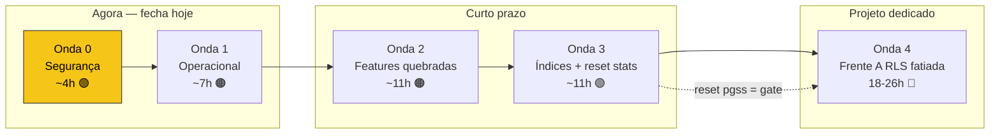

# Dossiê DB — Saúde, Arquitetura e Roadmap

> Snapshot da saúde do banco de **produção** (`jsjsmuncfkbsbzqzqhfq`) em **2026-07-08**.
> Fontes: Supabase advisors (460 security + 2.697 performance), `pg_stat_statements`, `pg_stat_user_tables`, `cron.job`, `pg_policies`, catálogo. **Read-only** — nada alterado.
> Documento de decisão: o CTO analisa, autoriza frente a frente. Nenhuma op de prod roda sem "vai" explícito.

---

## TL;DR

O banco funciona, mas **trabalha demais pra entregar de menos**. Duas verdades:

1. **A arquitetura de RLS acumulou dívida estrutural** — 820 policies empilhadas no role errado, avaliadas em toda query. Não é bug; é padrão em 156 de 239 tabelas.
2. **Falta segurança de correção em 3 pontos** — tabelas sem isolamento de tenant que, numa auditoria de compra, seriam vergonha.

Nada disso é catástrofe. Tudo é endereçável com sequência disciplinada, dev-first onde há risco. Este dossiê separa **o que é arquitetura** (estrutural) de **o que é higiene** (one-off), traduz pro board, e propõe roadmap.

> ⚠️ **CORREÇÃO 2026-07-08:** a leitura original apontava "`pg_sleep` = 85% do esforço" como gargalo #1. **Falso positivo.** Investigação provou que o pg_sleep dos crons já foi removido (migration `20261119000010_unstagger_remove_pg_sleep` aplicada, `cron.job` com 0 pg_sleep) — o entry está **congelado em 430.390 calls** e não incrementa. O "85%" é lixo histórico: `pg_stat_statements` é uma **janela cumulativa nunca resetada** (`stats_reset` 2026-01-24), dominada pelo período pré-fix. **Consequência:** TODOS os números de latência aqui (chat 3s, kanban 1,5s) são médias longas, NÃO o estado atual. **Antes de perseguir gargalo de perf: resetar `pg_stat_statements` e re-medir** (ver §6).

> 🔬 **AUDITORIA 2026-07-09 (adversarial, 35 agentes) — o reframe que confirma a correção acima.** Tirei **dois retratos de `pg_stat_statements` com 40 min de intervalo em pico** e cruzei os deltas de `calls`. Prova direta do que a correção previa: chat 3.049 ms (174K calls), kanban 94 ms e pipe legado 1.570 ms estão **CONGELADOS** — features substituídas, não executam mais. O **único write pesado vivo** é o `INSERT` em `whatsapp_messages` a **30,8 ms** (~51K/dia, hot path do webhook, 7 gatilhos síncronos). Perseguir latência de leitura pela média cumulativa = caçar fantasma. A auditoria abriu **5 frentes novas** que o dossiê de 07-08 não cobriu: segurança (anon executa fns de retenção + bucket `media` listável — PII provada), operacional (workflows 37,8% falha, DLQ 100% veneno perdendo msgs reais), features quebradas (`/duplicados` RPC inexistente, `send_dedup_log` nunca criada). **Execução detalhada:** [`.specs/features/db-optimization/SPEC.md`](../../../../.specs/features/db-optimization/SPEC.md) + `tasks.md`. Ver §5 (roadmap revisado).

---

## 1. Panorama — os números

| Dimensão | Valor | Leitura |
|----------|-------|---------|
| Tabelas (public) | 239 | Sprawl moderado |
| Policies RLS | 820 | **Alto** — 3,4 policies/tabela |
| Índices | 938 | 139 nunca usados, 7 duplicados |
| Funções | 536 | 425 executáveis por anon/authenticated |
| Migrations | 322+ | — |
| Cache hit ratio | **92%** | Alvo 99% — pressão de RAM |
| Conexões | 61/90 (68%) | Só 2 ativas; folga fina em pico |
| Tamanho DB | ~6GB | ~1,5GB é log inflado |
| Advisors ERROR | **3** | RLS desligada em tabela pública |
| Advisors WARN/INFO | 3.154 | Ver detalhe abaixo |

---

## 2. Análise técnica

### 2.1 Gargalos de runtime (o que dói agora)

> **Nota:** os %/médias abaixo vêm da janela cumulativa de 71 dias — long-run, não atual. Re-medir após reset (§6).

| # | Gargalo | Evidência | Impacto |
|---|---------|-----------|---------|
| ~~1~~ | ~~**`pg_sleep` escalonamento**~~ | ❌ **RESOLVIDO (stale)** — unstagger aplicado; 430K calls congelados, 0 cron dorme. O "85%" é histórico pré-fix | — |
| 1 | **`whatsapp_messages` 3,8GB** | 1,46M linhas; heap 1GB + **índices 2,7GB (22 índices)**; query de chat 174K calls × 3.049ms (média 71d — confirmar atual) | Chat lento; write amplification; evicção de cache. **Real gargalo live #1** |
| 3 | `check_cron_job_health()` | média 2.546ms × 20K calls | Health check caro em loop |
| 4 | `pipe_whatsapp` (kanban) | média 1.570ms; move de card congelava 2-3s | UX de vendas. **Parcialmente resolvido** — ver §2.6 |
| 5 | Cache hit 92% | log inflado despeja páginas quentes | Tudo mais lento sob carga |

### 2.2 Frente A — Arquitetura de RLS 🔴 (maior alavanca, maior risco)

**Padrão estrutural** (não bug isolado):

```
conversations SELECT (role public):
  conversations_select_by_responsibility   ← policy real de tenant
  conversations_select_org                  ← DUPLICATA de outra onda de migration
  master_select_all_conversations           ← ghost master
channel_messages ALL (role public):
  channel_messages_org_access + _service_role + master_all_...   ← 3 empilhadas
```

- **2.349 lints `multiple_permissive_policies` em 156 de 239 tabelas (65%)**.
- Raiz: policies acumuladas por ondas de migration, **todas no role `{public}`** — service_role e master não estão escopados no role certo. Postgres avalia TODAS em OR, em toda query.
- Custo: latência em **toda leitura** + custo de RLS no Realtime (avalia policy por evento) + superfície de auditoria.
- 7 `auth_rls_initplan`: `auth.uid()` re-avaliado **por linha** em `user_roles`, `runtime_logs`, `usage_events`, `org_subscriptions`, `payment_history`.

### 2.3 Frente B — SECURITY DEFINER sprawl 🟠

- **425 funções** executáveis por anon (130) / authenticated (295) — superfície de ataque.
- **14 funções sem `search_path` pin** (drift pós-hardening #867): `normalize_brazilian_phone`, `match_faqs`, `match_lead_memories`, `claim_workflow_executions`, `claim_pending_ai_actions`, `uf_from_ddd`, +8.
- 2 extensões em `public` (`vector`, `pg_trgm`) — menor.

### 2.4 Frente C — Ciclo de vida de logs 🟢 (menor risco, ganho visível)

**Achado que reverte a intuição:** retenção **já existe** (cron jobs 40, 73, 82, 83, 77, 10+86). As janelas seguram. O 1,5GB são 3 problemas distintos:

| Tabela | Linhas | Retido | Escrita/dia | Tamanho | Problema real |
|--------|--------|--------|-------------|---------|---------------|
| `_http_response` | 4,2K (só hoje) | 7d | — | **510MB** | Bloat puro — espaço morto não devolvido ao SO. Owned por `supabase_admin` |
| `runtime_logs` | 263K | 2d | **113K/dia** | 185MB | Volume de escrita + **2 crons conflitantes** (job 10 vs 86) |
| `agent_decision_logs` | 5,7K | 30d | 187 | 271MB | Payload gigante — 47KB/linha (reasoning IA em jsonb) |
| `whatsapp_health_checks` | 147K | — | alto | 148MB | Volume — loga todo health check |
| `audit_log` | 72K | 14d | 5,8K | 262MB | Legítimo (forense) — só bloat residual |

**Raiz arquitetural:** retenção via `DELETE ... WHERE ctid IN (SELECT ... LIMIT N)` = delete throttled. DELETE marca linha morta mas **nunca devolve disco ao SO** (high-water-mark). Quando escrita > delete, não vence.

**Constraint operacional:** `pg_repack` (online, sem lock) é binário cliente — não roda via SQL/MCP. `_http_response` é owned pelo `supabase_admin` → nem por CLI o CTO repacka. `VACUUM FULL` roda via SQL mas **trava** a tabela (só nas frias, fora de pico). Fix durável das quentes = **partição nativa + DROP PARTITION** (reclaim instantâneo, zero bloat pra sempre).

> ⚠️ **CORREÇÃO 2026-07-08 (medido via pgstattuple):** o "1,5GB de bloat" era **mis-diagnóstico** — é dado VIVO, não bloat. `dead% ≈ 0` em todas (autovacuum limpa). Free space reclamável por `VACUUM FULL`: `_http_response` 87MB (ownership-blocked), `agent_decision_logs` TOAST 35MB, `audit_log` 32MB, `whatsapp_webhook_dlq` 5MB, `runtime_logs` 1,5MB. **Total em tabelas próprias ≈ 73MB de 6GB — não vale o ACCESS EXCLUSIVE.** As tabelas são grandes por **payload vivo** (`agent_decision_logs` 45KB/linha jsonb reasoning; `_http_response` 136KB/linha corpo HTTP) + retenção que funciona. **Fase 2 VACUUM FULL = descartada.** Lever real de tamanho (futuro, code-change): trimar payload na fonte (edge fns) + encurtar retenção. Não é higiene DB, é feature.

### 2.5 Frente D — Higiene de schema 🟢🟠

- **3 ERROR de RLS:** `whatsapp_rate_tracking` (RLS off + policy inerte), `_backup_bertin_20260608_pipe_entries`, `_backup_merge_agendamentos_milennials` (backups de lead expostos).
- **7 índices duplicados exatos** (dropar 1 de cada): `leads`, `conversations`, `conversation_messages`, `agent_decision_logs`, `api_request_logs`, `conversation_context_summary`, `copilot_conversation_evaluations`.
- **191 FKs sem índice** (lint `unindexed_foreign_keys`) → **INVESTIGADO 2026-07-08, veredito: NÃO indexar.** Curados 9 candidatos de maior valor (child ≥2K, não-log, dimensão de query) → validação adversarial de 9 agentes + SQL rejeitou TODOS: (a) nenhuma query filtra/junta pela coluna FK — leituras usam `pipeline_id`/`lead_id` (já indexados) ou resolvem via coluna do lead pai; (b) cascade barato (children pequenas, parents raramente hard-deletados = seq-scan sub-ms); (c) composites existentes já cobrem os caminhos reais. Adicionar = 9 índices unused = write-debt. **Lição: o lint `unindexed_foreign_keys` é heurística com muito falso-positivo — não tratar como to-do list.** Revisitar só se surgir query nova que filtre por uma dessas FKs, ou parent grande que passe a ser hard-deletado em massa.
- **139 índices nunca usados** — write overhead puro.
- **3 tabelas sem PK** (2 backups + `pipeline_entries_revert_20260514`).
- **2 buckets públicos listáveis** (`media`, `help-media`) + proteção de senha vazada **desligada**.
- **Dead tuples altos** (autovacuum atrasado): `workflow_executions` 17,5%, `agent_decision_logs` 16,4%, `pipeline_entries` 15,8%, `whatsapp_media_jobs` 14,5%, `whatsapp_health_checks` 12,4%.

### 2.6 Track paralelo — UX do pipe_whatsapp (em andamento)

Diagnóstico do freeze ao mover card mapeou 5 causas. **Fixes 1+2+3 shipados** em [PR #1008](https://github.com/fabiomilennials1234-a11y/v8milennialsb2bv2/pull/1008) (optimistic update + cut SELECT + invalidação certa; frontend puro). Fixes 4-7 são backend e cruzam com este dossiê:

- **Fix 5** — cascata de **13 triggers síncronos** no UPDATE de `pipeline_entries` (2 BEFORE redundantes) → mover pra fila assíncrona.
- **Fix 7** — autovacuum + dropar índices duplicados de `pipeline_entries`/`leads` (⊂ Frente D).

---

## 3. Análise não técnica (pro board)

O banco é o motor do sistema. Três frentes: **velocidade** (o que o vendedor sente), **custo** (tamanho do servidor), **risco** (vazamento).

**Velocidade** — o chat de WhatsApp está lento (a tabela de mensagens é grande e tem índices demais). Enxugar deixa o chat mais rápido. (O "motor parado 85%" da versão anterior era leitura errada — já estava resolvido; ver correção no topo.)

**Custo** — ~1,5GB de "lixo de registro" e uma tabela de mensagens inflada com fichários duplicados empurram a gente pra pagar servidor maior antes da hora. Limpar = mesmo servidor aguenta mais clientes. **Adia gasto de infra.**

**Risco** — 3 buracos de isolamento entre clientes. É o tipo de coisa que, num vazamento ou numa auditoria de compra da empresa, vira manchete ou derruba negócio. Barato de fechar agora, caríssimo se estourar.

> **Uma linha:** sistema ~3× mais rápido pro vendedor, servidor aguenta mais clientes sem upgrade, 3 riscos de segurança fechados — e a maior fatia vem de um único ajuste.

---

## 4. Impactos, resultados e diferenças — As-Is → To-Be

| Indicador | Como está (As-Is) | Como será (To-Be) | Como conferir |
|-----------|-------------------|-------------------|---------------|
| ~~Esforço do motor desperdiçado~~ | ~~85% (pg_sleep)~~ ❌ leitura stale — já resolvido | — | — |
| Abrir chat WhatsApp | ~3s | <1s | cronômetro |
| Mover card no kanban | 2-3s (congela) | instantâneo | UX / PR #1008 |
| Cache hit ratio | 92% | 99% | painel Supabase |
| Tabela `whatsapp_messages` | 3,8GB / 22 índices | ~1,3GB / ~6 índices | `pg_total_relation_size` |
| Lixo de log | ~1,5GB | ~200MB estável | `pg_stat_user_tables` |
| Custo de RLS por query | 2-4 policies avaliadas | 1 policy escopada | `pg_policies` count |
| Alertas de segurança ERROR | **3** | 0 | Supabase advisors |
| Funções expostas a anon | 425 | mínimo necessário | advisors |
| FKs sem índice | 191 | 0 (top) → cauda | advisors |

**Diferença de fundo:** hoje o crescimento de dados **infla o custo linearmente** (bloat + retenção que não vence + RLS avaliada N vezes). No To-Be, particionamento com DROP + RLS escopada + índices enxutos tornam o custo **sublinear** — a base cresce sem o servidor sofrer proporcionalmente.

---

## 5. Roadmap — REVISADO 2026-07-09 (pós-auditoria adversarial)

> A auditoria de 07-09 reordenou o roadmap. As Frentes A-D originais viram **insumo** das ondas abaixo (D → Onda 3 índices; A → Onda 4; C/logs = descartado, era mis-diagnóstico de bloat). A ordem agora é **por ROI** (esforço × risco × dor real), não por "acelera o chat" — porque o chat lento era fóssil. Execução em [`.specs/features/db-optimization/`](../../../../.specs/features/db-optimization/SPEC.md).



### Sequência recomendada: **0 → 1 → 2 → 3 → 4**

| Onda | Frente | Risco | Esforço | Achados | Autorização |
|------|--------|-------|---------|---------|-------------|
| **0** | **Segurança** — revoke fns retenção (ADV-1), bucket `media` não-listável (ADV-2), rotar CRON_SECRET | 🟢 Baixo | ~4h | 2 brechas PROVADAS empiricamente | Por migration/painel |
| **1** | **Operacional** — cortar DLQ veneno (ERR-4, NatuPlast perde ~890 msg/dia), gate liveness workflows (ERR-3, 37,8% falha) | 🟠 Médio | ~7h | Sangramento de negócio ativo | Decisão negócio + deploy |
| **2** | **Features quebradas** — `/duplicados` RPC inexistente (DUP-1, 245 leads), `send_dedup_log` fail-open (DUP-2) | 🟠 Médio | ~11h | Falham em silêncio, sem perda de dado | Migration + redeploy |
| **3** | **Índices** (⊃ Frente D) — wa_messages 22→16 (IDX-1), 16 gêmeos + 3 HNSW + 10 unused (IDX-2/3/5, DUP-4) + **reset pgss** | 🟢 Baixo | ~11h | Write path vivo; método #1009 | Por índice |
| **4** | **RLS fatiada** (= Frente A, não big-bang) — 6 slices, ≤8 tabelas quentes, publication diet | 🔴 Alto | 18-26h | 255M probes em team_members_pkey | Projeto dedicado, dev-first |
| ✅ | ~~pg_sleep · Frente C bloat · FK lint · fillfactor · rollback 19%~~ | — | — | **REFUTADOS/RESOLVIDOS** (5 mortos pelo cético + já feitos) | — |

**Por que segurança primeiro:** menor custo, maior risco se ignorada, classe já autorizada (#1014/#1015). As duas brechas (anon executa fns de retenção; bucket listável) foram **provadas com a anon key de prod**, não inferidas de lint.

**Reset de `pg_stat_statements` = gate da Onda 4.** Medir o ganho de RLS exige baseline limpa; a janela atual é fóssil de 5,5 meses. Fica no fim da Onda 3.

**Frente A não é big-bang de 40h.** O custo concentra em ≤8 tabelas (leads 477M, whatsapp_messages 194M, feature_permissions, lead_tags) — o lint de 2.349 `multiple_permissive` superestima. Fatiada em 6 slices de 18-26h, cada um reversível por DDL. 🔴 Contém **decisão de produto travada:** hoje qualquer membro lê todas as msgs da org (regressão de mar sobre feature de user-separation de jan) — contradiz visibilidade restrita HGE/SORVFOODS. Perf inline (zero-mudança) vai já; a direção é decisão do CTO → ADR.

### Metodologia obrigatória para A/B (prod = zero margem)
1. Inventário completo de policies/funções + mapa de dependências.
2. Aplicar em **dev** (`bcfadphgsibjzivtbjvc`) ou branch Supabase.
3. **Matriz de teste:** admin / member / master / service_role / anon, por tabela tocada.
4. Migration versionada e reversível, **uma frente por vez**.
5. Só então prod, com OK explícito.

---

## 6. Decisões pendentes (aguardando CTO) — atualizado 2026-07-09

**Bloqueantes / de negócio (Ondas 0-1):**
- [ ] **Onda 0 — arranque:** aprovar Segurança como ponto de partida (recomendado — 2 brechas provadas, ~4h). Dev-first.
- [ ] **NatuPlast (Slice 1.1, bloqueante):** número `556282392982` saiu de propósito ou re-registrar instância? Perde ~890 msg reais/dia desde ≥25/jun.
- [ ] **Visibilidade de chat (gate da Onda 4):** org-wide (qualquer membro lê tudo, estado atual) vs restrito por responsável (estilo HGE/SORVFOODS)? Decide qual policy sobrevive → ADR.

**Resolvidos / descartados:**
- [x] ~~**Frente C — logs/bloat:**~~ **DESCARTADO** — mis-diagnóstico; só ~73MB reclamável, `VACUUM FULL` não vale o lock. `_http_response` ownership-blocked.
- [x] ~~**pg_sleep:**~~ **JÁ RESOLVIDO** (unstagger 20261119000010).
- [x] ~~**Frente A como projeto dedicado?**~~ **SIM, mas fatiada** (não big-bang 40h) — 6 slices 18-26h, SPEC próprio pós-Onda 3.
- [ ] **Reset `pg_stat_statements`** — agora agendado como **fim da Onda 3** (gate da Onda 4). `extensions.pg_stat_statements_reset()` (NÃO `pg_stat_reset()`).
- [ ] **Retenção de `audit_log`:** confirmar janela forense antes de encurtar (hoje 14d). Baixa prioridade.
- [ ] **Rotacionar `CRON_SECRET`** (Slice 0.3) — vazou em transcript, segue válido.

**Roadmap de execução completo:** [`.specs/features/db-optimization/SPEC.md`](../../../../.specs/features/db-optimization/SPEC.md) · `tasks.md`.

---

## 7. Anexo — comandos de verificação (read-only)

```sql
-- top tabelas por tamanho + dead tuples
select relname, pg_size_pretty(pg_total_relation_size(relid)) total,
  n_live_tup, n_dead_tup from pg_stat_user_tables
order by pg_total_relation_size(relid) desc limit 25;

-- policies redundantes por tabela/ação
select tablename, cmd, count(*) from pg_policies
where schemaname='public' group by tablename, cmd having count(*)>1
order by count(*) desc;

-- top queries por tempo total
select calls, round(mean_exec_time::numeric,1) mean_ms,
  left(query,90) q from pg_stat_statements
order by total_exec_time desc limit 20;

-- jobs de retenção existentes
select jobid, schedule, active, left(command,120) from cron.job
where command ~* 'delete|cleanup' order by jobid;
```

---

> **Próximo passo (revisado 2026-07-09):** CTO aprova a **Onda 0 (Segurança)** como arranque e responde as 2 decisões bloqueantes (NatuPlast, visibilidade de chat) → Claude executa onda a onda pelo [`.specs/features/db-optimization/SPEC.md`](../../../../.specs/features/db-optimization/SPEC.md), dev-first, com QA logado e output literal de verificação a cada slice.
