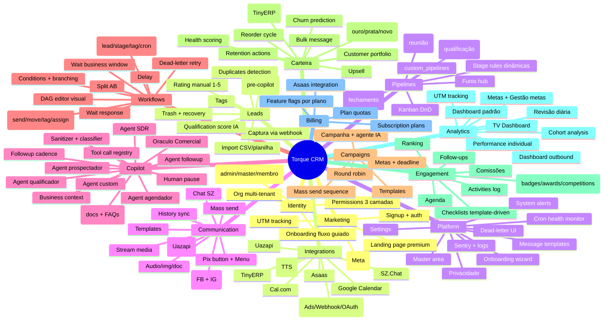
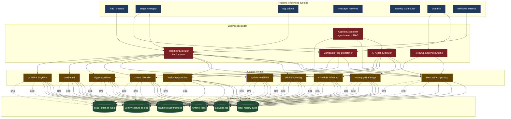
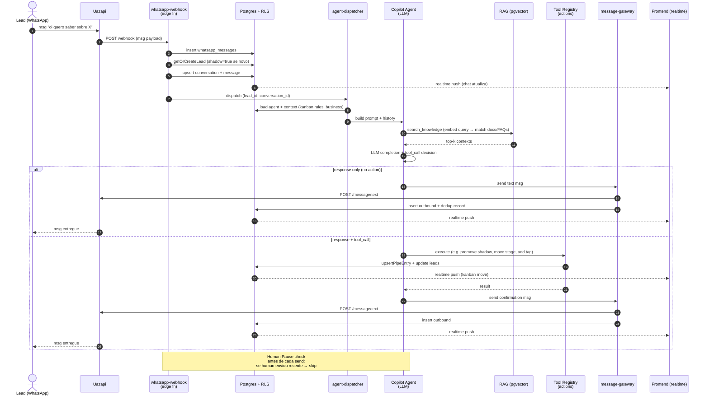
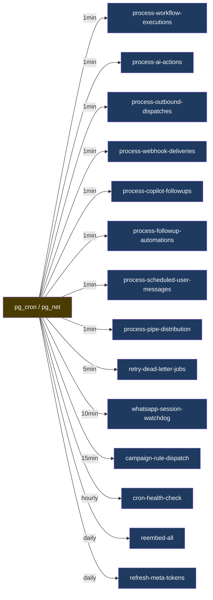

# Funcionalidades — Mapa Atual + Interações

> Vista **funcional** do sistema em **2026-05-26** — o que o produto FAZ, como features se conectam.
> Complementa [[Arquitetura Atual — As-Is]] (vista física do código).
> Fundamenta os critérios de decomposição em módulos do [[ADR-2026-05-26-modularizacao-monolito-modular]].

---

## 1. Mapa de capabilities (top-down por bounded context)



---

## 2. Lead lifecycle (entrada → venda → pós-venda)

```mermaid
flowchart LR
    subgraph entry["Entrada"]
        META[Meta Ads Form]
        N8N[n8n trigger]
        WHATSAPP_IN[WhatsApp inbound]
        FORM[Form externo]
        CSV[CSV import]
        CAL[Cal.com]
    end

    subgraph qualify["pipe_whatsapp — qualificação"]
        NL[novo_lead]
        AB[abordado]
        RE[respondeu]
        AG[agendado]
    end

    subgraph confirm["pipe_confirmacao — confirmação reunião"]
        RM[reuniao_marcada]
        D5[D-5]
        D3[D-3]
        D1[D-1]
        CP[compareceu]
        NS[no-show]
    end

    subgraph proposal["pipe_propostas — fechamento"]
        PE[proposta_enviada]
        NG[negociando]
        VD[vendido]
        PD[perdido]
    end

    subgraph postsale["Carteira — pós-venda"]
        ON[novo cliente]
        OU[ouro]
        PR[prata]
        DM[dormindo]
        RG[resgate]
        UP[upsell]
        CH[churn]
    end

    META --> N8N --> NL
    WHATSAPP_IN --> NL
    FORM --> NL
    CSV --> NL
    CAL -.bypass.-> RM

    NL --> AB --> RE --> AG --> RM
    RM --> D5 --> D3 --> D1 --> CP
    D1 -. no-show .-> NS
    CP --> PE --> NG --> VD
    NG -. perdido .-> PD
    VD --> ON --> OU
    OU -. inatividade .-> DM --> RG
    OU --> UP

    classDef entry fill:#1f3a5f,color:#fff
    classDef qf fill:#664400,color:#fff
    classDef cf fill:#7a4f00,color:#fff
    classDef pp fill:#5a2a00,color:#fff
    classDef ps fill:#1f4d2e,color:#fff
    classDef loss fill:#3a1a1a,color:#aaa

    class META,N8N,WHATSAPP_IN,FORM,CSV,CAL entry
    class NL,AB,RE,AG qf
    class RM,D5,D3,D1,CP cf
    class NS,PD loss
    class PE,NG,VD pp
    class ON,OU,PR,DM,RG,UP ps
    class CH loss
```



**Observações**:
- Lead pode estar em **múltiplos pipes simultâneo** (qualificação + confirmação podem rodar paralelo se já tem reunião marcada).
- Cal.com leads **bypassam qualificação** (já vêm com reunião marcada) — vai direto pra `pipe_confirmacao`.
- `pipe_propostas` é independente; pode entrar de qualquer pipe quando há intenção de fechar.
- Lead vendido vira cliente em `carteira` (não some do pipe_propostas — segmentação muda).

---

## 3. Event flow (trigger → automação → side effects)



---

## 4. Matriz de interações entre bounded contexts

Quem **chama** (linha) → quem **é chamado** (coluna). `✓` = chamada direta hoje; `⚙` = via engine compartilhado; vazio = sem interação.

| De ↓ / Para → | Identity | Leads | Pipelines | Communic | Copilot | Workflows | Campaigns | Carteira | Engagement | Analytics | Billing | Market | Integ | Platform |
|---|---|---|---|---|---|---|---|---|---|---|---|---|---|---|
| **Identity** | — | ✓ | ✓ | | | | | | | | | | | ✓ |
| **Leads** | ✓ | — | ✓ | ✓ | ⚙ | ✓ | ✓ | ✓ | ✓ | ✓ | | | ✓ | |
| **Pipelines** | ✓ | ✓ | — | | | ✓ | ✓ | ✓ | ✓ | ✓ | | | | |
| **Communic** | ✓ | ✓ | | — | ✓ | ⚙ | ⚙ | | | | | | ✓ | |
| **Copilot** | ✓ | ✓ | ✓ | ✓ | — | ⚙ | | ✓ | | | | | ✓ | |
| **Workflows** | ✓ | ✓ | ✓ | ✓ | ✓ | — | ✓ | ✓ | ✓ | | | | ✓ | |
| **Campaigns** | ✓ | ✓ | ✓ | ✓ | ✓ | ⚙ | — | | | | | | | |
| **Carteira** | ✓ | ✓ | ✓ | ✓ | ✓ | ⚙ | | — | ✓ | | | | ✓ | |
| **Engagement** | ✓ | ✓ | ✓ | | | ⚙ | | | — | ✓ | | | ✓ | |
| **Analytics** | ✓ | ✓ | ✓ | | | | ✓ | ✓ | ✓ | — | ✓ | ✓ | | |
| **Billing** | ✓ | | | | | | | | | | — | | ✓ | |
| **Market** | ✓ | ✓ | | | | | | | | ✓ | | — | ✓ | |
| **Integ** | | ✓ | ✓ | ✓ | ✓ | ✓ | ✓ | ✓ | ✓ | | ✓ | ✓ | — | |
| **Platform** | ✓ | | | | ✓ | ✓ | | | | ✓ | | | | — |

**Padrão observado**:
- `Leads` é o hub mais conectado (esperado — entidade central)
- `Workflows` é o segundo hub (engine de automação cross-cutting)
- `Communic`, `Copilot`, `Campaigns` se intersectam via engines compartilhados (`message-gateway`, `ai-action-executor`, `outbound-sender`) — fronteira mais delicada
- `Analytics` é majoritariamente consumer (lê de todos, ninguém escreve nela)
- `Identity` é consumido por todos mas chama pouco (boundary natural)
- `Integ` (Integrations) é cross-cutting: cada provider é facade pra serviço externo, consumido por múltiplos contexts

**Implicação pra Modularização**: os agrupamentos físicos propostos no [[ADR-2026-05-26-modularizacao-monolito-modular]] respeitam essa matriz — engines compartilhados ficam em `_shared/<bc>/` ou em módulos canônicos (ex: `message-gateway` no módulo `communication/`, consumido por outros via API pública).

---

## 5. Diagrama de sequência — fluxo crítico: lead inbound WhatsApp + Copilot responde

Cenário: lead manda primeira msg WhatsApp; sistema cria lead shadow, agente IA classifica, qualifica, agenda.



**Hot spots de falha** (cobertos por [[Areas Frageis]] + Phase 2 Hardening):
- step 6 (getOrCreateLead): race condition em duplicate phone — já tem retry, mas test stale
- step 9-14 (RAG + LLM): latência variável, timeout possível, prompt injection risk (sanitizer ativo)
- step 15-17 (tool_call): action handler pode falhar silenciosamente (Pillar 2 fail-closed)
- step 19 (Uazapi send): retry necessário em 5xx (já tem dlq-replay)

---

## 6. Engines compartilhados (cross-cutting)

Funções/módulos que orquestram interações entre múltiplos BCs. Hoje vivem em `_shared/`; pós-modularização vão pra módulo dono ou `_shared/core/`.

| Engine | O que faz | Consumido por | Vai virar |
|---|---|---|---|
| `message-gateway` | Single entry point pra todo send WhatsApp (resolve instance + dedup + rate limit + persist) | Copilot, Workflows, Campaigns, Carteira, Mass-send | módulo `communication/` |
| `workflow-executor` | DAG runner (nodes, edges, branching, retry) | Workflows, Campaigns | módulo `workflows/` |
| `ai-action-executor` | Executa actions decididas pelo Copilot (move stage, send msg, schedule) | Copilot | módulo `copilot/` ou `workflows/` (decisão pendente) |
| `permission_engine` | Cascade master → admin → feature → matrix | Toda edge fn que checa permissão | módulo `identity/` |
| `outbound-sender` | Disparo coordenado de msgs em batch (campaigns + workflows) | Workflows, Campaigns | módulo `communication/` |
| `dispatch-router` | Roteia incoming events pro handler certo | Workflows | módulo `workflows/` |
| `followup-cadence` | Schedule e disparo de follow-ups por copilot agent | Copilot | módulo `copilot/` |
| `lead-service` | CRUD + promoveShadowLead + getOrCreate | Quase todos | módulo `leads/` |
| `pipeline-adapter` | upsertPipeEntry (translate slug → entry) | Workflows, Copilot, Communication | módulo `pipelines/` |
| `retention-gate` | Decide se cliente precisa retention action | Carteira | módulo `carteira/` |

**Implicação**: 10 engines compartilhados = 10 pontos onde violação de fronteira é tentadora. Pós-modularização, cada um vira função exportada da API pública do módulo dono; consumidores chamam via `import { sendMessage } from "@/modules/communication"`, não via path interno.

---

## 7. Cron jobs (10+ jobs/1min)

Eventos disparados por `pg_cron` → `pg_net` → edge functions, auth via `x-cron-secret`.



**Por que importa pra modularização**: cada cron job é uma edge function; vai mover junto com o módulo dono. Slice 14 (`feat/modularizacao/14-edge-functions`) precisa garantir que `supabase/config.toml` continua apontando pros novos paths.

---

## 8. Integrações externas (boundary do sistema)

```mermaid
flowchart LR
    subgraph torque["Torque CRM"]
        BE[Edge Functions]
        DB[(Postgres)]
        FE[Frontend]
    end

    subgraph providers["Providers externos"]
        UAZ[Uazapi<br/>WhatsApp]
        META[Meta<br/>Ads/IG/Msg]
        GCAL[Google Calendar]
        TINY[TinyERP]
        ASA[Asaas<br/>billing]
        SZ[SZ.Chat]
        CAL[Cal.com]
        ELV[ElevenLabs TTS]
        GEM[Google Gemini<br/>embeddings + LLM]
        OPR[OpenRouter<br/>LLM proxy]
        SEN[Sentry]
        N8[n8n<br/>orquestração]
    end

    BE <-->|webhook + REST| UAZ
    BE <-->|webhook + Graph API| META
    BE <-->|OAuth + REST| GCAL
    BE <-->|REST + webhook| TINY
    BE -->|REST| ASA
    BE <-->|REST| SZ
    BE <--|webhook| CAL
    BE -->|REST| ELV
    BE -->|REST| GEM
    BE -->|REST| OPR
    BE -->|capture| SEN
    FE -->|capture| SEN
    N8 -->|webhook| BE
```

**Por que importa**: cada integração é uma boundary onde Pillar 3 (Zod validation) e Pillar 4 (idempotency) aplicam de forma mais crítica. Webhooks de entrada são o vetor #1 de payload inesperado.

---

## 9. Para onde isso vai (post-modularização)

Após [[ADR-2026-05-26-modularizacao-monolito-modular|Modularização]] (Phase 1) terminar:

- Cada **capability** (seção 1) = arquivos dentro de 1 módulo `src/modules/<bc>/` + edge functions em `supabase/functions/<bc>/<fn>/`
- Cada **engine compartilhado** (seção 6) = função exportada da API pública do módulo dono
- Cada **integração externa** (seção 8) = facade em `src/modules/integrations/<provider>/` ou no módulo consumidor (ex: TinyERP no `carteira/` se único consumer)
- Cada **cron job** (seção 7) = mantém edge fn; só path muda
- **Matriz de interações** (seção 4) = enforced via ESLint `boundaries` + grafo do `dependency-cruiser`. Edges proibidos viram erro de build.

Este doc é foto. **Vai ser substituído** pela versão pós-modularização em slice 17 do projeto, com mesma estrutura mas refletindo `src/modules/`.
