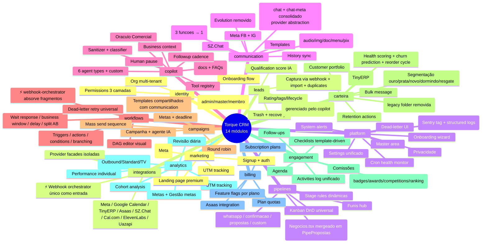
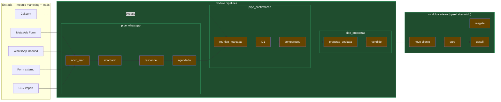
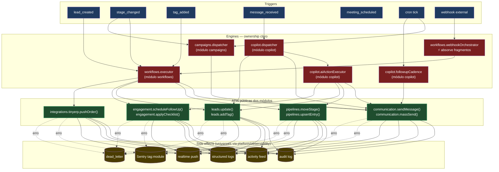
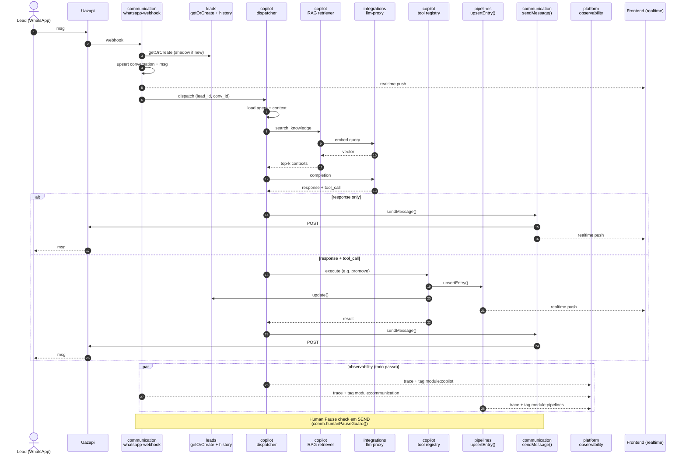
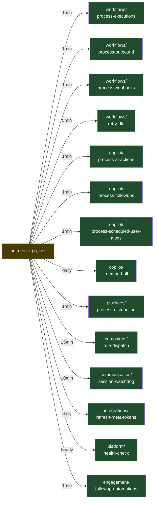
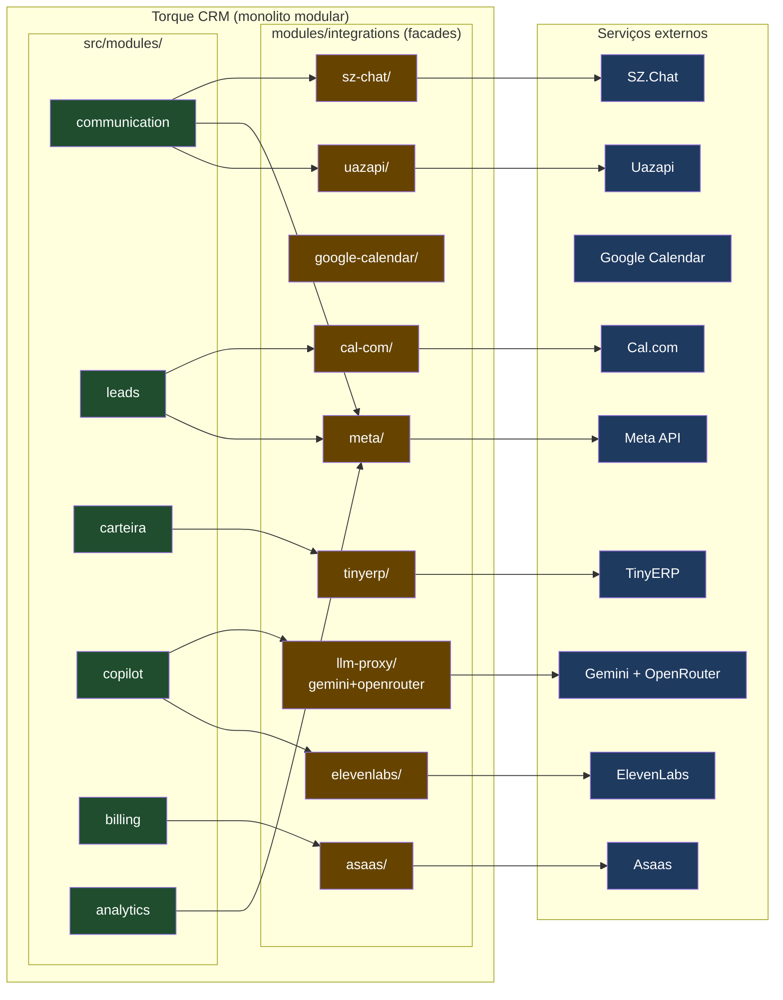
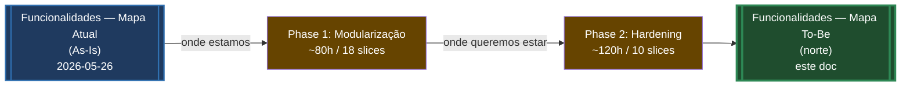

# Funcionalidades — Mapa To-Be (norte)

> **Visão alvo** pós-Modularização (Phase 1) + Hardening (Phase 2). Atua como **goal** do roadmap.
> Espelha [[Funcionalidades — Mapa Atual]] (As-Is) mas projeta o estado final.
> Diferenças destacadas em ⚡ por seção.
> Reversibilidade: ver [[ADR-2026-05-26-modularizacao-monolito-modular#Reversibilidade]].

---

## ⚡ TL;DR — o que muda

| Dimensão | As-Is | To-Be |
|---|---|---|
| **Organização física** | Por camada técnica (`components/`, `hooks/`, `pages/`, `functions/`) | Por bounded context (`src/modules/<bc>/`, `supabase/functions/<bc>/<fn>/`) |
| **API entre módulos** | Import direto de path interno | Apenas via `index.ts` público; cross-import enforced |
| **Pastas duplicadas** | `lead/`+`leads/`+`lead-detail/`, `chat/`+`chat-meta/`, `pipelines/`+`pipe-propostas/`+`kanban/`+`confirmacao/` | 1 pasta por BC |
| **Hooks soltos** | 250+ no root de `src/hooks/` | 0 no root; todos sob `src/modules/<bc>/hooks/` |
| **Edge functions soltas** | 97 no root de `supabase/functions/` | 0 no root; todas sob `supabase/functions/<bc>/<fn>/` |
| **_shared inflado** | 35+ módulos misturando core + domínio | `_shared/core/` (10 cross-cutting) + `_shared/<bc>/` quando necessário |
| **Naming** | pt/en mix (`campanhas`+`campaigns`, `pipeline`+`pipe-`) | 1 idioma por conceito (escolha: pt no UI, en no domínio técnico) |
| **Páginas órfãs** | `MockupChat`, `MockupChatV2`, `MockupChatV3`, `MockupChatV3 2`, `Negocios.tsx` paralelo a `PipePropostas.tsx` | Removidas ou consolidadas |
| **Telemetria** | Erros sem dimensão de domínio | Sentry tag `module:<bc>`, structured logs com `module` field |
| **Testes** | 41 testes stale em 25 files | 0 failures; 70% coverage nos top-3 módulos |
| **Boundary** | Convenção verbal | ESLint `boundaries` em error mode + CI gate |

---

## 1. Mapa de capabilities (To-Be)



**⚡ Mudanças**:
- **`communication`**: omnichannel (chat + chat-meta = 1 módulo, provider abstraction). Mass-send unificado (3 funções → 1 com modos).
- **`carteira`**: absorbiu `upsell/` (legacy folder removida; conceito já fundido em CONTEXT.md).
- **`workflows`**: `webhook-orchestrator` absorbe fragmentos de roteamento (`webhook-new-lead`, `webhook-confirmacao`, etc viram handlers internos).
- **`analytics`**: 3 dashboards consolidados em 1 com toggles (Standard / Outbound / TV).
- **`pipelines`**: `Negocios.tsx` mergeado em `PipePropostas.tsx` (mesma capability, nomes diferentes).

---

## 2. Lead lifecycle (To-Be — sem mudança funcional)



**⚡ Mudanças**:
- Mesmo lifecycle, mas **stages e regras de transição vivem dentro do módulo** `pipelines/`
- `entry` é responsabilidade de `marketing/` (lead forms) + `leads/` (entrada genérica)
- `carteira/` é módulo único — `upsell/` legacy removida

---

## 3. Event flow (To-Be — engines com ownership claro)



**⚡ Mudanças**:
- Engines têm **ownership documentado** (cada um pertence a 1 módulo)
- Actions passam por **API pública do módulo dono** (não por path interno)
- **Webhook Orchestrator** absorve `webhook-new-lead`, `webhook-confirmacao`, etc — entrada única roteada para o workflow correto
- Side effects ganham `module:<bc>` tag (Pillar 5 do Hardening)

---

## 4. Matriz de interações (To-Be — enforced)

```
✅ permitido sempre  •  🔁 só via API pública  •  ❌ proibido (CI bloqueia)
```

| De ↓ / Para → | identity | leads | pipelines | communic | copilot | workflows | campaigns | carteira | engage | analytics | billing | market | integ | platform |
|---|---|---|---|---|---|---|---|---|---|---|---|---|---|---|
| **identity** | — | 🔁 | 🔁 | ❌ | ❌ | ❌ | ❌ | ❌ | ❌ | ❌ | ❌ | ❌ | ❌ | 🔁 |
| **leads** | 🔁 | — | 🔁 | 🔁 | 🔁 | 🔁 | 🔁 | 🔁 | 🔁 | 🔁 | ❌ | ❌ | 🔁 | ❌ |
| **pipelines** | 🔁 | 🔁 | — | ❌ | ❌ | 🔁 | 🔁 | 🔁 | 🔁 | 🔁 | ❌ | ❌ | ❌ | ❌ |
| **communic** | 🔁 | 🔁 | ❌ | — | 🔁 | 🔁 | 🔁 | ❌ | ❌ | ❌ | ❌ | ❌ | 🔁 | ❌ |
| **copilot** | 🔁 | 🔁 | 🔁 | 🔁 | — | 🔁 | ❌ | 🔁 | ❌ | ❌ | ❌ | ❌ | 🔁 | ❌ |
| **workflows** | 🔁 | 🔁 | 🔁 | 🔁 | 🔁 | — | 🔁 | 🔁 | 🔁 | ❌ | ❌ | ❌ | 🔁 | ❌ |
| **campaigns** | 🔁 | 🔁 | 🔁 | 🔁 | 🔁 | 🔁 | — | ❌ | ❌ | ❌ | ❌ | ❌ | ❌ | ❌ |
| **carteira** | 🔁 | 🔁 | 🔁 | 🔁 | 🔁 | 🔁 | ❌ | — | 🔁 | ❌ | ❌ | ❌ | 🔁 | ❌ |
| **engage** | 🔁 | 🔁 | 🔁 | ❌ | ❌ | 🔁 | ❌ | ❌ | — | 🔁 | ❌ | ❌ | 🔁 | ❌ |
| **analytics** | 🔁 | 🔁 | 🔁 | 🔁 | 🔁 | 🔁 | 🔁 | 🔁 | 🔁 | — | 🔁 | 🔁 | ❌ | ❌ |
| **billing** | 🔁 | ❌ | ❌ | ❌ | ❌ | ❌ | ❌ | ❌ | ❌ | ❌ | — | ❌ | 🔁 | ❌ |
| **market** | 🔁 | 🔁 | ❌ | ❌ | ❌ | ❌ | ❌ | ❌ | ❌ | 🔁 | ❌ | — | 🔁 | ❌ |
| **integ** | ❌ | 🔁 | 🔁 | 🔁 | 🔁 | 🔁 | 🔁 | 🔁 | 🔁 | ❌ | 🔁 | 🔁 | — | ❌ |
| **platform** | 🔁 | ❌ | ❌ | ❌ | 🔁 | 🔁 | ❌ | ❌ | ❌ | 🔁 | ❌ | ❌ | ❌ | — |

**⚡ Mudanças vs As-Is**:
- Cada `✓`/`⚙` virou `🔁` (only via public API) ou `❌` (explicitly forbidden, CI fails)
- **`analytics` é leitor-only** — escreve só em platform (telemetria)
- **`billing` é mais isolado** — só conversa com `identity` e `integ` (Asaas)
- **`platform` é base** — recebe muito mas chama pouco (não cria features de domínio)

ESLint `boundaries` config (slice 1 do Modularização) declara cada `❌` como erro. PR que viola = CI vermelho.

---

## 5. Sequence diagram (To-Be — mesmo fluxo, módulos explícitos)

Cenário idêntico: lead inbound WhatsApp + Copilot tool_call. Mudança: cada chamada **explicita o módulo dono**.



**⚡ Mudanças**:
- Cada participant agora tem `<modulo>` prefixado — fica óbvio quem é dono
- **Observability paralela** — cada módulo emite trace+tag pra `platform`
- `humanPauseGuard()` é função pública de `communication/`, não polui copilot

---

## 6. Engines compartilhados (To-Be — cada um em 1 módulo)

| Engine | Onde mora (To-Be) | Como é consumido |
|---|---|---|
| `message-gateway` (renamed: `sendMessage`) | `modules/communication/api/sendMessage.ts` | `import { sendMessage } from "@/modules/communication"` |
| `mass-send` (3 funcs → 1) | `modules/communication/api/massSend.ts` | `import { massSend } from "@/modules/communication"` |
| `workflow-executor` | `modules/workflows/api/executor.ts` | `import { executeWorkflow } from "@/modules/workflows"` |
| `webhook-orchestrator` (⚡ expandido) | `modules/workflows/api/webhookOrchestrator.ts` | `import { handleWebhook } from "@/modules/workflows"` (substitui webhook-new-lead, etc) |
| `ai-action-executor` | `modules/copilot/api/executeAction.ts` | `import { executeAiAction } from "@/modules/copilot"` |
| `permission-engine` | `modules/identity/api/permissions.ts` | `import { canDo, assertPermission } from "@/modules/identity"` |
| `outbound-sender` | absorbido por `communication.sendMessage` + `campaigns.dispatch` | (consolidado, deixa de existir como engine separado) |
| `dispatch-router` | absorbido por `workflows.webhookOrchestrator` | (consolidado) |
| `followup-cadence` | `modules/copilot/api/followupCadence.ts` | `import { scheduleFollowup } from "@/modules/copilot"` |
| `lead-service` | `modules/leads/api/leadService.ts` | `import { getOrCreateLead, promote } from "@/modules/leads"` |
| `pipeline-adapter` (renamed: `pipelines.entries`) | `modules/pipelines/api/entries.ts` | `import { upsertEntry } from "@/modules/pipelines"` |
| `retention-gate` | `modules/carteira/api/retention.ts` | `import { shouldOfferRetention } from "@/modules/carteira"` |

**⚡ Mudanças**:
- **2 engines consolidados**: `outbound-sender` e `dispatch-router` desaparecem (suas responsabilidades viraram parte de outras APIs)
- Cada engine tem **nome de função imperativo** (não "engine"/"executor"/"adapter") — caller chama `sendMessage()`, não `MessageGateway.dispatch()`
- 10 engines → **8 funções públicas distribuídas em 6 módulos**

---

## 7. Cron jobs (To-Be — organizados por módulo)



**⚡ Mudanças**:
- **Path muda** mas comportamento + cadence iguais
- `supabase/config.toml` ajustado em slice 14 do Modularização
- Edge fn naming consistente: `<module>/<verb>-<noun>` (não `verb-noun-thing`)

---

## 8. Integrações externas (To-Be — facade isolada)



**⚡ Mudanças**:
- Cada provider é **facade isolada** em `modules/integrations/<provider>/` com:
  - Public API tipada
  - Retry + circuit breaker
  - Sentry tag `module:integrations.<provider>`
  - Zod schema dos payloads (Pillar 3)
- Módulo consumidor **nunca chama API externa direto** — sempre via facade
- Trocar provider (ex: Uazapi → Cloud API) muda só facade

---

## 9. Consolidações e remoções

Lista do que **muda funcionalmente** (não só de pasta):

### Consolidações

| O que | De | Para | Justificativa |
|---|---|---|---|
| Chat omnichannel | `chat/` + `chat-meta/` separados | `communication/` único com provider abstraction | Backend Meta já entrega em `channel_messages`. Apenas UI estava separada. ADR-2026-05-25 já antecipou. |
| Mass send | `mass-send-create` + `mass-send-control` + `mass-send-status` | `communication.massSend(action)` com `action: 'create' \| 'control' \| 'status'` | 3 endpoints com mesma surface de auth/log. |
| Webhook entry | `webhook-new-lead` + `webhook-confirmacao` + `webhook-orchestrator` + `webhook-validate-url` + `webhook-send-test` | `workflows.webhookOrchestrator(payload)` único + handlers internos | Roteamento já existe parcialmente; consolidar evita 5 patterns de auth/dedup. |
| Dashboard | `Dashboard.tsx` + `DashboardOutbound.tsx` + `TVDashboard.tsx` | `analytics.DashboardPage` único com `<DashboardModeToggle />` | 3 layouts, mesmo data source. Toggle preserva UX de cada modo. |
| Pipe propostas | `Negocios.tsx` + `PipePropostas.tsx` | `pipelines.PipePropostas` único | Mesma capability, naming legacy. |
| TinyERP push order | `tinyerp-push-order` + `tinyerp-push-upsell-order` | `integrations.tinyerp.pushOrder({ isUpsell: bool })` | Mesma rota TinyERP, só payload muda. |
| Process cron series | 9 `process-*` no root | 9 funções dentro dos módulos donos | Mesma cadence, só path muda. |

### Remoções

| O que | Por quê |
|---|---|
| Pasta `src/components/upsell/` | Conceito absorvido por `carteira/` (CONTEXT.md já diz "Carteira subsumes the legacy Upsell concept") |
| `evolution-provider.ts` + `evolution-api.test.ts` | Migração Evolution → Uazapi concluída há meses |
| `MockupChat.tsx`, `MockupChatV2.tsx`, `MockupChatV3.tsx`, `MockupChatV3 2.tsx` | Mockups órfãos; nenhum em rota ativa |
| `pages/master/` se contiver pages que duplicam settings | Caso a caso na slice 13 (platform) |
| 11 wrappers `pipe_*` views (se realtime já só ouvir `pipeline_entries`) | Caso a caso; remover só após confirmar zero consumer |

### Renomeações

| De | Para | Por quê |
|---|---|---|
| `components/campanhas/` + `pages/campaigns/` | `modules/campaigns/` (en) | Domínio técnico em inglês; UI labels continuam em pt |
| `pipe-propostas/`, `confirmacao/`, `kanban/` (espalhados) | `modules/pipelines/<sub-feature>/` | Agrupamento por BC |
| `_shared/lead-service.ts` | `modules/leads/api/leadService.ts` | Module ownership |
| Hooks `useAgent*` | `modules/copilot/hooks/use*` | Module ownership |

---

## 10. Critérios de "estamos no To-Be" (exit do projeto)

Checklist de conformidade total:

- [ ] `ls src/components/` retorna **vazio** (ou só `ui/` + `shared/`)
- [ ] `ls src/hooks/*.ts` retorna **vazio** (todos em `modules/<bc>/hooks/`)
- [ ] `ls src/pages/*.tsx` retorna **vazio** (todos em `modules/<bc>/pages/`)
- [ ] `ls supabase/functions/` retorna **só** `_shared/` + subpastas de módulo (nenhuma function solta)
- [ ] `ls supabase/functions/_shared/` retorna **só** `core/` + `<bc>/`
- [ ] Cada `modules/<bc>/` tem `index.ts` exportando API pública
- [ ] Cada `modules/<bc>/` tem `CLAUDE.md` com escopo + áreas frágeis + owner
- [ ] `eslint --max-warnings=0` passa com `boundaries` em error mode
- [ ] `npm run test:unit` retorna **0 failures**
- [ ] Top-3 módulos com 70% coverage (Pillar 1 do Hardening)
- [ ] Sentry dashboard mostra erros por `module:` tag
- [ ] Bundle delta vs As-Is: ±5%
- [ ] `MockupChat*`, `evolution-*`, `upsell/` removidos
- [ ] Mass-send consolidado em 1 função
- [ ] Webhook orchestrator único
- [ ] Dashboard único com toggle
- [ ] `Negocios.tsx` removido
- [ ] Vault Obsidian atualizado (este doc fica como referência)
- [ ] PR final `develop → main` mergeado

---

## 11. O que NÃO muda

- Stack (React 18 + TS 5.8 + Vite 5, Supabase, Tailwind, shadcn/ui, TanStack Query, etc)
- Modelo de dados (zero schema migration neste projeto, exceto se derivar de bug Pillar 2)
- Comportamento de domínio (mesmas regras, mesmas transições, mesmos triggers)
- Cron cadences
- Integrações (mesmas APIs externas)
- Permissões (mesma cascade master → admin → feature → matrix)
- Multi-tenancy (mesmo isolation via RLS + org_id)
- Stack de IA (Gemini embeddings + LLM via proxy)

---

## 12. Relação com As-Is e roadmap



- **As-Is** ([[Funcionalidades — Mapa Atual]]): fotografia. Mostra dor.
- **Phase 1** ([[ADR-2026-05-26-modularizacao-monolito-modular|Modularização]]): estrutura física + boundary enforcement.
- **Phase 2** ([Hardening](../../../../.specs/features/hardening/SPEC.md)): stop-bleeding + harden top-3 + patterns reutilizáveis.
- **To-Be** (este doc): norte. Critério de aceite final do projeto inteiro.
