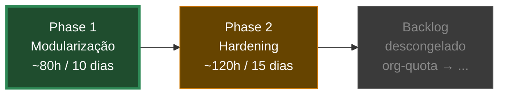

# Roadmap — visão estratégica

> **Fonte canônica**: [`.specs/project/ROADMAP.md`](../../../../.specs/project/ROADMAP.md) — esta nota é vitrine pra navegação no vault.
> Detalhe de execução por fase: `.specs/features/<projeto>/SPEC.md`.

## Sequência macro (6 meses)

## Phase 1 — Modularização (in progress)

Reorganiza `src/` em `src/modules/<bc>/` + `supabase/functions/` em `<bc>/<fn>/`. Boundary enforced por ESLint + CI. **Pré-requisito físico** do hardening.

- **SPEC**: [`.specs/features/modularizacao/SPEC.md`](../../../../.specs/features/modularizacao/SPEC.md)
- **ADR**: [[ADR-2026-05-26-modularizacao-monolito-modular]]
- **Foto As-Is**: [[Arquitetura Atual — As-Is]]
- **Status**: slice 0 (planejamento) deployed; aguarda aprovação ADR pra cortar slice 1.
- **Exit criteria**: 0 arquivos no root de `src/{components,hooks,pages}` + `supabase/functions/`. ESLint `boundaries` em error mode. CI verde. Bundle delta ±5%.

## Phase 2 — Hardening (queued)

Stop-the-bleeding (top 5 root causes) + harden top-3 módulos com 6 pillars. Absorve sprint "Coverage 70%" pausado.

- **SPEC**: [`.specs/features/hardening/SPEC.md`](../../../../.specs/features/hardening/SPEC.md)
- **Gated by**: Phase 1 merged em main
- **Fontes triagem**: `runtime_logs`, `dead_letter_events`, `workflow_executions`, `pending_ai_actions`, `conversations` (drift), Sentry, GitHub issues
- **6 pillars**: test coverage, fail-closed, Zod boundaries, idempotency, observability por módulo, RLS audit
- **Exit criteria**: top 5 causes 0 ocorrências por 7 dias + 70% coverage nos top-3 + Sentry tag por módulo + CI gate Zod

## Backlog congelado (descongela pós-Phase 2)

| Item | Prioridade pós-descongela |
|---|---|
| `org-quota-enforcement` (E2E pendente) | 1 |
| `agent-team-system` (operational) | sem urgência |
| `analytics-marketing-redesign` (specced) | sem urgência |
| `cache-optimization` (specced) | sem urgência |
| `master-api-status` (specced) | sem urgência |
| `metrics-period-filter` (specced) | sem urgência |

## Disciplina durante feature grande

Memória firmada (`feedback_branch_discipline_during_feature.md`): durante Phase 1 ou Phase 2, **apenas dois tipos de branch permitidos**:

- `feat/<projeto>/<slice>` — saindo de `develop`
- `hotfix/<descricao>` — saindo de `main` (protocolo: merge main → sync main→develop → rebase slices em curso)

Backlog congelado descongela após PR `develop → main` da Phase 2.

## Por que sequencial

Hardening sem fronteira física = testes/observability em código espaguete que vai ser reorganizado. Retrabalho garantido. Phase 1 cria a estrutura; Phase 2 hardeniza sobre ela. Mesma lógica do precedent `automations-onda-1` (estabilizar antes de refatorar).
