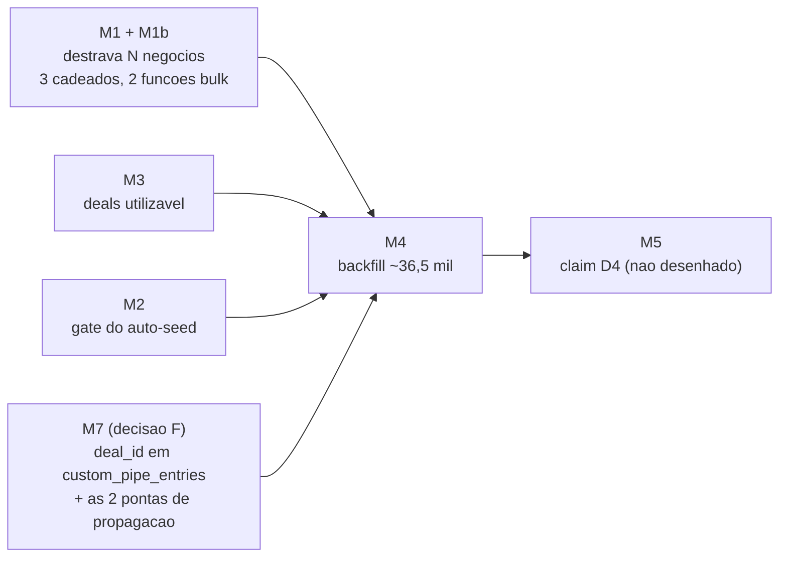

# Alterações de DB — Separação Lead ↔ Negócio

> [!danger] NADA APLICADO. Alvo é branch efêmera, nunca prod.
> Este documento é o plano de execução das migrations da **fatia 2**. Em
> 2026-07-29 prod recebeu **apenas `SELECT`** de diagnóstico (role read-only).
> Todo o estado descrito aqui foi **medido em produção**, não inferido.
>
> A fatia 1 (interface) está pronta e **não depende de nenhuma migration daqui**:
> a UI lê `pipeline_entries` e trata card de funil como negócio.

## Estado medido em prod (2026-07-29, revisto 2026-07-30)

| Fato | Valor |
|---|---|
| `deals` | **0 linhas**, RLS ligada, 5 policies, colunas completas — **mas não é inerte: 2 gatilhos vivos** (`trg_deal_won_lead_products`, `update_deals_updated_at`) e satélites `deal_items`/`lead_products` (0 linhas cada). Ver M3 |
| `pipeline_entries` | **36.709** linhas — 20.517 padrão (65 orgs) + 16.192 custom (24 orgs) *(re-medido 2026-07-31; era 36.507 em 07-30 e 36.497 em 07-29 — base viva, sobe alguns por dia)* |
| `custom_pipe_entries` | 16.193 — **espelhadas em `pipeline_entries` com a mesma PK** (16.193/16.193 casam por `id`). Somar as duas conta o mesmo card 2×. **Não tem `deal_id`** → M7 |
| `pipeline_entries` com `deal_id` | **0** |
| `uq_pipeline_entries_pipeline_lead` | **viva** (1º cadeado) |
| `idx_pipeline_entries_pipeline_lead` | **vivo** (unique parcial — 2º cadeado) |
| `custom_pipe_entries_pipeline_id_lead_id_key` | **viva** (3º cadeado — `UNIQUE (pipeline_id, lead_id)`) |
| `trg_auto_assign_lead_default_pipe` | **ativo** |
| Grants em `deals` | `authenticated` = DML completo; `anon` = SELECT (igual `leads`/`pipeline_entries` — RLS é quem barra) |

> Base viva: as contagens oscilam por unidade entre leituras. O que não oscila é a
> relação — `custom_pipe_entries ⊂ pipeline_entries` por `id`.

---

## Ordem de execução e dependências



**M1+M1b, M3 e M7 são independentes entre si.** M4 depende dos quatro; o corte
("o que é lead real") **já foi decidido** em 2026-07-30 — tudo vira negócio (decisão A).
M5 tem formato decidido (coluna em `leads`, decisão C) e nenhuma UI escrita.

**M7 está numerado fora de ordem porque nasceu depois** (decisão F, 2026-07-30) — mas
roda **antes do M4**, e sem ele o backfill deixa 16.192 cards custom sem negócio na tela
que os renderiza. O texto dele está posicionado imediatamente antes do M4.

---

## M1 — Destravar N negócios por lead

**Por quê:** é o ponto de não-retorno da feature. Sem isso, a recompra — motivo de
existir da separação — continua impossível.

> [!warning] São TRÊS cadeados, não dois — e não um
> Dois vivem em `pipeline_entries` (a constraint **e** um índice único parcial
> separado, protegendo o mesmo par de colunas). O terceiro vive em
> `custom_pipe_entries`: `custom_pipe_entries_pipeline_id_lead_id_key`,
> `UNIQUE (pipeline_id, lead_id)` — verificado em `pg_constraint` (2026-07-30).
>
> Dropar só a constraint de `pipeline_entries` não destrava nada. Dropar as duas de
> `pipeline_entries` destrava **só os funis padrão**: 16.192 cards em 24 orgs vivem
> em funil customizado, e a Milennials — org piloto — tem 914 deles. Sem o terceiro
> drop, a decisão F (`deal_id` em `custom_pipe_entries`) não entrega recompra no
> piloto.
>
> *(Corrigido em 2026-07-30. A versão anterior dizia "DOIS cadeados" e o DDL abaixo
> só tocava `pipeline_entries` — o mesmo tipo de erro que ela própria denunciava, um
> nível acima.)*

```sql
-- 1) constraint (o índice homônimo cai junto, é o backing index dela)
ALTER TABLE public.pipeline_entries
  DROP CONSTRAINT uq_pipeline_entries_pipeline_lead;

-- 2) índice único parcial — o segundo cadeado, fácil de esquecer
DROP INDEX IF EXISTS public.idx_pipeline_entries_pipeline_lead;

-- 3) o terceiro cadeado, na tabela dos funis customizados
ALTER TABLE public.custom_pipe_entries
  DROP CONSTRAINT custom_pipe_entries_pipeline_id_lead_id_key;
```

**Rollback:** só é possível enquanto não existir lead com 2 entries no mesmo funil.

```sql
CREATE UNIQUE INDEX CONCURRENTLY idx_pipeline_entries_pipeline_lead
  ON public.pipeline_entries (pipeline_id, lead_id) WHERE lead_id IS NOT NULL;
ALTER TABLE public.pipeline_entries
  ADD CONSTRAINT uq_pipeline_entries_pipeline_lead UNIQUE (pipeline_id, lead_id);
ALTER TABLE public.custom_pipe_entries
  ADD CONSTRAINT custom_pipe_entries_pipeline_id_lead_id_key UNIQUE (pipeline_id, lead_id);
```

**Verificação:** criar 2 negócios do mesmo lead no mesmo funil pela UI e ver os dois
aparecerem no kanban.

> [!danger] 🔴 `upsertPipeEntry` vira duplicador determinístico — NÃO é "corrida aceita"
> `upsertPipeEntry` (`_shared/pipeline-adapter.ts:155`) faz select → update → insert,
> **sem `ON CONFLICT`**, e o select é `getPipeEntry` → `.maybeSingle()`
> (`pipeline-adapter.ts:122`).
>
> Hoje o unique garante no máximo 1 linha, então `maybeSingle()` sempre acerta.
> Depois do drop, com 2+ linhas do mesmo `(pipeline_id, lead_id)`, o postgrest-js
> **zera o `data` e devolve `PGRST116`** — medido no bundle instalado,
> `node_modules/@supabase/postgrest-js/dist/index.mjs:107-119`:
> `if (isMaybeSingle && method === "GET" && data.length > 1) { error = PGRST116; data = null; }`.
>
> `getPipeEntry` trata erro como "não achei" e devolve `null` → `upsertPipeEntry`
> cai no ramo do `INSERT` e **cria mais uma linha**. Toda chamada seguinte
> duplica de novo: 2 → 3 → 4. Não depende de concorrência, não é janela de corrida —
> é o caminho feliz, sequencial, sempre.
>
> **Quem passa por aqui:** `lead-webhook` (`place_in_pipe`) e o Copilot
> (`_shared/actions/schedule-meeting.ts:63`) — ou seja, ingest e IA, os dois caminhos
> de maior volume. Consertar `upsertPipeEntry` (ler todas as linhas, escolher a mais
> recente, ou `ON CONFLICT` de verdade) é pré-requisito do M1, não follow-up.
>
> *(Corrigido em 2026-07-30: a versão anterior classificava isto como "efeito
> colateral aceito… é corrida, não erro". Era falso e minimizava um duplicador.)*

---

## M1b — Reescrever as DUAS funções de bulk (BLOQUEANTE, mesma migration)

**Por quê:** as duas usam

```sql
ON CONFLICT (pipeline_id, lead_id) DO UPDATE SET ...
```

`ON CONFLICT` com lista de colunas **exige** um índice único que as cubra. Assim que
M1 derruba os cadeados, elas passam a levantar **`42P10 — there is no unique or
exclusion constraint matching the ON CONFLICT specification`** em runtime.

> [!danger] São DOIS consumidores, não um — e saem do mesmo botão
> | Função | Tabela que escreve | Quebra quando cai |
> |---|---|---|
> | `bulk_move_stage` | `pipeline_entries` | cadeados 1 e 2 |
> | `bulk_add_to_custom_pipe` (`baseline:1431`) | `custom_pipe_entries` | cadeado 3 |
>
> Não são telas diferentes: o **mesmo diálogo** decide entre as duas conforme o funil
> escolhido no dropdown (`BulkActionBar.tsx:159-161` — `useBulkMoveStage()` /
> `useBulkMoveToCustomPipe()`). O usuário escolhe "funil padrão" ou "funil
> customizado" no mesmo lugar e não sabe que chamou RPC diferente.
>
> E o diálogo está montado em **5 telas**: `PipeWhatsapp:939`,
> `PipeConfirmacao:987`, `PipePropostas:1638`, `CustomPipelineKanban:245` e
> `Leads:1087`.
>
> Não é degradação silenciosa: é erro duro na cara do usuário, na hora.
>
> *(Corrigido em 2026-07-30: a versão anterior só citava `bulk_move_stage`. Aplicar
> M1 com essa lista deixaria metade do botão quebrada.)*

> [!warning] Os dois consertos que este doc sugeria são INVÁLIDOS — medido
> **"UPDATE explícito da entry alvo (o id já é conhecido no laço)"** — o id **não** é
> conhecido. O `DECLARE` de `bulk_move_stage` em prod tem exatamente
> `v_is_master`, `v_member_org`, `v_lead_id`, `v_lead_org`, `v_pipeline_id`: o laço
> percorre `p_lead_ids`, nunca carrega o `id` da entry. A frase descrevia um código
> que não existe.
>
> **`ON CONFLICT (id)` é pior que o bug.** `pipeline_entries.id` e
> `custom_pipe_entries.id` têm `DEFAULT gen_random_uuid()` (verificado em
> `information_schema.columns`). O `INSERT` não passa `id`, então cada tentativa
> sorteia um uuid novo, o árbitro **nunca** dispara e o `DO UPDATE` nunca roda: o SQL
> para de dar erro e passa a **CRIAR card em silêncio** a cada "mover em massa".
> Trocaria um erro visível por corrupção invisível — exatamente a falha que o §M4
> chama de "a pior das duas".
>
> **A forma correta**, nas duas funções: dentro do laço, `SELECT id INTO v_entry_id`
> da entry `(pipeline_id, lead_id)` **ordenando** por `created_at` (pode haver mais
> de uma depois do M1); se achou, `UPDATE ... WHERE id = v_entry_id`; se não,
> `INSERT` puro. Sem `ON CONFLICT`. Decidir explicitamente o que "mover em massa"
> significa quando o lead tem 2 negócios no mesmo funil — hoje a pergunta não existe,
> depois do M1 ela existe todo dia.

**Ler o corpo atual antes de reescrever** — este documento não transcreve as funções
inteiras, só localiza o defeito.

```sql
-- localizar os dois trechos antes de editar
SELECT p.proname, pg_get_functiondef(p.oid)
FROM pg_proc p JOIN pg_namespace n ON n.oid = p.pronamespace
WHERE n.nspname = 'public'
  AND p.proname IN ('bulk_move_stage', 'bulk_add_to_custom_pipe');
```

**Verificação:** mover 2+ cards em massa pela UI **depois** do drop — uma vez para
funil padrão e uma vez para funil customizado, porque são caminhos diferentes — e
conferir que `sale_events`/`meeting_events` receberam os eventos.

---

## M2 — Gatear o auto-seed por org (D1 + D7)

**Por quê:** hoje `fn_auto_assign_lead_default_pipe` semeia `whatsapp/novo` em todo
lead novo — foi assim que os ~36,5 mil cards nasceram. O D1 diz que negócio nasce só de
clique; o D7 diz que o rollout é por org, com piloto na Milennials
(`6030520a-2ca7-477d-be89-55758e2cd808`).

**Sem DDL.** A flag mora em `organizations.feature_flags` (jsonb), mesmo padrão do
`new_lead_modal_v2`. Só a função muda:

```sql
CREATE OR REPLACE FUNCTION public.fn_auto_assign_lead_default_pipe()
 RETURNS trigger LANGUAGE plpgsql SECURITY DEFINER
 SET search_path TO 'public', 'pg_temp'
AS $function$
DECLARE
  v_pipeline_id uuid;
  v_stage_exists boolean;
  v_manual_only boolean;
BEGIN
  -- (0) NOVO: org no modelo "negócio nasce só de clique" (D1) não semeia nada.
  SELECT coalesce((feature_flags->>'deal_manual_only')::boolean, false)
    INTO v_manual_only
  FROM public.organizations WHERE id = NEW.organization_id;

  IF v_manual_only THEN
    RETURN NULL;
  END IF;

  -- (resto do corpo atual, inalterado: skip 'cal', skip se já está em pipe, etc.)
  ...
END;
$function$;
```

Ligar o piloto (na branch, nunca em prod sem ordem):

```sql
UPDATE public.organizations
   SET feature_flags = coalesce(feature_flags, '{}'::jsonb)
                       || '{"deal_manual_only": true}'::jsonb
 WHERE id = '6030520a-2ca7-477d-be89-55758e2cd808';
```

**Rollback:** `feature_flags - 'deal_manual_only'`, ou `CREATE OR REPLACE` da versão
anterior. Reversível a quente, sem migration.

> [!warning] Antes de acender a flag da Milennials
> `place_in_pipe` do `lead-webhook` vira no-op nessa org (mudança de código, fora
> deste doc). São **20+ workflows n8n, um por cliente**, que colocam lead no funil
> por esse caminho. **Auditar os da Milennials antes**, senão lead entra e não
> aparece em funil nenhum.
>
> 🟠 **Cal.com — decidido em 2026-07-30 (decisão B): ingest nunca cria negócio.**
> A **data não se perde**: `leads.compromisso_date` existe, é `timestamptz`, já tem 252
> leads em 10 orgs e já é escrita por `webhook-calcom:324,458`, `lead-webhook:592` e
> `_shared/actions/schedule-meeting.ts:61` — a aba Leads inclusive edita o campo
> (`Leads.tsx:1044-1050`), e `useLeads.ts:245-257` espelha de volta em
> `pipe_confirmacao.meeting_date`.
>
> O que **depende do card nascer** é o **lembrete D-5/D-3/D-1**, que roda em cima do
> card de `confirmacao`. Sob manual puro: data guardada no lead, lembrete morto. É o
> lembrete que precisa de plano — não o armazenamento.
>
> *(Correção: versões anteriores diziam "`leads` tem zero coluna de reunião, a data
> seria descartada". Falso — o levantamento buscou só `%meeting%`/`%reuniao%`/
> `%schedul%` e o nome real é `compromisso_date`.)*

---

## M3 — Deixar `deals` utilizável

Boa notícia: **não há tabela a criar.** `deals` já existe com `title`, `value`,
`currency`, `owner_id`, `source_lead_id`, `probability`, `expected_close_date`,
`closed_at`, `won`, `loss_reason_id`, `notes`, `metadata`, soft-delete
(`deleted_at`/`deleted_by`) — e a FK `pipeline_entries.deal_id → deals.id ON DELETE
SET NULL` já está no lugar.

> [!warning] `deals` **não** é tabela inerte: tem gatilhos vivos e duas satélites
> "0 linhas" não é o mesmo que "nada acontece quando escrevem nela". Medido em prod
> (`pg_trigger`, 2026-07-30):
>
> | Gatilho | Onde | Quando | Faz o quê |
> |---|---|---|---|
> | `trg_deal_won_lead_products` | `deals` | **AFTER UPDATE** `WHEN (new.won = true AND old.won IS DISTINCT FROM true)` | `SECURITY DEFINER`; insere em **`public.lead_products`** a partir de `deal_items` |
> | `update_deals_updated_at` | `deals` | BEFORE UPDATE | carimba `updated_at` |
> | `trg_deal_items_sync_value` | `deal_items` | AFTER INSERT/UPDATE/DELETE | `fn_sync_deal_value_from_items()` faz `UPDATE deals.value` |
>
> **Satélites alcançáveis por escrita em `deals`:** `deal_items` (0 linhas hoje) e
> `lead_products` (0 linhas hoje). Nenhuma das duas era citada neste documento.
>
> A consequência prática está no M4: o gatilho é **AFTER UPDATE**, então negócio que
> **nasce** com `won = true` (é o caso dos 217 do backfill) **não o dispara**. Ver a
> decisão explícita lá.
>
> *(Acrescentado em 2026-07-30: um documento que ensina "cuidado com gatilho que degrada
> em silêncio" não tinha catalogado os gatilhos da própria tabela de destino.)*

### M3a — 🔴 Corrigir a RLS antes de acender (BLOQUEANTE)

**4 das 5** policies usam **`get_user_organization_id()`** — a primeira org do usuário,
sem ramo de master. A **5ª** é o master read-only, e carrega um defeito próprio:

| Policy | Comando | Predicado medido em prod (2026-07-30) | Problema |
|---|---|---|---|
| `deals_select` | SELECT | `organization_id = (SELECT get_user_organization_id())` **AND `deleted_at IS NULL`** | 1ª org apenas |
| `deals_insert` | INSERT | `WITH CHECK` na 1ª org | 1ª org apenas |
| `deals_update` | UPDATE | 1ª org | 1ª org apenas |
| `deals_delete` | DELETE | 1ª org | 1ª org apenas |
| `master_select_all_deals` | SELECT | `(SELECT is_master_user())` — **puro, sem `deleted_at IS NULL`** | master só lê **e** enxerga negócio na lixeira |

**São dois defeitos — e o primeiro sozinho já bloqueia.** *(Nenhum deles é o "segundo
defeito" que a versão anterior alegava, sobre `WITH CHECK` omitido; aquele era falso, ver
o bloco abaixo.)*

1. **O escopo de org.** Mesma classe do incidente de `lead_comments` (resolvido em prod
   pelo #1069): `get_user_organization_id()` devolve a primeira org e ignora master.
   Master operando lead de outra org vê SELECT vazio e toma violação de RLS no INSERT.
   Usuário multi-org só enxerga a primeira. É isto que precisa ser corrigido antes de
   existir qualquer negócio.
2. **A 5ª policy fura o soft-delete.** `master_select_all_deals` é PERMISSIVE e não tem
   `deleted_at IS NULL` — detalhe no bloco logo abaixo. Só aparece **depois** da correção
   do item 1, quando o ramo de master passa a existir nas quatro e ela vira redundante
   com efeito residual nocivo.

> [!warning] O "segundo defeito" era falso — `WITH CHECK` omitido NÃO é buraco
> A versão anterior dizia que `deals_update` sem `WITH CHECK` permitiria `UPDATE`
> trocando `organization_id` e empurrando o negócio pra outra org.
>
> **Não permite.** Em policy de `UPDATE`, quando `WITH CHECK` é omitido o PostgreSQL
> aplica a expressão do `USING` **também** à linha nova. A linha com
> `organization_id` de outra org falha a checagem e o `UPDATE` é recusado.
>
> Medido em 2026-07-30: `public` tem **90 policies de `UPDATE`**, das quais **50
> omitem `WITH CHECK`** — entre elas `leads_update_by_responsibility_and_permissions`
> e `pipeline_entries_update`, as duas tabelas mais sensíveis do produto. Se a
> premissa fosse verdadeira, o CRM inteiro seria multi-tenant furado há anos.
>
> Escrever `WITH CHECK` explícito (como o SQL abaixo faz) continua sendo boa prática
> — deixa a intenção legível e protege de alguém afrouxar o `USING` depois. Só não é
> correção de vulnerabilidade, e chamar de "escalada de privilégio" gasta atenção que
> o defeito real (o `get_user_organization_id()`) precisa.

> [!danger] 🔴 A 5ª policy TAMBÉM cai — dropar só as 4 refura o soft-delete
> `master_select_all_deals` é **PERMISSIVE**, logo entra em `OR` com as outras. Depois da
> correção, `deals_select` guarda `deleted_at IS NULL` e ela — que **não tem essa guarda**
> — passa por cima: o master-ghost continua enxergando negócio na lixeira. E ela vira
> **redundante**, porque o ramo `OR is_master_user()` passa a estar nas quatro.
>
> *(Corrigido em 2026-07-30: a lista abaixo dropava só 4 e o texto dizia "as 5 policies
> usam `get_user_organization_id()`" — as duas coisas não podiam ser verdade juntas. Quem
> seguisse este doc ao pé da letra deixaria a 5ª viva. Quem escreveu a migration
> `20270730000010_deals_rls_org_scope.sql` pegou sozinho e dropou as cinco; este doc é que
> estava atrás.)*

Corrigir espelhando **`pipeline_entries`** (org-wide + master):

```sql
DROP POLICY IF EXISTS deals_select ON public.deals;
DROP POLICY IF EXISTS deals_insert ON public.deals;
DROP POLICY IF EXISTS deals_update ON public.deals;
DROP POLICY IF EXISTS deals_delete ON public.deals;
-- a 5ª: redundante com o ramo de master nas quatro, e é a ÚNICA sem
-- `deleted_at IS NULL` — deixá-la viva refura o soft-delete que deals_select guarda
DROP POLICY IF EXISTS master_select_all_deals ON public.deals;

-- A guarda de soft-delete entra no USING das TRÊS que leem linha existente
-- (select/update/delete) e também no WITH CHECK do update. Não é zelo: sem ela em
-- UPDATE/DELETE, a linha da lixeira continua alcançável por comando sem
-- WHERE/RETURNING e por função SECURITY INVOKER — inclusive hard-delete.
CREATE POLICY deals_select ON public.deals FOR SELECT
  USING (
    deleted_at IS NULL
    AND (organization_id IN (SELECT get_my_organization_ids()) OR (SELECT is_master_user()))
  );

CREATE POLICY deals_insert ON public.deals FOR INSERT
  WITH CHECK (organization_id IN (SELECT get_my_organization_ids()) OR (SELECT is_master_user()));

CREATE POLICY deals_update ON public.deals FOR UPDATE
  USING (
    deleted_at IS NULL
    AND (organization_id IN (SELECT get_my_organization_ids()) OR (SELECT is_master_user()))
  )
  WITH CHECK (
    deleted_at IS NULL
    AND (organization_id IN (SELECT get_my_organization_ids()) OR (SELECT is_master_user()))
  );

CREATE POLICY deals_delete ON public.deals FOR DELETE
  USING (
    deleted_at IS NULL
    AND (organization_id IN (SELECT get_my_organization_ids()) OR (SELECT is_master_user()))
  );
```

> [!danger] 🔴 Este SQL estava atrás da migration já commitada — corrigido em 2026-07-31
> A fonte de verdade é `supabase/migrations/20270730000010_deals_rls_org_scope.sql`
> (linhas 187-241). O doc punha `deleted_at IS NULL` **só** em `deals_select`; a migration
> põe no `USING` de select, update **e** delete, e também no `WITH CHECK` do update.
>
> Seguir a versão antiga deste doc faria `deals` nascer com **o mesmo furo de soft-delete
> que o bloco acima acabou de denunciar na 5ª policy** — só que agora no UPDATE e no
> DELETE. Não existe "caminho de restauração" a preservar: restaurar e purgar são RPC
> `SECURITY DEFINER` (`restore_lead`, `restore_leads_bulk`, `purge_lead`, `bulk_delete_leads`),
> nunca `UPDATE`/`DELETE` direto do client.
>
> **Consequência que a migration documenta e o M4 herda:** as RPCs equivalentes de negócio
> **não existem** — medido em `pg_proc` (2026-07-31), as únicas funções que casam `%deal%`
> são os dois triggers. A fatia 2 precisa de `bulk_delete_deals` / `restore_deal` /
> `purge_deal` **antes** de qualquer UI de lixeira de negócio, senão o client bate
> `42501 new row violates row-level security policy for table "deals"`.
>
> Também alinhado: `(SELECT is_master_user())` entre parênteses, como na migration — o
> `InitPlan` avalia a função uma vez por query em vez de uma vez por linha.

> [!warning] Decisão consciente: `deals` **não** herda o gate de responsabilidade de `leads`
> Quem este SQL espelha é **`pipeline_entries`**, não `leads`. A diferença é de produto,
> não de estilo — predicados medidos em prod (2026-07-30):
>
> | Tabela | `SELECT` |
> |---|---|
> | `pipeline_entries_select` | `organization_id IN (SELECT get_my_organization_ids())` — **org-wide** |
> | `leads_select_by_responsibility_and_permissions` | org **+** `is_user_admin() OR has_feature_permission('leads.view_all', organization_id) OR is_user_responsible(pre_sale_responsible_id, sale_responsible_id) OR can_see_lead_by_permissions(sdr_id, closer_id) OR is_user_responsible_in_any_pipe(id)` |
>
> Com o SQL acima, **todo membro da org enxerga todo negócio, inclusive `value` e
> `notes`.** Não é regressão de visibilidade — o card já é org-wide hoje —, mas é uma
> decisão de produto encostada no D4/D7, e `deals` vai carregar valor de venda. Fica
> registrada como **escolha**, não como consequência: se o gate "vendedor só vê o que é
> dele" tiver que valer para negócio, isso é **policy nova**, com desenho próprio, não
> ajuste desta migration.
>
> *(Corrigido em 2026-07-30: este parágrafo dizia "corrigir espelhando `leads`". O SQL
> nunca espelhou `leads`, e a frase fazia crer que o gate de responsabilidade tinha sido
> preservado.)*
>
> Detalhe que reforça o drop da 5ª policy: `master_select_all_leads` — a que
> `master_select_all_deals` diz espelhar — **tem** `deleted_at IS NULL`. A de `deals`
> nasceu sem.

> [!note] Por que `get_my_organization_ids()` e não subquery inline
> É `SECURITY DEFINER` e bypassa RLS. Subquery inline em `team_members` dentro de
> policy causa **recursão infinita** quando o Realtime avalia `apply_rls()` — regra
> já documentada na CLAUDE.md raiz.

**Grants: há o que fazer — `anon` sai.**

```sql
REVOKE ALL ON public.deals FROM PUBLIC;  -- no-op medido (não há linha de PUBLIC no ACL), mantido pela regra das duas metades
REVOKE ALL ON public.deals FROM anon;
```

E a verificação **aborta** se `anon` continuar lendo (`has_table_privilege`). A RLS não é
a única barreira: é a segunda. Tabela que vai carregar `value` e `notes` de venda não
depende de um único predicado estar certo para não vazar.

> [!warning] *(Corrigido em 2026-07-31)* Este bloco dizia **"Grants: nada a fazer… `anon`
> tem SELECT, exatamente como `leads` e `pipeline_entries` — quem barra é a RLS."*
> A migration commitada `20270730000010:243-245` faz o contrário: revoga de `PUBLIC` **e**
> de `anon`, e a verificação dela aborta se `anon` ainda enxergar. "Copiar o que as outras
> tabelas fazem" era copiar uma fraqueza herdada, não seguir um padrão.

**O gotcha do `ALTER DEFAULT PRIVILEGES` continua valendo** — `REVOKE ... FROM PUBLIC`
sozinho não fecha grant nominal. Daí os dois `REVOKE`, sempre.

### M3b — Matar a segunda verdade de posição

`deals` carrega `pipeline_id` e `stage_id`, e `pipeline_entries` é o card. Manter os
dois é garantir divergência.

```sql
ALTER TABLE public.deals DROP COLUMN pipeline_id;
ALTER TABLE public.deals DROP COLUMN stage_id;
```

> [!danger] `DROP COLUMN` é irreversível sem backup
> Exige autorização explícita do CTO na sessão. Como `deals` tem **0 linhas**, o
> risco de perda de dado é nulo hoje.

> [!warning] Não existe "janela que fecha no M4" — existe dependência de código
> A versão anterior dizia: *"essa janela fecha assim que o M4 rodar. Fazer M3b antes
> do M4."* **Falso**, e a razão está no próprio documento: o `INSERT` do M4 (abaixo)
> lista `organization_id, title, value, owner_id, source_lead_id, won, closed_at,
> notes, metadata, created_at` — **não escreve `pipeline_id` nem `stage_id`**. Depois
> do backfill as duas colunas seguem **100% NULL**, com dezenas de milhares de
> negócios criados. Dropar continua sendo zero perda de dado.
>
> O que de fato ordena o trabalho é **código**, não relógio: a página `/negocios`
> (`src/modules/pipelines/pages/Negocios.tsx`) e os hooks `useDeals*` leem
> `deals.pipeline_id`/`stage_id`. Enquanto eles existirem, o `DROP COLUMN` quebra
> build/runtime — e a decisão D já resolveu isso: **aposentar `/negocios`**. A ordem
> real é *decisão D → remover o código morto → M3b*, e ela pode acontecer antes ou
> depois do M4, tanto faz.
>
> Prazo inventado é pior que prazo nenhum: cria pressa para uma migration
> irreversível.

**Verificação — duas metades, e a segunda não é o repositório:**

1. **TypeScript:** nenhum código do repo referenciando `deals.pipeline_id` /
   `deals.stage_id` (hoje `useDeals*` está vivo, mas sem uso real).
2. **Catálogo do banco.** `DROP COLUMN` **não falha no DDL** quando uma função plpgsql
   referencia a coluna: plpgsql resolve nomes em runtime, então a quebra aparece depois,
   na cara do usuário. Grep no TypeScript não vê isso.

```sql
-- funções (plpgsql resolve nome em runtime — o DROP passa e explode depois)
SELECT p.proname
FROM pg_proc p JOIN pg_namespace n ON n.oid = p.pronamespace
WHERE n.nspname = 'public'
  AND (p.prosrc ILIKE '%deals.pipeline_id%' OR p.prosrc ILIKE '%deals.stage_id%');

-- views
SELECT table_name FROM information_schema.views
WHERE table_schema = 'public'
  AND (view_definition ILIKE '%deals.pipeline_id%' OR view_definition ILIKE '%deals.stage_id%');

-- policies de deals
SELECT policyname, qual, with_check FROM pg_policies
WHERE schemaname = 'public' AND tablename = 'deals';
```

**Resultado medido em prod (2026-07-30): 0 funções, 0 views, 0 policies.** Seis funções
contêm a string `deals`; as 4 de analytics (`get_analytics_{overview,commercial,financial,
pipeline}_metrics`) usam um **CTE** de mesmo nome e leem `pipe_propostas`, não a tabela —
e nenhuma das seis cita `pipeline_id`/`stage_id` de `deals`. **O M3b é seguro** — o que
faltava era a verificação capaz de dizer isso; a antiga não teria dito a ninguém.

---

## M7 — `deal_id` em `custom_pipe_entries` (decisão F) — **roda ANTES do M4**

> [!note] Por que o número está fora de ordem
> Numerada **M7** porque nasceu depois do resto do plano (decisão F, 2026-07-30), mas a
> **ordem de execução é esta**: antes do M4. Está posicionada aqui no texto de propósito —
> quem lê M1→M6 em sequência não pode passar direto por ela.
>
> *(Acrescentada em 2026-07-30. Antes desta seção, o documento se vendia como o plano
> completo e **não tinha migration nenhuma para a decisão F** — quem seguisse M1–M6 ao pé
> da letra nunca adicionaria a coluna. A migration
> `supabase/migrations/20270730000030_custom_pipe_entries_deal_id.sql` já resolve o
> problema real; era o plano que estava atrás.)*

**Por quê:** a decisão F do CTO. `custom_pipe_entries` não tem `deal_id`, são 16.193 cards
em 24 orgs, e **é essa tabela que o kanban customizado lê**. Sem a coluna, todo funil
custom fica fora do modelo de Negócio.

**São DUAS pontas, e uma sem a outra deixa metade do buraco aberto:**

| | O quê | Sem ela |
|---|---|---|
| **(a)** | `deal_id` entra no `sync_custom_pipe_to_entries` — na **lista do `INSERT`** e no **`ON CONFLICT (id) DO UPDATE`** | o próximo arrastar-e-soltar do card reescreve o espelho **sem** o campo e apaga o vínculo |
| **(b)** | Gatilho reverso `pipeline_entries → custom_pipe_entries`, **só para `deal_id`** | a escrita do M4, que chega pelo lado do espelho, nunca desce até a fonte |

**Prova de terminação (os dois gatilhos escrevem um no outro).** Não é promessa, são duas
guardas independentes, ambas **por valor**:

- **G1** — `WHEN (OLD.deal_id IS DISTINCT FROM NEW.deal_id)` no gatilho reverso.
- **G2** — `AND deal_id IS DISTINCT FROM NEW.deal_id` no `WHERE` do `UPDATE` que ele
  executa: se nada muda, 0 linhas afetadas e nenhum gatilho encadeia.

```
Partindo do espelho (caminho do M4):
  1. UPDATE pipeline_entries SET deal_id = D (era NULL) → G1 verdadeira, dispara
  2. UPDATE custom_pipe_entries SET deal_id = D        → dispara o sync
  3. sync reescreve pipeline_entries com deal_id = D, que JÁ é D → G1 falsa. PARA.

Partindo da fonte (usuário movendo o card):
  1. UPDATE custom_pipe_entries SET deal_id = D → sync escreve pipeline_entries
  2. deal_id mudou lá → G1 verdadeira, reverso dispara
  3. UPDATE ... WHERE deal_id IS DISTINCT FROM D → já é D → 0 linhas. PARA.
```

Profundidade máxima 3, convergente por construção. **Deliberadamente não usar
`pg_trigger_depth()` como trava:** profundidade é proxy, não invariante — um teto por
profundidade descartaria **em silêncio** uma propagação legítima nascida dentro de outro
gatilho (que é justamente o que o M4 faz).

> [!danger] 🔴 A recomendação "backfillar pela FONTE" foi **RETIRADA** — as duas razões eram falsas
> Esta seção recomendava ao M4 backfillar por `custom_pipe_entries`, alegando (a) que a
> rota da fonte dispara o gatilho reverso **zero** vezes e por isso preserva `updated_at`,
> e (b) que `stage_changed_at` **não é tocado em nenhuma das rotas**. As duas estão
> refutadas com medição dentro da migration que esta própria seção cita
> (`20270730000030:148-196`) — o doc é que ficou atrás do artefato.
>
> **(a) é falsa duas vezes.** O reverso **dispara** na rota da fonte: é o passo 2 do trace
> "partindo da fonte", quatro linhas acima, neste mesmo documento — ele só não afeta linha
> nenhuma, por G2. E o carimbo de `updated_at` **nunca dependeu dele**: são dois gatilhos
> `BEFORE UPDATE`, sem `WHEN` e sem lista de colunas, um em cada tabela
> (`trg_custom_pipe_entries_updated_at` → `update_updated_at_column()` e
> `update_pipeline_entries_updated_at` → `update_updated_at()`), ambos incondicionais.
> **Nenhuma rota preserva `updated_at`** — as duas carimbam as duas tabelas. A rota da
> fonte não compra nada nesse quesito.
>
> **(b) é falsa.** `stage_changed_at = EXCLUDED.stage_changed_at` está no
> `ON CONFLICT (id) DO UPDATE` do `sync_custom_pipe_to_entries` (lido com
> `pg_get_functiondef` em prod), e **as duas rotas terminam no sync**. Medido 2026-07-31:
> **370 dos 16.193 pares já divergem hoje, em 12 orgs** — o backfill reconcilia esses à
> força e muda a "idade na etapa" que `useLeadsDeals`
> (`src/modules/leads/hooks/useLeadsDeals.ts:105,175`) mostra na aba Negócios. *(Eram 367
> em 2026-07-30.)* O filtro "Parado há" da `20270729000010` lê a mesma coluna mas o RPC
> resolve só `p.type='system'`, então card custom não chega lá — **esse** filtro não é
> afetado.
>
> **Rota decidida: pelo ESPELHO**, que é o que o SQL do M4 sempre fez. Justificativa
> completa no bloco "Rota escolhida" da seção M4. Em resumo: 20.517 dos 36.709 cards são
> `system` e não têm outra rota; para o card custom as duas rotas custam o mesmo (o sync
> recalcula `stage_key` em toda escrita da fonte); e o `SET` do M4 é `deal_id` sozinho, que
> é o segundo ramo da INVARIANTE desta migration.
>
> **O que o M4 paga por isso, declarado e conferido lá:** `updated_at` carimbado nas duas
> tabelas; `stage_changed_at` reconciliado nos pares que já divergiam (guarda 3f prova que
> foi só neles); `leads.pipe_whatsapp` protegido por `DISABLE TRIGGER` nominal + guarda 3e.
>
> *(Bloco reescrito em 2026-07-31. A versão anterior foi escrita contra um cabeçalho
> superseded da `20270730000030` e contradizia o SQL do M4 duzentas linhas abaixo — quem
> executasse recebia duas ordens mutuamente exclusivas, e o único SQL pronto implementava
> a desaconselhada.)*

**Verificação (embutida, aborta a transação):** coluna `uuid` nullable + FK
`→ deals(id) ON DELETE SET NULL` + índice parcial + `sync` propagando `deal_id` **nos dois
caminhos** + gatilho reverso **com G1 e G2** + `anon` sem `EXECUTE`. Detalhe completo no
cabeçalho de `20270730000030_custom_pipe_entries_deal_id.sql`, que também aborta se o M4
tiver rodado fora de ordem (espelho com `deal_id`, fonte com `NULL`).

**Rollback:** derrubar só o gatilho reverso é seguro e não perde nada (degrada para "o
espelho não desce mais para a fonte"). `DROP COLUMN` é perda de dado assim que houver
vínculo gravado — exportar antes.

**HERDADO, não corrigido aqui:** nem `pipeline_entries` nem `custom_pipe_entries` têm FK
composta garantindo `deals.organization_id = <entry>.organization_id`. A FK simples
permite, em tese, apontar para negócio de outro tenant. Vale issue própria.

---

## M4 — Backfill dos ~36,5 mil cards

**O corte foi decidido (2026-07-30, decisão A): tudo vira negócio**, a faxina vira
relatório, e a execução acontece **só em branch efêmera**. O critério "nunca conversou"
foi medido e descartado: pegaria 14.296 cards (39%) mas esvaziaria orgs reais (Dolce
Rosa 918→8, HGE −85%). *(Este parágrafo dizia "depende do D3, ainda aberto" — estava
stale.)*

**Quantos são** (re-medido 2026-07-31): `pipeline_entries` tem **36.709** linhas —
**20.517** em funis `type='system'` + **16.192** em `type='custom'`. **Não são 52.588 nem
39.613**: somar `custom_pipe_entries` conta o mesmo card duas vezes, porque o gatilho
`sync_custom_pipe_to_entries` espelha cada linha dela em `pipeline_entries` com a
**mesma chave primária** — **16.193 de 16.193 casam por `id`**.

> [!note] O par 16.193 (fonte) × 16.192 (espelho em funil custom) fecha — e a diferença é o achado
> Não é linha órfã. **Um** card de `custom_pipe_entries` tem espelho cujo `pipeline_id`
> aponta para funil **`system`/`propostas`**, então ele cai na contagem de system, não na
> de custom. É o card `dd91cd35-…` da Basic4u — mesmo `id`, mesma org, mesmo lead, mesmo
> `created_at` nos dois lados, mas fonte no funil custom "Reativação" (`stage_key` que
> resolve `novo`) e espelho em `propostas`/`vendido`. O `ON CONFLICT DO UPDATE` do sync
> **não escreve `pipeline_id`**, então o espelho foi movido de funil depois de criado e a
> fonte ficou para trás. É exatamente o par que a pré-condição 0b do SQL abaixo aborta —
> registrado aqui para que o número ímpar não pareça erro de medição.

> [!danger] 🔴 Backfillar `pipeline_entries` **não** cobre os dois mundos
> Cobre `pipeline_entries`. O **kanban customizado lê `custom_pipe_entries`**
> (`src/modules/pipelines/hooks/custom/useCustomPipelines.ts`), e essa tabela **não tem
> `deal_id`** (medido em `information_schema.columns`, 2026-07-30). O
> `sync_custom_pipe_to_entries` é de **mão única** — copia custom → padrão — e seu
> `ON CONFLICT (id) DO UPDATE` **não menciona `deal_id`**; não existe gatilho reverso.
>
> Efeito de rodar o M4 sozinho: os **16.192** cards custom (914 na **Milennials**, a org
> piloto) ganham negócio em `deals`, ganham `deal_id` no espelho — e seguem com `deal_id`
> **NULL na tabela que a tela renderiza**. Duas verdades dentro do piloto, exatamente o
> que a decisão F existe para evitar.
>
> **O espelho custom só recebe `deal_id` via M7** — a seção logo acima desta, que roda
> antes do backfill.
>
> *(Corrigido em 2026-07-30: a frase anterior era "Backfillar `pipeline_entries` cobre os
> dois mundos". Falsa justamente na tela onde vivem 44% dos cards.)*

> [!danger] A armadilha que mata métrica em silêncio
> Dois triggers de `pipeline_entries` carregam `WHEN (new.lead_id IS NOT NULL)`:
> `trg_pipeline_entries_stage_event_insert` e `trg_pipeline_entries_stage_event_update`
> — são eles que alimentam `sale_events` e as métricas de etapa (ADR-0017).
>
> O de reunião (`trg_meeting_events_capture`) **não tem cláusula `WHEN`** — ele
> degrada por dentro: `fn_capture_meeting_event` faz `FROM leads l WHERE l.id =
> NEW.lead_id` e casa `me.lead_id = NEW.lead_id`. Com `lead_id` nulo, não casa nada.
>
> **Portanto: o card mantém `lead_id` preenchido E ganha `deal_id`.** Nunca esvaziar
> `lead_id`. Se esvaziar, a métrica de vendas para com `WHEN` e a de reunião para em
> silêncio — pior das duas.

> [!danger] 🔴 O `LEFT JOIN` da versão anterior fabricava negócio fantasma — medido
> O SQL antigo casava a etapa assim:
>
> ```sql
> LEFT JOIN public.pipeline_stages ps
>        ON ps.organization_id = pe.organization_id
>       AND ps.stage_key       = pe.stage_key      -- ⚠️ sem discriminar QUAL funil
> ```
>
> `pipeline_stages` é por **org + tipo de funil**, e o mesmo `stage_key` se repete em
> funis diferentes da mesma org. Medido em 2026-07-30: **266 pares
> `(organization_id, stage_key)` duplicados** (573 linhas). Como o join não escolhe
> funil, um card casa com N etapas e o `INSERT ... SELECT` emite N linhas.
>
> | Efeito | Medido |
> |---|---|
> | Linhas que o `INSERT` emitiria | **39.164** |
> | Cards reais | 36.497 *(base de 2026-07-29, quando o fantasma foi medido)* |
> | **Negócios fantasma** (duplicados, sem card) | **2.667** |
> | Cards que casam com etapas de `stage_role` **divergente** | **494** — o `won` sai a sorteio |
>
> Pior que o volume: o `UPDATE` seguinte casa `pe.id = novo.entry_id` e cada card
> recebe **um** `deal_id` — o outro negócio fica órfão, invisível na tela e contado
> na métrica. É exatamente a classe de erro que este documento chama de "a pior das
> duas": não aparece, não dá erro, só suja o número.

> [!warning] O remédio óbvio (`ps.pipeline_type = p.type`) falha em 100% dos casos
> Parece o conserto natural, e não é: `pipelines.type` vale `'system'`/`'custom'`,
> enquanto `pipeline_stages.pipeline_type` guarda o **funil**
> (`whatsapp`/`confirmacao`/`propostas`). Vocabulários diferentes na mesma palavra.
> Medido: `ps.pipeline_type = p.type` casa **0 de 38.097**; o backfill inteiro sairia
> com etapa nula e **nenhum negócio marcado como ganho**.
>
> A coluna que fala o mesmo vocabulário é **`p.slug`**.

> [!danger] 🔴 O `UPDATE` do M4 **escreve em `leads`** — e nenhuma guarda antiga via
> `UPDATE public.pipeline_entries SET deal_id = …` parece uma escrita de uma coluna só. Não é.
> `trg_sync_whatsapp_stage_to_lead` é (lido com `pg_get_triggerdef` em prod, 2026-07-31):
>
> ```
> CREATE TRIGGER trg_sync_whatsapp_stage_to_lead
>   AFTER INSERT OR DELETE OR UPDATE ON public.pipeline_entries
>   FOR EACH ROW EXECUTE FUNCTION sync_pipeline_entry_to_lead_pipe_whatsapp()
> ```
>
> **Sem lista de colunas e sem `WHEN`.** Um `SET deal_id = …` satisfaz isso igual a
> qualquer outro `UPDATE`. A única proteção dentro da função é
> `IF pg_trigger_depth() > 1 THEN RETURN`, e ela **não vale aqui**: o `UPDATE` do M4 é
> statement de topo, roda em **profundidade 1**. A guarda blinda recursão, não backfill.
>
> Para todo card de funil `type='system'` / `slug='whatsapp'` a função executa
> `UPDATE public.leads SET pipe_whatsapp = NEW.stage_key WHERE id = NEW.lead_id`.
>
> | Medido em prod, 2026-07-31 | |
> |---|---|
> | Cards alvo do backfill em funil `whatsapp` | **19.413** |
> | Leads cujo `leads.pipe_whatsapp` **diverge** do `stage_key` do card | **1.885** |
> | Orgs atingidas | **34** |
> | Milennials (org piloto) | **133** de 1.138 cards whatsapp |
> | Maiores: Basic4u 602 · Bella Itália 228 · Bertin 157 · Maria Bonita 157 · Coopeafamijf 131 | |
> | `pipe_whatsapp` NULL virando valor | **0** (toda divergência é valor↔valor) |
>
> São **1.885 linhas de dado de cliente reescritas** por um backfill que anuncia escrever
> só `deal_id`. E as quatro guardas da versão anterior **não olhavam `leads`**: 3a contava
> negócios×cards, 3b só `lead_id IS NULL`, 3c `sale_events`/`meeting_events`/`lead_products`,
> 3d o espelho custom. A transação commitava imprimindo `VALIDATION PASSED`.
>
> **Não é reconciliação boa que veio de brinde.** Qual dos dois lados está certo — o card
> ou o lead — é pergunta de produto com 1.885 respostas, e ninguém a fez. O backfill do
> `deal_id` não é o lugar de respondê-la em silêncio.
>
> **Segunda ponta, hoje dormente:** toda escrita em `leads` roda também
> `enqueue_lead_webhooks`, que monta o payload e insere em `webhook_deliveries` **sem
> comparar `OLD`/`NEW`** — qualquer `UPDATE` vira entrega. Hoje sairia **0**, mas só porque
> `webhooks` tem **0 linhas ativas na base inteira** (medido 2026-07-31), incluindo 0 em
> `lead.updated`. Isso é **acidente de configuração, não desenho**: a primeira org que ligar
> um webhook de lead recebe 1.885 entregas de um backfill de `deal_id`. Com o gatilho
> desligado no passo 1b, essa ponta não existe — não por sorte.
>
> **Conserto adotado abaixo:** desligar **esse gatilho, nominalmente**, em volta da escrita
> (passos 1b e 2c), e uma guarda 3e que compara `md5` de `(id, pipe_whatsapp)` de todos os
> leads da org antes×depois e **aborta** se um byte mudar. A divergência preexistente fica
> onde está, visível, e sai como `RAISE NOTICE` de relatório no fim da transação — vira
> script próprio, com revisão própria e a decisão de produto tomada por quem pode tomá-la.
>
> *(Descoberto em 2026-07-31, depois de a versão anterior deste bloco ter passado por
> revisão. O gatilho estava listado no cabeçalho da `20270730000030` como "sai na primeira
> linha por `pg_trigger_depth`" — verdade **para o bounce do sync**, que roda aninhado, e
> falso para o `UPDATE` de topo do M4. A frase certa no contexto errado.)*

> [!warning] Efeito colateral por dado, **não** por desenho: `enforce_closed_at_on_final_stage`
> O bounce do sync (reverso → `custom_pipe_entries` → sync → espelho) menciona `stage_key`
> no `SET`, o que satisfaz `trg_enforce_closed_at` (`BEFORE INSERT OR UPDATE OF stage_key`).
> A função carimba `NEW.closed_at := NOW()` quando `stage_key IN ('vendido','perdido')` e
> `closed_at IS NULL` — **mesmo com `stage_key` inalterado**, porque ela não compara com `OLD`.
>
> Medido em prod 2026-07-31: **29 cards custom** em estágio final, **0** deles com
> `closed_at` nulo. Inerte **hoje, por dado**. Se algum funil custom passar a usar as chaves
> `vendido`/`perdido` sem `closed_at`, o backfill carimba data de fechamento inventada. A
> guarda 3g abaixo conta esses cards e aborta se não for 0 — barato, e o dia em que mudar
> alguém fica sabendo antes, não depois.

> [!warning] Rota escolhida: **pelo ESPELHO** (`pipeline_entries`) — e por que a
> recomendação contrária do M7 caiu
> O M7 recomendava backfillar pela **fonte** (`custom_pipe_entries`). Essa recomendação foi
> **removida** (ver a seção M7, reescrita): os dois motivos que a sustentavam estão
> refutados com medição dentro da própria `20270730000030:148-196`. Fica a rota do espelho,
> agora como **escolha declarada**, por três razões:
>
> 1. **56% da base não tem outra rota.** 20.517 dos 36.709 cards são de funil `system`
>    (medido 2026-07-31) e existem **só** em `pipeline_entries`. Backfillar "pela fonte"
>    cobriria no máximo os 16.192 custom — seriam dois SQLs e duas superfícies de guarda.
> 2. **Para o card custom as duas rotas custam o mesmo.** O `sync_custom_pipe_to_entries`
>    **recalcula `stage_key` a partir de `custom_pipeline_stages` em toda escrita da fonte**
>    (li o `pg_get_functiondef` em prod). Então tanto `UPDATE custom_pipe_entries` quanto o
>    bounce vindo do espelho terminam no mesmo `ON CONFLICT DO UPDATE`, com os mesmos
>    efeitos sobre `stage_key`, `stage_changed_at` e `updated_at`. A rota da fonte tem menos
>    saltos; não tem menos efeito.
> 3. **A rota do espelho respeita a INVARIANTE da `20270730000030`**, que diz: *"para card
>    custom, escreva a FONTE, **ou** escreva `deal_id` SOZINHO no statement"*. O `SET` do M4
>    é `deal_id` e nada mais — segundo ramo da invariante, satisfeito literalmente.
>
> A guarda 3d ("card custom com `deal_id` no espelho e NULL na fonte") depende do gatilho
> reverso do M7, que é justamente o que a rota do espelho exercita. Coerente agora.

Forma correta do backfill (medida, org por org, começando pela Milennials). São dois
universos e cada um tem sua tabela de etapas — funil padrão em `pipeline_stages`,
customizado em `custom_pipeline_stages`.

> [!danger] 🔴 A prova de 1:1 é **passo da transação**, não lembrete
> A lição deste M4 é que a conferência que teria pego os 2.667 fantasmas rodava **depois**
> da escrita. Guarda por disciplina falha do mesmo jeito: quem está com pressa pula o
> `SELECT` de conferência e o fantasma volta, silencioso como antes.
>
> Por isso o bloco abaixo é **uma transação só**: guarda → escrita → guarda → `COMMIT`.
> As guardas fazem `RAISE EXCEPTION`, não `RAISE NOTICE` — falhar **desfaz** a escrita.
> Depois de um erro a transação fica em estado abortado e o `COMMIT` final vira
> `ROLLBACK` automaticamente; não há meia-migração possível.
>
> *(Corrigido em 2026-07-30: antes eram um `[!tip] rodar na branch e conferir` + um
> `SELECT` solto pós-`INSERT`. A CLAUDE.md raiz manda trocar guarda por disciplina por
> guarda por desenho, e o padrão de migrations deste repo exige verificação embutida que
> **aborta a transação**.)*

```sql
BEGIN;

-- ── 0. O parâmetro vive numa temp table porque o psql NÃO interpola `:org`
--        dentro de $$…$$ — as guardas abaixo leem daqui.
CREATE TEMP TABLE _param ON COMMIT DROP AS SELECT :'org'::uuid AS org;

-- ── 0b. PRÉ-CONDIÇÃO: fonte e espelho têm que concordar em `stage_key`.
--        O bounce do sync reescreve `pipeline_entries.stage_key` com o valor
--        RECALCULADO da fonte. Se os dois lados já divergem, o backfill não
--        "propaga um vínculo": ele MOVE o card de etapa — e aí deixa de ser
--        inerte. Acorda `fn_capture_pipeline_stage_event` (sem guarda nenhuma,
--        grava em pipeline_stage_events / ADR-0017), `fn_log_pipeline_stage_change_history`
--        (grava em lead_history justamente quando auth.uid() IS NULL, que é o
--        contexto desta migration) e, se o espelho estiver num funil `system`,
--        `trigger_workflow_pipeline_stage_changed` — que faz `net.http_post` para
--        process-workflow-executions com `mode: fire_trigger`.
--
--        Medido em prod 2026-07-31: **1 par divergente na base inteira** —
--        card dd91cd35-c66e-4b54-8e56-1c5aab4d498e, org **Basic4u**: fonte no funil
--        custom "Reativação" resolvendo `novo`, espelho parado em `vendido` no funil
--        **system `propostas`** com `closed_at` preenchido. Backfillar Basic4u sem
--        reconciliar esse card: (a) desfaz uma venda (`vendido` → `novo`),
--        (b) `enforce_closed_at_on_final_stage` zera o `closed_at`,
--        (c) grava evento e histórico de um movimento que nunca aconteceu,
--        (d) dispara os **4 workflows `stage_changed` ativos** da Basic4u (medido).
--        Milennials (piloto) está limpa: 0 divergentes.
DO $$
DECLARE v_org uuid := (SELECT org FROM _param); v_div bigint;
BEGIN
  SELECT count(*) INTO v_div
  FROM public.custom_pipe_entries c
  JOIN public.pipeline_entries pe ON pe.id = c.id
  LEFT JOIN public.custom_pipeline_stages cs ON cs.id = c.stage_id
  WHERE c.organization_id = v_org
    AND pe.deal_id IS NULL AND pe.lead_id IS NOT NULL
    AND COALESCE(cs.stage_key, 'unknown') IS DISTINCT FROM pe.stage_key;

  IF v_div > 0 THEN
    RAISE EXCEPTION
      'FAIL: % card(s) custom com stage_key divergente entre fonte e espelho. O bounce do sync MOVERIA o card de etapa, gravando pipeline_stage_events + lead_history e podendo disparar workflow. Reconcilie antes de backfillar esta org.', v_div;
  END IF;
  RAISE NOTICE 'Fonte e espelho concordam em stage_key: o bounce sera inerte.';
END$$;

-- ── 0c. Retrato do "antes". Só existe nesta transação; é contra ele que a
--        guarda final compara. Nenhum destes números pode mudar.
--        `leads_fp` é a peça que faltava: impressão digital de TODOS os
--        `leads.pipe_whatsapp` da org. É contra ela que a guarda 3e prova que o
--        backfill não reescreveu lead nenhum. Contagem não serviria — reescrever
--        1.885 valores não muda contagem alguma.
CREATE TEMP TABLE _antes ON COMMIT DROP AS
SELECT (SELECT count(*) FROM public.sale_events    WHERE organization_id = (SELECT org FROM _param)) AS sale_events,
       (SELECT count(*) FROM public.meeting_events WHERE organization_id = (SELECT org FROM _param)) AS meeting_events,
       (SELECT count(*) FROM public.lead_products  WHERE organization_id = (SELECT org FROM _param)) AS lead_products,
       -- ADR-0017: o caderno de etapas e o histórico do lead. O bounce alcança os
       -- dois quando stage_key muda; 0b garante que não muda, 3c prova.
       (SELECT count(*) FROM public.pipeline_stage_events WHERE organization_id = (SELECT org FROM _param)) AS pipeline_stage_events,
       (SELECT count(*) FROM public.lead_history         WHERE organization_id = (SELECT org FROM _param)) AS lead_history,
       (SELECT count(*) FROM public.pipeline_entries
         WHERE organization_id = (SELECT org FROM _param) AND lead_id IS NULL)                       AS cards_sem_lead,
       (SELECT md5(coalesce(string_agg(l.id::text || '=' || coalesce(l.pipe_whatsapp, '<null>'), ',' ORDER BY l.id), ''))
          FROM public.leads l WHERE l.organization_id = (SELECT org FROM _param))                    AS leads_fp,
       -- Quantos leads o gatilho REESCREVERIA se estivesse ligado. Não é guarda:
       -- é o número que vai no relatório da org, para a decisão de produto que
       -- este backfill deliberadamente NÃO toma.
       (SELECT count(*) FROM public.pipeline_entries pe
          JOIN public.pipelines p ON p.id = pe.pipeline_id
          JOIN public.leads l ON l.id = pe.lead_id
         WHERE p.type = 'system' AND p.slug = 'whatsapp'
           AND pe.deal_id IS NULL AND pe.lead_id IS NOT NULL
           AND pe.organization_id = (SELECT org FROM _param)
           AND l.pipe_whatsapp IS DISTINCT FROM pe.stage_key)                                        AS wa_drift_preexistente;

-- ── 0d. Snapshot de `stage_changed_at` do lado do espelho, só do alvo custom.
--        O bounce sobrescreve essa coluna com o valor da FONTE. Medido em prod
--        2026-07-31: 370 dos 16.193 pares já divergem hoje, em 12 orgs. O backfill
--        reconcilia esses à força — é mutação DECLARADA, não acidente, e a guarda
--        3f prova que mudou exatamente esse conjunto e nem uma linha a mais.
--        Quem lê a coluna do lado do espelho: `useLeadsDeals`
--        (src/modules/leads/hooks/useLeadsDeals.ts:105,175) — a "idade na etapa" da
--        aba Negócios muda para esses pares. O kanban custom lê a FONTE, que não muda.
CREATE TEMP TABLE _snap_scat ON COMMIT DROP AS
SELECT pe.id, pe.stage_changed_at,
       (pe.stage_changed_at IS DISTINCT FROM c.stage_changed_at) AS divergia_antes
FROM public.custom_pipe_entries c
JOIN public.pipeline_entries pe ON pe.id = c.id
WHERE c.organization_id = (SELECT org FROM _param)
  AND pe.deal_id IS NULL AND pe.lead_id IS NOT NULL;

-- ── 1. GUARDA ANTES: o join tem que ser 1:1. Mesmo `WHERE` do `INSERT`.
DO $$
DECLARE v_org uuid := (SELECT org FROM _param); v_linhas bigint; v_cards bigint;
BEGIN
  SELECT count(*), count(DISTINCT pe.id) INTO v_linhas, v_cards
  FROM public.pipeline_entries pe
  JOIN public.pipelines p ON p.id = pe.pipeline_id
  LEFT JOIN public.pipeline_stages ps
         ON ps.organization_id = pe.organization_id
        AND ps.stage_key = pe.stage_key AND ps.pipeline_type = p.slug
  LEFT JOIN public.custom_pipeline_stages cs
         ON cs.pipeline_id = pe.pipeline_id AND cs.stage_key = pe.stage_key
  WHERE pe.deal_id IS NULL AND pe.lead_id IS NOT NULL
    AND pe.organization_id = v_org;

  IF v_linhas <> v_cards THEN
    RAISE EXCEPTION
      'FAIL: o join multiplica (% linhas para % cards) — % negocio(s) fantasma. Abortando ANTES de escrever.',
      v_linhas, v_cards, v_linhas - v_cards;
  END IF;
  RAISE NOTICE 'Prova de 1:1 OK: % linhas = % cards.', v_linhas, v_cards;
END$$;

-- ── 1b. 🔴 Desligar NOMINALMENTE o gatilho que escreve em `leads` ───────────
-- `trg_sync_whatsapp_stage_to_lead` é AFTER INSERT OR DELETE OR UPDATE, sem lista
-- de colunas e sem WHEN: um `SET deal_id` o acorda. Sua única proteção é
-- `pg_trigger_depth() > 1`, inoperante aqui porque o UPDATE abaixo é de topo.
-- Sem esta linha ele reescreve `leads.pipe_whatsapp` (1.885 linhas / 34 orgs na
-- base inteira, medido 2026-07-31) e nenhuma guarda percebe.
--
-- Por que DISABLE nominal e não `session_replication_role = replica`: replica
-- desliga TUDO, inclusive `trg_sync_deal_id_to_custom_pipe_entry` e o sync — os
-- 16.192 cards custom ficariam com `deal_id` NULL na fonte, que é exatamente o
-- buraco que o M7 existe para fechar. Precisão importa: um gatilho, pelo nome.
--
-- Preço, dito por inteiro:
--   • exige ser dono da tabela — `pipeline_entries` é de `postgres` (medido
--     2026-07-31), e é como `postgres` que a migration roda;
--   • pega ACCESS EXCLUSIVE em `pipeline_entries` até o COMMIT — leitura e escrita
--     da tabela ficam bloqueadas durante o backfill inteiro;
--   • enquanto desligado, NENHUMA escrita concorrente sincroniza `pipe_whatsapp`.
-- As três coisas são aceitáveis por um motivo único e verificável: o M4 roda
-- **só em branch efêmera**, sem tráfego (decisão A). Rodar isto num banco com
-- gente dentro é outra conversa, e não está autorizada aqui.
-- É transacional: se qualquer guarda abaixo abortar, o ROLLBACK religa sozinho.
ALTER TABLE public.pipeline_entries DISABLE TRIGGER trg_sync_whatsapp_stage_to_lead;

-- ── 2. A escrita
-- 2a) um negócio por card existente (título herda o nome do funil)
WITH novo AS (
  INSERT INTO public.deals (
    organization_id, title, value, owner_id, source_lead_id,
    won, closed_at, notes, metadata, created_at
  )
  SELECT
    pe.organization_id,
    p.name,
    nullif(pe.metadata->>'sale_value', '')::numeric,
    pe.assigned_to,
    pe.lead_id,
    -- IS TRUE: os 35 cards com stage_key órfão viram `false`, não NULL
    (coalesce(ps.stage_role, cs.stage_role) = 'won') IS TRUE,
    pe.closed_at,
    pe.notes,
    jsonb_build_object('backfilled_from_entry', pe.id),
    pe.created_at
  FROM public.pipeline_entries pe
  JOIN public.pipelines p ON p.id = pe.pipeline_id
  -- funil PADRÃO: pipeline_stages.pipeline_type fala o vocabulário do SLUG
  -- (whatsapp/confirmacao/propostas), nunca o de p.type (system/custom)
  LEFT JOIN public.pipeline_stages ps
         ON ps.organization_id = pe.organization_id
        AND ps.stage_key       = pe.stage_key
        AND ps.pipeline_type   = p.slug
  -- funil CUSTOMIZADO: etapa mora em outra tabela, chaveada pelo próprio funil.
  -- `pipelines` espelha `custom_pipelines` com o MESMO id (81 de 81), então
  -- cs.pipeline_id = pe.pipeline_id casa direto.
  LEFT JOIN public.custom_pipeline_stages cs
         ON cs.pipeline_id = pe.pipeline_id
        AND cs.stage_key   = pe.stage_key
  WHERE pe.deal_id IS NULL
    AND pe.lead_id IS NOT NULL
    AND pe.organization_id = (SELECT org FROM _param)
  RETURNING id, (metadata->>'backfilled_from_entry')::uuid AS entry_id
)
-- 2b) amarra o card ao negócio SEM tocar lead_id
UPDATE public.pipeline_entries pe
   SET deal_id = novo.id
  FROM novo
 WHERE pe.id = novo.entry_id;

-- ── 2c. Religar. Fora de qualquer bloco condicional de propósito: se estivesse
--        dentro de um DO com EXCEPTION, um erro poderia deixá-lo desligado numa
--        transação que ainda commita. Aqui, ou esta linha roda, ou nada commita.
--        A guarda 3h ainda confere o catálogo — cinto e suspensório, porque um
--        gatilho de sincronização desligado em silêncio é dano permanente e mudo.
ALTER TABLE public.pipeline_entries ENABLE TRIGGER trg_sync_whatsapp_stage_to_lead;

-- ── 3. GUARDA DEPOIS: nada aqui é opcional, tudo aborta.
DO $$
DECLARE
  a         _antes%ROWTYPE;
  v_org     uuid   := (SELECT org FROM _param);
  v_deals   bigint;
  v_amarr   bigint;
  v_agora   bigint;
  v_scat    bigint;
  v_fp      text;
  v_tgstate "char";
BEGIN
  SELECT * INTO a FROM _antes;

  -- 3a. A conferência que teria pego os 2.667 fantasmas: negócio criado = card amarrado.
  --     Os DOIS lados escopados por 'backfilled_from_entry' de propósito: contar todo
  --     `deal_id IS NOT NULL` faria a guarda acusar falso assim que a org tiver negócio
  --     criado pela UI.
  SELECT count(*) INTO v_deals FROM public.deals
   WHERE organization_id = v_org AND metadata ? 'backfilled_from_entry';
  SELECT count(*) INTO v_amarr
    FROM public.pipeline_entries pe
    JOIN public.deals d ON d.id = pe.deal_id
   WHERE pe.organization_id = v_org AND d.metadata ? 'backfilled_from_entry';
  IF v_deals <> v_amarr THEN
    RAISE EXCEPTION 'FAIL: % negocio(s) criado(s) para % card(s) amarrado(s) — sobrou fantasma.', v_deals, v_amarr;
  END IF;

  -- 3b. `lead_id` NUNCA pode ter sido esvaziado: a metrica de reuniao morre em silencio.
  SELECT count(*) INTO v_agora FROM public.pipeline_entries
   WHERE organization_id = v_org AND lead_id IS NULL;
  IF v_agora <> a.cards_sem_lead THEN
    RAISE EXCEPTION 'FAIL: cards sem lead_id foi de % para % — trg_meeting_events_capture para de casar.', a.cards_sem_lead, v_agora;
  END IF;

  -- 3c. O backfill nao pode ter produzido evento de venda/reuniao nem lead_products.
  SELECT count(*) INTO v_agora FROM public.sale_events WHERE organization_id = v_org;
  IF v_agora <> a.sale_events THEN
    RAISE EXCEPTION 'FAIL: sale_events foi de % para %.', a.sale_events, v_agora;
  END IF;
  SELECT count(*) INTO v_agora FROM public.meeting_events WHERE organization_id = v_org;
  IF v_agora <> a.meeting_events THEN
    RAISE EXCEPTION 'FAIL: meeting_events foi de % para %.', a.meeting_events, v_agora;
  END IF;
  SELECT count(*) INTO v_agora FROM public.lead_products WHERE organization_id = v_org;
  IF v_agora <> a.lead_products THEN
    RAISE EXCEPTION 'FAIL: lead_products foi de % para % — ver a decisao sobre os 217 ganhos.', a.lead_products, v_agora;
  END IF;
  -- ADR-0017: as DUAS tabelas que o bounce alcanca se stage_key mudar. A
  -- pre-condicao 0b existe para que ele nao mude; estas duas provam. Ficaram de
  -- fora da versao anterior desta guarda, que so olhava sale/meeting/lead_products.
  SELECT count(*) INTO v_agora FROM public.pipeline_stage_events WHERE organization_id = v_org;
  IF v_agora <> a.pipeline_stage_events THEN
    RAISE EXCEPTION 'FAIL: pipeline_stage_events foi de % para % — o bounce moveu card de etapa (fn_capture_pipeline_stage_event nao tem guarda).', a.pipeline_stage_events, v_agora;
  END IF;
  SELECT count(*) INTO v_agora FROM public.lead_history WHERE organization_id = v_org;
  IF v_agora <> a.lead_history THEN
    RAISE EXCEPTION 'FAIL: lead_history foi de % para % — fn_log_pipeline_stage_change_history gravou movimento inventado (ela grava justamente quando auth.uid() IS NULL).', a.lead_history, v_agora;
  END IF;

  -- 3d. O espelho custom precisa ter recebido o vinculo (M7). A checagem de coluna vem
  --     ANTES de propósito: sem M7, o SELECT seguinte falharia com "column does not
  --     exist" — aborta igual, mas com mensagem que nao explica nada.
  IF NOT EXISTS (SELECT 1 FROM information_schema.columns
                  WHERE table_schema='public' AND table_name='custom_pipe_entries'
                    AND column_name='deal_id') THEN
    RAISE EXCEPTION 'FAIL: custom_pipe_entries.deal_id nao existe — M7 nao foi aplicado. O kanban custom renderizaria card sem negocio.';
  END IF;
  IF EXISTS (SELECT 1 FROM public.custom_pipe_entries c
              JOIN public.pipeline_entries pe ON pe.id = c.id
             WHERE c.organization_id = v_org
               AND pe.deal_id IS NOT NULL AND c.deal_id IS NULL) THEN
    RAISE EXCEPTION 'FAIL: card custom com deal_id no espelho e NULL na fonte — o gatilho reverso do M7 nao esta no lugar.';
  END IF;

  -- 3e. 🔴 A GUARDA QUE FALTAVA: `leads` nao pode ter sido tocado.
  --     Impressao digital, nao contagem: reescrever pipe_whatsapp em 1.885 linhas
  --     nao muda contagem nenhuma. Esta guarda e a razao de existir do passo 1b.
  SELECT md5(coalesce(string_agg(l.id::text || '=' || coalesce(l.pipe_whatsapp, '<null>'), ',' ORDER BY l.id), ''))
    INTO v_fp FROM public.leads l WHERE l.organization_id = v_org;
  IF v_fp IS DISTINCT FROM a.leads_fp THEN
    RAISE EXCEPTION
      'FAIL: leads.pipe_whatsapp MUDOU (fingerprint % -> %). O backfill escreveu em dado de cliente. Confira se trg_sync_whatsapp_stage_to_lead ficou ligado no passo 1b.',
      a.leads_fp, v_fp;
  END IF;

  -- 3f. `stage_changed_at` do espelho: o bounce reconcilia com a FONTE. Mutacao
  --     DECLARADA — mas so no conjunto que JA divergia. Uma linha a mais e bug.
  SELECT count(*) INTO v_agora
    FROM _snap_scat s JOIN public.pipeline_entries pe ON pe.id = s.id
   WHERE pe.stage_changed_at IS DISTINCT FROM s.stage_changed_at;
  SELECT count(*) INTO v_scat FROM _snap_scat WHERE divergia_antes;
  IF v_agora <> v_scat THEN
    RAISE EXCEPTION
      'FAIL: stage_changed_at mudou em % card(s), mas so % divergiam da fonte antes. O bounce saiu do previsto.', v_agora, v_scat;
  END IF;

  -- 3g. `closed_at`: enforce_closed_at_on_final_stage carimba NOW() em card
  --     'vendido'/'perdido' com closed_at NULL, sem comparar com OLD. Hoje sao 0
  --     na base inteira — inerte por DADO, nao por desenho. No dia em que deixar
  --     de ser, a transacao para aqui em vez de inventar data de fechamento.
  SELECT count(*) INTO v_agora
    FROM public.custom_pipe_entries c JOIN public.pipeline_entries pe ON pe.id = c.id
   WHERE c.organization_id = v_org AND pe.stage_key IN ('vendido','perdido') AND pe.closed_at IS NULL;
  IF v_agora <> 0 THEN
    RAISE EXCEPTION 'FAIL: % card(s) custom em estagio final com closed_at NULL — o bounce carimbou/carimbaria data de fechamento inventada.', v_agora;
  END IF;

  -- 3h. O gatilho de `leads` voltou LIGADO ('O' = origin). Desligado em silencio
  --     e pior que o problema original: pipe_whatsapp para de sincronizar para sempre.
  SELECT t.tgenabled INTO v_tgstate FROM pg_trigger t
   WHERE t.tgrelid = 'public.pipeline_entries'::regclass
     AND t.tgname  = 'trg_sync_whatsapp_stage_to_lead' AND NOT t.tgisinternal;
  IF v_tgstate IS DISTINCT FROM 'O' THEN
    RAISE EXCEPTION 'FAIL: trg_sync_whatsapp_stage_to_lead ficou em estado % (esperado O). Religue antes de qualquer escrita.', coalesce(v_tgstate::text, 'AUSENTE');
  END IF;

  RAISE NOTICE 'VALIDATION PASSED: % negocios amarrados; lead_id intacto; leads.pipe_whatsapp byte-a-byte igual; sale/meeting/lead_products/pipeline_stage_events/lead_history inalterados; stage_changed_at mudou so nos % ja divergentes; gatilho de leads religado.', v_deals, v_scat;
  RAISE NOTICE 'RELATORIO (nao e falha): % lead(s) desta org tem pipe_whatsapp divergente do card de whatsapp. Drift PREEXISTENTE, deliberadamente NAO reconciliado aqui — vira script proprio, com decisao propria sobre qual lado esta certo.', a.wa_drift_preexistente;
END$$;

COMMIT;
```

Medido com este join (base inteira, **re-medido 2026-07-31**): **36.709 linhas para 36.709
cards — 1:1, zero fantasma**, dos quais **217** nascem `won = true`. Resíduo conhecido:
**35 cards** (0,1%) com `stage_key` que não existe em etapa nenhuma — nascem com
`won = false`, o que é o certo, e valem um relatório à parte. *(Em 2026-07-30 eram
36.507 / 215 / 35. Base viva: o total sobe alguns por dia; o que não muda é a igualdade
`linhas = cards`, que é o invariante — o número absoluto é retrato, não contrato.)*

> [!note] Por que o 1:1 vale — o invariante é **unicidade**, não exclusividade mútua
> Uma versão anterior explicava o 1:1 assim: *"os dois `LEFT JOIN` não se multiplicam
> porque são mutuamente exclusivos — card de funil padrão não casa em
> `custom_pipeline_stages` e vice-versa"*. **O raciocínio está errado**, mesmo com o
> resultado certo: exclusividade mútua impede que um card case nos **dois** lados; ela não
> impede que case **N vezes do mesmo lado** — que foi exatamente o que produziu os 2.667
> fantasmas.
>
> O que garante o 1:1 é **unicidade da chave de cada join** (medido em `pg_constraint`,
> 2026-07-30):
>
> | Tabela | Constraint | Chave do join |
> |---|---|---|
> | `pipeline_stages` | `UNIQUE (organization_id, pipeline_type, stage_key)` | `(pe.organization_id, p.slug, pe.stage_key)` — cobre a chave inteira |
> | `custom_pipeline_stages` | `UNIQUE (pipeline_id, stage_key)` | `(pe.pipeline_id, pe.stage_key)` — cobre a chave inteira |
>
> Cada `LEFT JOIN` casa **no máximo 1 linha por construção**. O join velho falhava porque
> usava `(organization_id, stage_key)` — um **prefixo** da unique, não ela inteira.
>
> Isto importa para quem for acrescentar um terceiro join: a pergunta certa é "a condição
> cobre uma chave única inteira?", não "os dois lados se excluem?".

**A verificação não é um passo à parte** — é o bloco `-- 3. GUARDA DEPOIS` acima, dentro
da mesma transação. Não existe versão "conferir depois": ou os números batem e o `COMMIT`
acontece, ou a transação aborta e nada foi escrito.

> [!warning] Decisão explícita: o backfill **não** popula `lead_products` para os 217 ganhos
> `trg_deal_won_lead_products` é **AFTER UPDATE** (`WHEN new.won = true AND old.won IS
> DISTINCT FROM true`). Os 217 negócios que o backfill cria já **nascendo** com
> `won = true` não passam por ele — negócio ganho pela UI depois do backfill passa.
> Histórico e futuro divergem, e isso precisa estar escrito, não descoberto.
>
> **Aceito nesta fatia**, por duas razões medidas em prod (2026-07-30):
> 1. `fn_deal_won_populate_lead_products` insere **a partir de `deal_items`**
>    (`FROM public.deal_items di WHERE di.deal_id = NEW.id`). `deal_items` tem **0
>    linhas**, e o backfill não cria item nenhum — mesmo que o gatilho disparasse,
>    inseriria zero linhas.
> 2. `lead_products` tem **0 linhas** hoje: não há dado existente com que divergir.
>
> Por isso a guarda 3c exige `lead_products` **inalterado**: se um dia mudar, é sinal de
> que a premissa acima caiu. Se a fatia 3 depender de `lead_products` para os ganhos
> históricos, é **script à parte**, não parte do M4.

**Rollback** — escopado pelo que o backfill marcou, nunca pela org inteira:

```sql
-- Desamarra SÓ os cards cujo negócio veio deste backfill. `WHERE organization_id = :org`
-- puro (a versão anterior) apagaria também o vínculo dos negócios criados de verdade
-- pela UI depois — rollback que destrói dado que não criou.
UPDATE public.pipeline_entries pe
   SET deal_id = NULL
 WHERE pe.organization_id = :'org'
   AND pe.deal_id IN (SELECT id FROM public.deals
                       WHERE organization_id = :'org'
                         AND metadata ? 'backfilled_from_entry');

-- Mesma coisa do lado da fonte custom (M7), que o gatilho reverso não desfaz sozinho
UPDATE public.custom_pipe_entries c
   SET deal_id = NULL
 WHERE c.organization_id = :'org'
   AND c.deal_id IN (SELECT id FROM public.deals
                      WHERE organization_id = :'org'
                        AND metadata ? 'backfilled_from_entry');

DELETE FROM public.deals
 WHERE organization_id = :'org' AND metadata ? 'backfilled_from_entry';
```

> Enquanto o alvo for branch efêmera o escopo não muda nada. O documento é o que alguém
> vai copiar no dia em que o piloto já estiver usando — é lá que a diferença aparece.

> [!warning] Regra do lint de métricas (ADR-0017) — o CI reprova
> `scripts/check-metric-antipatterns.sh` barra migration nova com `type = 'system'`
> como filtro, `COALESCE` encadeando 2+ chaves de atribuição, `updated_at` como
> âncora temporal e `SUM` de receita fora de `sale_events`. Backfill é caso legítimo
> de exceção pontual — usar `-- metric-lint-allow: <motivo>` na linha, nunca
> regenerar baseline às cegas.

---

## M5 — Claim do D4 ("Assumir")

**Formato decidido, SQL não escrito.** O D4 diz: o lead pertence à organização; o
negócio, ao vendedor; e um vendedor pode "assumir" o lead pra si.

**Decisão C (2026-07-30): coluna em `leads`** — simples — **+ entrar na allow-list do
gatilho de histórico**, que é o que devolve a auditoria de graça. `lead_history` já
registra mudança de campo (33.242 eventos em 90 dias), e `fn_track_lead_field_changes`
carrega uma lista fixa de 13 campos em `v_tracked_fields`; o gatilho é
`AFTER UPDATE ON leads FOR EACH ROW` **sem lista de colunas**, então basta
`CREATE OR REPLACE` da função — nenhum `CREATE TRIGGER` novo. Comissão hoje referencia
`pipeline_entries`, não o lead: o claim é sobre atendimento, não sobre pagamento.

> [!warning] Correção de 2026-07-30 — "o botão existe na UI sem ação ligada" era falso
> Não existe. `grep -i` por `assumir|claim` em `src/modules/leads/**` retorna **zero**
> ocorrências. Não é botão de mentira à espera de backend; é funcionalidade que ainda
> não tem front nenhum. A diferença muda o tamanho do M5: não é "ligar o fio", é
> desenhar a interação inteira.

---

## M6 — 🔴 Validar o org do responsável (achado do `/security-rubric`, 2026-07-29)

**O que foi medido:** as policies de `custom_pipe_entries` checam **apenas
`organization_id` da linha**; os `pipe_*` são views e não têm policy própria.
Nenhuma valida o org do membro referenciado em `responsible_id`, `sdr_id`,
`closer_id`, `sale_responsible_id`, `pre_sale_responsible_id` ou `assigned_to`.
A FK garante que o uuid **existe**, não **de quem ele é**.

**Consequência, medida e não suposta.** `team_members` tem SELECT org-scoped
(`get_my_organization_ids()` + linha própria + master), então o usuário **não
lê** o membro de fora: o join volta vazio e o responsável aparece **em branco**.
Não é vazamento de nome pelo caminho normal — é **atribuição órfã**, com métrica
por membro subcontando essas linhas.

O risco de vazamento existe pelo caminho que **bypassa RLS**: RPC
`SECURITY DEFINER` ou edge function com `service_role` (que tem
`BYPASSRLS=true` em prod) resolvendo esse nome numa resposta devolvida à org
errada. Auditar os RPCs de métrica por responsável antes de considerar fechado.

**Já existe em produção** (medido 2026-07-29):

| | |
|---|---|
| Linhas | **1.091** em `pipeline_entries` |
| Org das entries | Maria Bonita (`aad53078-…`) |
| Org do membro apontado | Mapila Alimentos (`17c46b69-…`) |
| Membro | `d72db961-…`, ainda ativo |
| Criadas em | **todas em 2026-05-06** — um único evento de import/backfill |
| Funis / membros distintos | 1 e 1 |

Um dia só, um membro só: tem cara de import que reusou id de outra org, não de
exploração.

**Não é buraco novo** — é sistêmico e vale pra todo caminho que aceita
responsável escolhido no cliente (o drawer do lead já fazia isso). O modal de
novo negócio adicionou mais uma porta, e por isso ganhou guarda de cliente em
`useAddLeadToStandardPipe` + `CrossPipePanel`. **Guarda de cliente é defesa em
profundidade, não a última linha:** quem monta a chamada direto com o próprio
token passa por cima dela.

Conserto no banco — **gatilho genérico anexado a três tabelas**:

> [!danger] 🔴 A versão anterior deste SQL quebrava no primeiro `INSERT` — HERDADO, corrigido agora
> Ela lia `NEW.responsible_id`, `NEW.sdr_id` e `NEW.closer_id`. **Nenhuma dessas colunas
> existe** nas tabelas de que esta seção fala (medido em `information_schema.columns`,
> 2026-07-30):
>
> | Tabela | Colunas de responsável que existem de verdade |
> |---|---|
> | `pipeline_entries` | `assigned_to` — **só ela** |
> | `custom_pipe_entries` | `assigned_to`, `pre_sale_responsible_id`, `sale_responsible_id` |
> | `leads` | `responsible_id`, `sdr_id`, `closer_id`, `pre_sale_responsible_id`, `sale_responsible_id` |
>
> Anexado a `pipeline_entries`, o gatilho levantaria `record "new" has no field
> "responsible_id"` no primeiro `INSERT`. Pior: o inventário logo abaixo mede exatamente
> `pe.assigned_to` (1.091 linhas cross-org) — **a coluna que o gatilho nem olhava**. O
> conserto proposto não consertava o problema medido.
>
> *(Defeito **HERDADO** — não nasceu na revisão de 2026-07-30 —, mas SQL que não roda é
> pior que SQL ausente, então foi trocado em vez de só marcado.)*

```sql
-- Gatilho genérico, aplicado nas tabelas que carregam responsável.
-- Genérico DE VERDADE: lê por `to_jsonb(NEW)` em vez de nomear campos, porque o
-- conjunto de colunas muda por tabela e `NEW.<campo inexistente>` é erro de runtime,
-- não NULL. `jsonb ->> 'chave ausente'` devolve NULL — a chave some do join sozinha.
CREATE OR REPLACE FUNCTION public.fn_assert_member_same_org()
 RETURNS trigger LANGUAGE plpgsql SECURITY DEFINER
 SET search_path TO 'public', 'pg_temp'
AS $function$
DECLARE
  v_row jsonb := to_jsonb(NEW);
  v_bad uuid;
BEGIN
  SELECT m.id INTO v_bad
  FROM unnest(ARRAY[
         'responsible_id', 'sdr_id', 'closer_id',
         'pre_sale_responsible_id', 'sale_responsible_id', 'assigned_to'
       ]) AS k(col)
  JOIN public.team_members m
    ON m.id = (v_row ->> k.col)::uuid
  WHERE m.organization_id <> (v_row ->> 'organization_id')::uuid
  LIMIT 1;

  IF v_bad IS NOT NULL THEN
    RAISE EXCEPTION 'team_member % pertence a outra organização', v_bad;
  END IF;
  RETURN NEW;
END;
$function$;

-- Função de gatilho sem CREATE TRIGGER não valida coisa nenhuma. As três tabelas
-- que carregam coluna de responsável (medido em information_schema.columns,
-- 2026-07-31 — a tabela logo acima lista quais colunas cada uma tem):
CREATE TRIGGER trg_assert_member_same_org_pipeline_entries
  BEFORE INSERT OR UPDATE ON public.pipeline_entries
  FOR EACH ROW EXECUTE FUNCTION public.fn_assert_member_same_org();

CREATE TRIGGER trg_assert_member_same_org_custom_pipe_entries
  BEFORE INSERT OR UPDATE ON public.custom_pipe_entries
  FOR EACH ROW EXECUTE FUNCTION public.fn_assert_member_same_org();

CREATE TRIGGER trg_assert_member_same_org_leads
  BEFORE INSERT OR UPDATE ON public.leads
  FOR EACH ROW EXECUTE FUNCTION public.fn_assert_member_same_org();
```

> [!danger] 🔴 `BEFORE INSERT OR UPDATE` — nunca `DELETE`
> Em gatilho de `DELETE`, `NEW` **não é atribuído**, e `to_jsonb(NEW)` levanta erro em
> runtime. Seria o mesmo modo de falha (`record "new" has no field …`) que a correção do
> bloco acima acabou de matar, reintroduzido pela cláusula de evento.
>
> `BEFORE` e não `AFTER` porque a função existe para **recusar** a linha: recusar antes de
> escrever é mais barato e não deixa o `AFTER` de outro gatilho rodar sobre uma escrita que
> vai ser desfeita.
>
> *(Corrigido em 2026-07-31: o doc prometia "uma das duas formas" e só trazia a (a), e não
> tinha `CREATE TRIGGER` nenhum no arquivo inteiro. Quem copiasse criava uma função órfã e
> ficava achando que a validação estava no ar.)*

> [!warning] Ordem obrigatória: **medir, limpar, só então acender**
> Medido 2026-07-31: **1.091** linhas em `pipeline_entries` **e as mesmas 1.091** em
> `custom_pipe_entries` (são cards custom — a fonte e o espelho contam o mesmo dado).
> Com o gatilho no ar antes da limpeza, **todo `UPDATE` nessas linhas passa a falhar** —
> inclusive o `UPDATE` do M4, que toca `custom_pipe_entries` pelo gatilho reverso. Acender
> o M6 antes do M4 sem limpar trava o backfill da Maria Bonita.

> ⚠️ **Medir antes de acender.** Se já existir linha violando (troca de org de
> membro no passado, import antigo), o trigger passa a recusar `UPDATE` nessas
> linhas e quebra fluxo em produção. Rodar o inventário primeiro:
>
> ```sql
> SELECT count(*) FROM public.pipeline_entries pe
> JOIN public.team_members m ON m.id = pe.assigned_to
> WHERE m.organization_id <> pe.organization_id;
> ```

---

## Pré-requisitos de ambiente

> [!danger] O servidor de dev está APOSENTADO
> `bcfadphgsibjzivtbjvc` — decisão CTO 2026-07-22. Não usar, não deployar, não
> referenciar. O ambiente canônico é **branch efêmera de prod**.

✅ **A guarda mecânica existe e está commitada.** Reverificado em 2026-07-30:

| Artefato citado na CLAUDE.md | Estado real |
|---|---|
| `.specs/project/runbook-validacao-local.md` | **existe**, versionado |
| `scripts/db-push-branch.sh` | **existe**, versionado |

Os dois entraram no repo em `5ff10b76` — *feat(infra): guarda mecânica contra escrever
em produção por engano*.

> [!note] Correção de 2026-07-30
> Esta tabela dizia **"não existe"** nas duas linhas, com a conclusão "escrever o
> script de guarda é pré-requisito da primeira migration". Era verdade em 2026-07-29
> e deixou de ser no dia seguinte. Doc que descreve ausência já resolvida faz o
> próximo reescrever o que já está pronto — e, pior, sugere que não há barreira
> nenhuma entre um `db push` e a produção.

Continua valendo o motivo de a guarda existir: o `.env` do repo aponta para
`jsjsmuncfkbsbzqzqhfq`, que **é prod**. Toda escrita passa pelo script; checkout
não-linkado é a primeira linha de defesa.

Sequência para validar:

1. Conferir que o checkout **não está linkado** (`supabase db push` bare tem que
   falhar com `Cannot find project ref`) e usar `scripts/db-push-branch.sh` para toda
   escrita — ele recusa a URL se contiver o ref de prod, roda `--dry-run` e exige
   confirmação
2. `list_branches` (nunca duas) → `create_branch`
3. **`db push` do repo** — a linha do baseline no ledger é marcador de 189 chars, não
   o dump; `create_branch` sozinho replaya sobre schema vazio
4. Apontar `VITE_SUPABASE_*` para a branch **antes** de subir o front, senão o teste
   escreve em prod
5. Aplicar M1+M1b → M3a+M3b → M2 → **M7**, e só então M4 (o M7 antes do M4 não é
   preferência: a guarda 1b da migration da decisão F **aborta** se o backfill tiver
   rodado primeiro)
6. QA logado com **admin, membro e master** separadamente (a RLS do M3a é justamente
   sobre isso)
7. `delete_branch` no fim da sessão — **$0,01344/hora**, branch órfã é cobrança à toa

## O que NÃO fazer

- Não aplicar M1 sem M1b na mesma transação — quebra movimento em massa na hora, **nas
  duas** funções (`bulk_move_stage` e `bulk_add_to_custom_pipe`)
- Não consertar o M1b com `ON CONFLICT (id)` — `id` tem `DEFAULT gen_random_uuid()`, o
  árbitro nunca dispara e "mover" passa a **criar card em silêncio**
- Não aplicar M1 sem corrigir `upsertPipeEntry` — sem o unique, o `maybeSingle()` vira
  duplicador determinístico no ingest e no Copilot
- Não esvaziar `lead_id` de `pipeline_entries` em hipótese alguma
- Não acender `deal_manual_only` em prod antes de auditar os workflows n8n da org
- Não rodar o M4 sem a prova de 1:1 antes — o join errado fabrica ~2.667 negócios
  fantasma e nenhum erro aparece. **A prova é passo da transação**, não SELECT solto:
  guarda → escrita → guarda → `COMMIT`, com `RAISE EXCEPTION`
- Não rodar o M4 sem o **M7** — `custom_pipe_entries` não tem `deal_id`, e é essa tabela
  que o kanban customizado lê. Sem M7 o backfill deixa 16.192 cards (914 na Milennials)
  com negócio criado e a tela sem enxergar nenhum
- Não dropar só as 4 policies de `deals` no M3a — `master_select_all_deals` é a única sem
  `deleted_at IS NULL` e é PERMISSIVE (entra em `OR`): deixá-la viva refura o soft-delete
- Não desfazer o M4 com `UPDATE ... SET deal_id = NULL WHERE organization_id = :org` puro
  — apaga também o vínculo dos negócios criados pela UI depois do backfill
- Não usar `ps.pipeline_type = p.type` para casar etapa: são vocabulários diferentes,
  casa 0 de 38.097. É `p.slug` (padrão) + `custom_pipeline_stages` (customizado)
- ~~Não rodar M3b (`DROP COLUMN`) depois do M4~~ — **regra removida em 2026-07-30**: o
  backfill não escreve `pipeline_id`/`stage_id`, então elas seguem 100% NULL e não há
  janela nenhuma. O que ordena é código (`/negocios` aposentada antes), não tempo
- Não usar `execute_sql`/`apply_migration` do MCP: está em `read_only` por desenho.
  Escrita de QA é `psql` na branch
