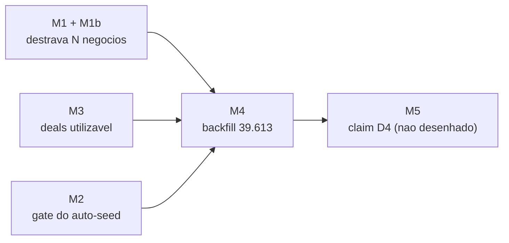

# Alterações de DB — Separação Lead ↔ Negócio

> [!danger] NADA APLICADO. Alvo é branch efêmera, nunca prod.
> Este documento é o plano de execução das migrations da **fatia 2**. Em
> 2026-07-29 prod recebeu **apenas `SELECT`** de diagnóstico (role read-only).
> Todo o estado descrito aqui foi **medido em produção**, não inferido.
>
> A fatia 1 (interface) está pronta e **não depende de nenhuma migration daqui**:
> a UI lê `pipeline_entries` e trata card de funil como negócio.

## Estado medido em prod (2026-07-29)

| Fato | Valor |
|---|---|
| `deals` | **0 linhas**, RLS ligada, 5 policies, colunas completas |
| `pipeline_entries` com `deal_id` | **0** de 39.613 |
| `uq_pipeline_entries_pipeline_lead` | **viva** |
| `idx_pipeline_entries_pipeline_lead` | **vivo** (unique parcial — 2º cadeado) |
| `trg_auto_assign_lead_default_pipe` | **ativo** |
| Grants em `deals` | `authenticated` = DML completo; `anon` = SELECT (igual `leads`/`pipeline_entries` — RLS é quem barra) |

---

## Ordem de execução e dependências



**M1+M1b e M3 são independentes entre si.** M4 depende dos três e da **decisão D3**
("o que é lead real no corte"), ainda aberta. M5 não tem desenho.

---

## M1 — Destravar N negócios por lead

**Por quê:** é o ponto de não-retorno da feature. Sem isso, a recompra — motivo de
existir da separação — continua impossível.

> [!warning] São DOIS cadeados, não um
> A constraint **e** um índice único parcial separado protegem o mesmo par de
> colunas. Dropar só a constraint (como dizia o plano original) não destrava nada:
> o índice parcial continua barrando o segundo negócio de qualquer lead.

```sql
-- 1) constraint (o índice homônimo cai junto, é o backing index dela)
ALTER TABLE public.pipeline_entries
  DROP CONSTRAINT uq_pipeline_entries_pipeline_lead;

-- 2) índice único parcial — o segundo cadeado, fácil de esquecer
DROP INDEX IF EXISTS public.idx_pipeline_entries_pipeline_lead;
```

**Rollback:** só é possível enquanto não existir lead com 2 entries no mesmo funil.

```sql
CREATE UNIQUE INDEX CONCURRENTLY idx_pipeline_entries_pipeline_lead
  ON public.pipeline_entries (pipeline_id, lead_id) WHERE lead_id IS NOT NULL;
ALTER TABLE public.pipeline_entries
  ADD CONSTRAINT uq_pipeline_entries_pipeline_lead UNIQUE (pipeline_id, lead_id);
```

**Verificação:** criar 2 negócios do mesmo lead no mesmo funil pela UI e ver os dois
aparecerem no kanban.

**Efeito colateral aceito:** `upsertPipeEntry` (`_shared/pipeline-adapter.ts`) faz
select → update → insert, **sem `ON CONFLICT`**. Sobrevive ao drop, mas sem o unique
duas chamadas concorrentes podem criar entries duplicadas. É corrida, não erro.

---

## M1b — Reescrever `bulk_move_stage` (BLOQUEANTE, mesma migration)

**Por quê:** a função usa

```sql
ON CONFLICT (pipeline_id, lead_id) DO UPDATE SET ...
```

`ON CONFLICT` com lista de colunas **exige** um índice único que as cubra. Assim que
M1 derruba os dois, a função passa a levantar **`42P10 — there is no unique or
exclusion constraint matching the ON CONFLICT specification`** em runtime.

> [!danger] Se M1 for aplicada sem M1b, o movimento em massa de etapa quebra
> Não é degradação silenciosa: é erro duro na cara do usuário, na hora.

**O que fazer:** `CREATE OR REPLACE FUNCTION public.bulk_move_stage(...)` trocando o
upsert por **UPDATE explícito** da entry alvo (o id já é conhecido no laço), ou por
`ON CONFLICT (id)`. **Ler o corpo atual antes de reescrever** — este documento não
transcreve a função inteira, só localiza o defeito.

```sql
-- localizar o trecho antes de editar
SELECT prosrc FROM pg_proc p JOIN pg_namespace n ON n.oid = p.pronamespace
WHERE n.nspname = 'public' AND p.proname = 'bulk_move_stage';
```

**Verificação:** mover 2+ cards em massa pela UI **depois** do drop, e conferir que
`sale_events`/`meeting_events` receberam os eventos.

---

## M2 — Gatear o auto-seed por org (D1 + D7)

**Por quê:** hoje `fn_auto_assign_lead_default_pipe` semeia `whatsapp/novo` em todo
lead novo — foi assim que os 39.613 cards nasceram. O D1 diz que negócio nasce só de
clique; o D7 diz que o rollout é por org, com piloto na Milennials
(`6030520a-2ca7-477d-be89-55758e2cd808`).

**Sem DDL.** A flag mora em `organizations.feature_flags` (jsonb), mesmo padrão do
`new_lead_modal_v2`. Só a função muda:

```sql
CREATE OR REPLACE FUNCTION public.fn_auto_assign_lead_default_pipe()
 RETURNS trigger LANGUAGE plpgsql SECURITY DEFINER
 SET search_path TO 'public', 'pg_temp'
AS $function$
DECLARE
  v_pipeline_id uuid;
  v_stage_exists boolean;
  v_manual_only boolean;
BEGIN
  -- (0) NOVO: org no modelo "negócio nasce só de clique" (D1) não semeia nada.
  SELECT coalesce((feature_flags->>'deal_manual_only')::boolean, false)
    INTO v_manual_only
  FROM public.organizations WHERE id = NEW.organization_id;

  IF v_manual_only THEN
    RETURN NULL;
  END IF;

  -- (resto do corpo atual, inalterado: skip 'cal', skip se já está em pipe, etc.)
  ...
END;
$function$;
```

Ligar o piloto (na branch, nunca em prod sem ordem):

```sql
UPDATE public.organizations
   SET feature_flags = coalesce(feature_flags, '{}'::jsonb)
                       || '{"deal_manual_only": true}'::jsonb
 WHERE id = '6030520a-2ca7-477d-be89-55758e2cd808';
```

**Rollback:** `feature_flags - 'deal_manual_only'`, ou `CREATE OR REPLACE` da versão
anterior. Reversível a quente, sem migration.

> [!warning] Antes de acender a flag da Milennials
> `place_in_pipe` do `lead-webhook` vira no-op nessa org (mudança de código, fora
> deste doc). São **20+ workflows n8n, um por cliente**, que colocam lead no funil
> por esse caminho. **Auditar os da Milennials antes**, senão lead entra e não
> aparece em funil nenhum.
>
> 🟠 **Cal.com continua em aberto** (D1). `origin='cal'` hoje entra direto em
> `confirmacao/reuniao_marcada`, e os lembretes D-5/D-3/D-1 dependem desse card.
> Sob manual puro, reunião marcada não gera card e o lembrete morre. Decidir antes.

---

## M3 — Deixar `deals` utilizável

Boa notícia: **não há tabela a criar.** `deals` já existe com `title`, `value`,
`currency`, `owner_id`, `source_lead_id`, `probability`, `expected_close_date`,
`closed_at`, `won`, `loss_reason_id`, `notes`, `metadata`, soft-delete
(`deleted_at`/`deleted_by`) — e a FK `pipeline_entries.deal_id → deals.id ON DELETE
SET NULL` já está no lugar.

### M3a — 🔴 Corrigir a RLS antes de acender (BLOQUEANTE)

As 5 policies usam **`get_user_organization_id()`** — a primeira org do usuário, sem
ramo de master:

| Policy | Comando | Problema |
|---|---|---|
| `deals_select` | SELECT | 1ª org apenas |
| `deals_insert` | INSERT | `WITH CHECK` na 1ª org |
| `deals_update` | UPDATE | 1ª org **e sem `WITH CHECK`** |
| `deals_delete` | DELETE | 1ª org |
| `master_select_all_deals` | SELECT | master só lê |

Dois defeitos:

1. **Mesma classe do incidente de `lead_comments`** (resolvido em prod pelo #1069):
   `get_user_organization_id()` devolve a primeira org e ignora master. Master
   operando lead de outra org vê SELECT vazio e toma violação de RLS no INSERT.
   Usuário multi-org só enxerga a primeira.
2. **`deals_update` não tem `WITH CHECK`** — a regra de migration do repo trata isso
   como escalada de privilégio: dá pra `UPDATE` mudando `organization_id` e empurrar
   o negócio pra outra org.

Corrigir espelhando `leads`:

```sql
DROP POLICY IF EXISTS deals_select ON public.deals;
DROP POLICY IF EXISTS deals_insert ON public.deals;
DROP POLICY IF EXISTS deals_update ON public.deals;
DROP POLICY IF EXISTS deals_delete ON public.deals;

CREATE POLICY deals_select ON public.deals FOR SELECT
  USING (
    deleted_at IS NULL
    AND (organization_id IN (SELECT get_my_organization_ids()) OR is_master_user())
  );

CREATE POLICY deals_insert ON public.deals FOR INSERT
  WITH CHECK (organization_id IN (SELECT get_my_organization_ids()) OR is_master_user());

CREATE POLICY deals_update ON public.deals FOR UPDATE
  USING      (organization_id IN (SELECT get_my_organization_ids()) OR is_master_user())
  WITH CHECK (organization_id IN (SELECT get_my_organization_ids()) OR is_master_user());

CREATE POLICY deals_delete ON public.deals FOR DELETE
  USING (organization_id IN (SELECT get_my_organization_ids()) OR is_master_user());
```

> [!note] Por que `get_my_organization_ids()` e não subquery inline
> É `SECURITY DEFINER` e bypassa RLS. Subquery inline em `team_members` dentro de
> policy causa **recursão infinita** quando o Realtime avalia `apply_rls()` — regra
> já documentada na CLAUDE.md raiz.

**Grants:** nada a fazer. Medido: `authenticated` já tem DML completo; `anon` tem
SELECT, exatamente como `leads` e `pipeline_entries` — quem barra é a RLS.
**Não repetir aqui o gotcha do `ALTER DEFAULT PRIVILEGES`:** conferir com
`has_table_privilege('anon', 'public.deals', 'SELECT')` e garantir que nenhuma
policy nova dê acesso a `anon`.

### M3b — Matar a segunda verdade de posição

`deals` carrega `pipeline_id` e `stage_id`, e `pipeline_entries` é o card. Manter os
dois é garantir divergência.

```sql
ALTER TABLE public.deals DROP COLUMN pipeline_id;
ALTER TABLE public.deals DROP COLUMN stage_id;
```

> [!danger] `DROP COLUMN` é irreversível sem backup
> Exige autorização explícita do CTO na sessão. Como `deals` tem **0 linhas**, o
> risco de perda de dado é nulo hoje — mas essa janela fecha assim que o M4 rodar.
> **Fazer M3b antes do M4.**

**Verificação:** `deals` sem colunas de posição, e nenhum código do repo referenciando
`deals.pipeline_id` / `deals.stage_id` (hoje `useDeals*` está vivo mas sem uso real).

---

## M4 — Backfill dos 39.613 cards

**Depende do D3, ainda aberto.** A pergunta não respondida: *o que é "lead real" no
corte* — todo card vira negócio, ou só o que passou da qualificação?

> [!danger] A armadilha que mata métrica em silêncio
> Dois triggers de `pipeline_entries` carregam `WHEN (new.lead_id IS NOT NULL)`:
> `trg_pipeline_entries_stage_event_insert` e `trg_pipeline_entries_stage_event_update`
> — são eles que alimentam `sale_events` e as métricas de etapa (ADR-0017).
>
> O de reunião (`trg_meeting_events_capture`) **não tem cláusula `WHEN`** — ele
> degrada por dentro: `fn_capture_meeting_event` faz `FROM leads l WHERE l.id =
> NEW.lead_id` e casa `me.lead_id = NEW.lead_id`. Com `lead_id` nulo, não casa nada.
>
> **Portanto: o card mantém `lead_id` preenchido E ganha `deal_id`.** Nunca esvaziar
> `lead_id`. Se esvaziar, a métrica de vendas para com `WHEN` e a de reunião para em
> silêncio — pior das duas.

Forma do backfill (org por org, começando pela Milennials):

```sql
-- 1) um negócio por card existente (título herda o nome do funil)
WITH novo AS (
  INSERT INTO public.deals (
    organization_id, title, value, owner_id, source_lead_id,
    won, closed_at, notes, metadata, created_at
  )
  SELECT
    pe.organization_id,
    p.name,
    nullif(pe.metadata->>'sale_value', '')::numeric,
    pe.assigned_to,
    pe.lead_id,
    (ps.stage_role = 'won'),
    pe.closed_at,
    pe.notes,
    jsonb_build_object('backfilled_from_entry', pe.id),
    pe.created_at
  FROM public.pipeline_entries pe
  JOIN public.pipelines p ON p.id = pe.pipeline_id
  LEFT JOIN public.pipeline_stages ps
         ON ps.organization_id = pe.organization_id
        AND ps.stage_key = pe.stage_key
  WHERE pe.deal_id IS NULL
    AND pe.lead_id IS NOT NULL
    AND pe.organization_id = :org
  RETURNING id, (metadata->>'backfilled_from_entry')::uuid AS entry_id
)
-- 2) amarra o card ao negócio SEM tocar lead_id
UPDATE public.pipeline_entries pe
   SET deal_id = novo.id
  FROM novo
 WHERE pe.id = novo.entry_id;
```

**Verificação obrigatória, antes e depois (os números têm que bater):**

```sql
SELECT count(*) FILTER (WHERE lead_id IS NULL)  AS cards_sem_lead,   -- tem que seguir igual
       count(*) FILTER (WHERE deal_id IS NULL)  AS cards_sem_deal,
       count(*)                                  AS total
FROM public.pipeline_entries WHERE organization_id = :org;

SELECT count(*) FROM public.sale_events   WHERE organization_id = :org;  -- antes = depois
SELECT count(*) FROM public.meeting_events WHERE organization_id = :org; -- antes = depois
```

**Rollback:**

```sql
UPDATE public.pipeline_entries SET deal_id = NULL WHERE organization_id = :org;
DELETE FROM public.deals
 WHERE organization_id = :org AND metadata ? 'backfilled_from_entry';
```

> [!warning] Regra do lint de métricas (ADR-0017) — o CI reprova
> `scripts/check-metric-antipatterns.sh` barra migration nova com `type = 'system'`
> como filtro, `COALESCE` encadeando 2+ chaves de atribuição, `updated_at` como
> âncora temporal e `SUM` de receita fora de `sale_events`. Backfill é caso legítimo
> de exceção pontual — usar `-- metric-lint-allow: <motivo>` na linha, nunca
> regenerar baseline às cegas.

---

## M5 — Claim do D4 ("Assumir")

**Não desenhado.** O D4 diz: o lead pertence à organização; o negócio, ao vendedor; e
um vendedor pode "assumir" o lead pra si. Hoje o botão existe na UI **sem ação
ligada** — sem isto, é botão de mentira.

Decidir antes de escrever SQL: claim é **coluna em `leads`** (simples, sem histórico)
ou **tabela própria** (auditável, permite fila e devolução)? Comissão hoje referencia
`pipeline_entries`, não o lead — então o claim é sobre atendimento, não sobre
pagamento.

---

## M6 — 🔴 Validar o org do responsável (achado do `/security-rubric`, 2026-07-29)

**O que foi medido:** as policies de `custom_pipe_entries` checam **apenas
`organization_id` da linha**; os `pipe_*` são views e não têm policy própria.
Nenhuma valida o org do membro referenciado em `responsible_id`, `sdr_id`,
`closer_id`, `sale_responsible_id`, `pre_sale_responsible_id` ou `assigned_to`.
A FK garante que o uuid **existe**, não **de quem ele é**.

**Consequência, medida e não suposta.** `team_members` tem SELECT org-scoped
(`get_my_organization_ids()` + linha própria + master), então o usuário **não
lê** o membro de fora: o join volta vazio e o responsável aparece **em branco**.
Não é vazamento de nome pelo caminho normal — é **atribuição órfã**, com métrica
por membro subcontando essas linhas.

O risco de vazamento existe pelo caminho que **bypassa RLS**: RPC
`SECURITY DEFINER` ou edge function com `service_role` (que tem
`BYPASSRLS=true` em prod) resolvendo esse nome numa resposta devolvida à org
errada. Auditar os RPCs de métrica por responsável antes de considerar fechado.

**Já existe em produção** (medido 2026-07-29):

| | |
|---|---|
| Linhas | **1.091** em `pipeline_entries` |
| Org das entries | Maria Bonita (`aad53078-…`) |
| Org do membro apontado | Mapila Alimentos (`17c46b69-…`) |
| Membro | `d72db961-…`, ainda ativo |
| Criadas em | **todas em 2026-05-06** — um único evento de import/backfill |
| Funis / membros distintos | 1 e 1 |

Um dia só, um membro só: tem cara de import que reusou id de outra org, não de
exploração.

**Não é buraco novo** — é sistêmico e vale pra todo caminho que aceita
responsável escolhido no cliente (o drawer do lead já fazia isso). O modal de
novo negócio adicionou mais uma porta, e por isso ganhou guarda de cliente em
`useAddLeadToStandardPipe` + `CrossPipePanel`. **Guarda de cliente é defesa em
profundidade, não a última linha:** quem monta a chamada direto com o próprio
token passa por cima dela.

Conserto no banco (uma das duas formas):

```sql
-- (a) trigger genérico, aplicado nas tabelas que carregam responsável
CREATE OR REPLACE FUNCTION public.fn_assert_member_same_org()
 RETURNS trigger LANGUAGE plpgsql SECURITY DEFINER
 SET search_path TO 'public', 'pg_temp'
AS $function$
DECLARE v_bad uuid;
BEGIN
  SELECT m.id INTO v_bad
  FROM public.team_members m
  WHERE m.id IN (NEW.responsible_id, NEW.sdr_id, NEW.closer_id)
    AND m.organization_id <> NEW.organization_id
  LIMIT 1;

  IF v_bad IS NOT NULL THEN
    RAISE EXCEPTION 'team_member % pertence a outra organização', v_bad;
  END IF;
  RETURN NEW;
END;
$function$;
```

> ⚠️ **Medir antes de acender.** Se já existir linha violando (troca de org de
> membro no passado, import antigo), o trigger passa a recusar `UPDATE` nessas
> linhas e quebra fluxo em produção. Rodar o inventário primeiro:
>
> ```sql
> SELECT count(*) FROM public.pipeline_entries pe
> JOIN public.team_members m ON m.id = pe.assigned_to
> WHERE m.organization_id <> pe.organization_id;
> ```

---

## Pré-requisitos de ambiente

> [!danger] O servidor de dev está APOSENTADO
> `bcfadphgsibjzivtbjvc` — decisão CTO 2026-07-22. Não usar, não deployar, não
> referenciar. O ambiente canônico é **branch efêmera de prod**.

🔴 **A guarda mecânica descrita na CLAUDE.md raiz não existe no repositório.**
Verificado em 2026-07-29:

| Artefato citado na CLAUDE.md | Estado real |
|---|---|
| `.specs/project/runbook-validacao-local.md` | **não existe** |
| `scripts/db-push-branch.sh` | **não existe** |

Hoje a única barreira entre um `db push` e a produção é disciplina — e o `.env` do
repo aponta para `jsjsmuncfkbsbzqzqhfq`, que **é prod**. Escrever o script de guarda
é pré-requisito da primeira migration, não tarefa paralela.

Sequência para validar:

1. Escrever `scripts/db-push-branch.sh` — recusa a URL se contiver o ref de prod,
   roda `--dry-run`, exige confirmação
2. `list_branches` (nunca duas) → `create_branch`
3. **`db push` do repo** — a linha do baseline no ledger é marcador de 189 chars, não
   o dump; `create_branch` sozinho replaya sobre schema vazio
4. Apontar `VITE_SUPABASE_*` para a branch **antes** de subir o front, senão o teste
   escreve em prod
5. Aplicar M1+M1b → M3a+M3b → M2, e só então M4
6. QA logado com **admin, membro e master** separadamente (a RLS do M3a é justamente
   sobre isso)
7. `delete_branch` no fim da sessão — **$0,01344/hora**, branch órfã é cobrança à toa

## O que NÃO fazer

- Não aplicar M1 sem M1b na mesma transação — quebra movimento em massa na hora
- Não esvaziar `lead_id` de `pipeline_entries` em hipótese alguma
- Não acender `deal_manual_only` em prod antes de auditar os workflows n8n da org
- Não rodar M3b (`DROP COLUMN`) depois do M4 — a janela de risco zero fecha lá
- Não usar `execute_sql`/`apply_migration` do MCP: está em `read_only` por desenho.
  Escrita de QA é `psql` na branch
