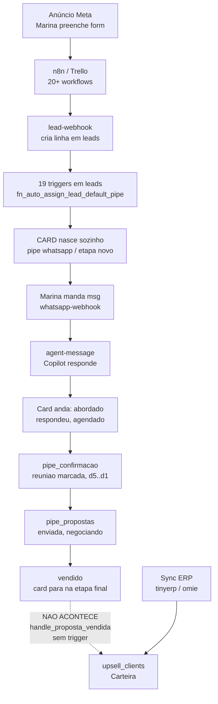
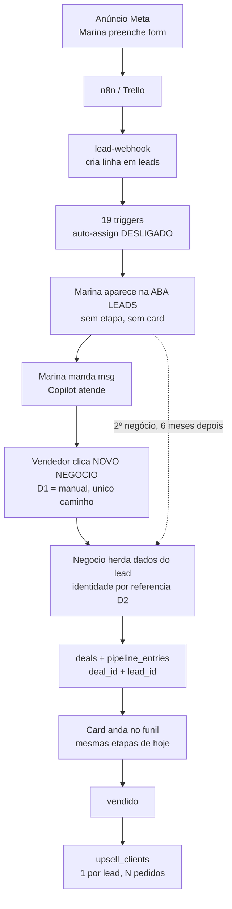

# Separação Lead ↔ Negócio — Fluxo E2E

> [!warning] PLANEJAMENTO — nada implementado, nada tocado em prod
> Documento de alinhamento. Prod recebeu só `SELECT` de contagem (role read-only).
> Localhost no ar em `http://localhost:8080/` — **aponta pro Supabase de produção**,
> logo ler é seguro, gravar grava lá.

## Como usar este doc

Duas colunas de verdade: **HOJE** (o que o código faz agora, com `arquivo:linha`) e
**ALVO** (o que passa a fazer). Onde o alvo ainda depende de você, tem um bloco
`> [!question] DECISÃO Dn` — **edite direto ali**. Todo o resto eu derivo dessas
respostas.

Referências de arquivo são clicáveis no vault e verificadas contra o repo em 2026-07-28.

---

## 1. O modelo em uma frase

**Hoje:** o lead *é* o card do funil. Uma linha em `leads`, uma etapa, um funil por vez.

**Alvo:** o lead *tem* negócios. A pessoa mora na aba Leads e nunca tem etapa; cada
venda é um Negócio, e é o Negócio que anda pelo funil.

| Conceito | Tabela | Nasce por | Cardinalidade | Tem etapa? |
|---|---|---|---|---|
| **Lead** | `leads` | trigger/ingest (n8n, webhook Meta, site, import) | 1 por pessoa/empresa | ❌ nunca |
| **Negócio** | `deals` + `pipeline_entries.deal_id` | ação do usuário (herda do lead) | N por lead | ✅ é a etapa |
| **Funil** | `pipelines` + `pipeline_entries` | — | organiza Negócios | — |

Estrutura visual do funil **não muda**: mesmas etapas, mesmo kanban, mesmas regras.
Muda só *o que é o card*.

---

## 2. O atendimento E2E — HOJE

Cenário: **Meta Ads → WhatsApp → reunião → proposta → venda → recompra.**
Cliente fictício: *Distribuidora Alfa*, contato *Marina*.



### 2.1 Entrada — o lead nasce

1. Marina preenche o formulário do anúncio. Meta → Trello → n8n (um workflow por
   cliente, 20+ em produção) → `POST /lead-webhook`.
2. `supabase/functions/lead-webhook/index.ts` faz `getOrCreateLead`, dedup por
   `normalized_phone`, aplica tags, responsável, e **opcionalmente** `place_in_pipe`
   (`index.ts:416`).
3. O `INSERT` em `leads` acorda **19 triggers**. Os que importam pra este fluxo:

| Trigger | Faz o quê |
|---|---|
| `trg_leads_normalize_phone` / `trg_leads_derive_uf` | normaliza telefone, deriva UF do DDD |
| `trg_leads_adopt_orphan_messages` | adota mensagens WhatsApp que chegaram antes do lead existir |
| `trg_workflow_lead_created` | dispara automações com gatilho `lead_created` |
| `trg_enqueue_lead_webhooks` | enfileira webhooks de saída |
| `trg_step_import_lead` | marca passo do onboarding |
| **`fn_auto_assign_lead_default_pipe`** | 🔴 **cria o card sozinho** |

4. `fn_auto_assign_lead_default_pipe`
   (`supabase/migrations/20260622180000_cal_leads_skip_whatsapp_default_pipe.sql:10`)
   decide assim: se `origin = 'cal'` → não semeia (a reunião já vem marcada); se o
   lead já está em algum pipe → não semeia; senão insere em
   `pipeline_entries (pipeline whatsapp, stage_key = 'novo')`.

> 🔴 **Este é o coração da mudança.** Hoje ninguém cria card — ele nasce. Foi assim que
> os **36.507** cards de produção apareceram (§7, medido em 2026-07-30).

### 2.2 Conversa — o Copilot atende

5. Marina manda "oi, queria preço". Uazapi → `whatsapp-webhook` (rota com secret no
   path) persiste a mensagem e chama `agent-message`
   (`whatsapp-webhook/index.ts:653`).
6. `agent-message` monta contexto (lead + conversa + business context + FAQ/RAG) e
   responde. É a área mais frágil do sistema.
7. A IA pode mover o card por `ai-action-executor` (regras de kanban).

> [!note] Copilot v2 **não está vivo**
> O roteamento por arquétipo (Qualificador/Vendedor/Carteira) via
> `_shared/copilot-v2/contact-status.ts:13` depende da função `get_contact_status`,
> que **não existe em prod** (verificado em `pg_proc`). O caminho vivo hoje é o v1:
> `whatsapp-webhook → agent-message`. Isso *ajuda* este projeto — o v2 ainda pode
> nascer já falando "negócio" em vez de "lead".

### 2.3 Movimento — o card anda

8. Vendedor arrasta o card. Update em `pipeline_entries.stage_key` acorda **13 triggers**:

| Trigger | Faz o quê |
|---|---|
| `trg_apply_stage_checklist_pipeline` | aplica checklist da etapa |
| `trg_enforce_closed_at` | carimba fechamento em etapa final |
| `trg_log_pipeline_stage_change_history` | histórico de etapa |
| `trg_meeting_events_capture` | 📊 alimenta métrica de reunião (event-sourced) |
| `trg_pipeline_entries_stage_event_insert/update` | 📊 alimenta `sale_events`/stage metrics — **só quando `lead_id IS NOT NULL`** |
| `trg_pipeline_entries_dispatch` | dispara envio automático da etapa |
| `trg_workflow_pipeline_stage_changed` | automações com gatilho `stage_changed` |
| `trg_sync_whatsapp_stage_to_lead` | espelha a etapa de volta no lead (acoplamento legado) |
| `trg_pe_snapshot_responsibles` | congela responsáveis na entrada |

> 🔴 **Armadilha de migração.** Os dois triggers de métrica só rodam
> `WHEN new.lead_id IS NOT NULL`. Se o card virar "só do negócio" e a gente esvaziar
> `lead_id`, **a métrica de vendas e de reunião para de existir — em silêncio.**
> Solução: o card mantém `lead_id` preenchido *e* ganha `deal_id`.

### 2.4 Venda — NÃO vira cliente de carteira (a carteira vem do ERP)

> [!danger] 🔴 Corrigido em 2026-07-30 — este passo NÃO acontece
> A versão anterior descrevia: *"proposta marcada `vendido` → `handle_proposta_vendida`
> insere em `upsell_clients`"*. **Não roda.** A função existe em `baseline:12258`, mas
> tem **zero triggers ligados** — verificado em `pg_trigger` tanto em **prod**
> (`jsjsmuncfkbsbzqzqhfq`) quanto na branch efêmera de QA. E **nenhuma outra função do
> schema a chama** (`pg_proc.prosrc` não a menciona em lugar nenhum). É código morto
> desde algum ponto do passado, não caminho vivo.
>
> Marcar proposta como vendida **não cria cliente de carteira hoje.**
>
> De onde vieram as **738 linhas** de `upsell_clients` (12 orgs, criadas entre
> 2026-02-23 e 2026-07-08): do **ERP**. Os escritores reais são
> `_shared/erp/sync/client-store.ts`, `omie-sync-clientes`, `tinyerp-sync-contacts` e
> `erp-order-webhook`. Carteira, hoje, é espelho de ERP — não subproduto do funil.
>
> **Por que isso importa para a separação Lead ↔ Negócio:** o plano assumia que
> "fechar negócio → vira cliente de carteira" já funcionava e só precisava sobreviver
> à migração. Não existe o que preservar. Se a carteira deve nascer da venda no funil,
> isso é **feature nova** (fatia 3), com custo próprio — não "não mexer que já está
> certo".

9. ~~Proposta marcada `vendido` → `handle_proposta_vendida` (`baseline:12258`): trava
   advisory lock, checa idempotência, e insere em `upsell_clients`.~~ *(Ver o bloco
   acima: função sem trigger, nunca executa. O corpo dela descreve a intenção do
   desenho original, não o comportamento do sistema.)*
10. `upsell_orders` + itens chegam pelo sync de ERP. Cron `calculate-portfolio-health`
    (30 min) recalcula health score, segmento (ouro/prata/novo/resgate/dormindo), ciclo
    de recompra e churn — este **está vivo** e opera sobre o que o ERP trouxe.

> 📌 **O cliente de carteira é chaveado por `lead_id`, não por negócio.** O desenho
> continua correto no modelo novo: 3 negócios ganhos do mesmo cliente = 1 linha na
> carteira, 3 pedidos. O que muda é o status: isso é **alvo**, não estado atual.

---

## 3. O atendimento E2E — ALVO



### O que muda, etapa por etapa

| Etapa | HOJE | ALVO |
|---|---|---|
| Entrada | lead nasce **e** card nasce junto | lead nasce **só na aba Leads** |
| Onde a pessoa mora | espalhada entre funil, chat e Combustível | aba Leads, tabela-verdade |
| Card do funil | é o lead | é o Negócio |
| Etapa (`stage_key`) | propriedade do lead | propriedade do Negócio |
| 2ª venda pro mesmo cliente | ❌ impossível (constraint) | ✅ 2º Negócio |
| Métrica de pipeline | mistura curioso com proposta de R$ 40 mil | lead → negócio (qualificação) e negócio → ganho (venda), separados |
| Carteira | módulo próprio no menu | faceta do lead na mesma tabela (fatia 2) |

### Bloqueio de schema — são TRÊS cadeados

```sql
-- proíbem hoje 2 cards do mesmo lead no mesmo funil
ALTER TABLE pipeline_entries DROP CONSTRAINT uq_pipeline_entries_pipeline_lead;
DROP INDEX idx_pipeline_entries_pipeline_lead;
-- o terceiro, nos funis customizados (16.176 cards / 24 orgs, 913 na Milennials)
ALTER TABLE custom_pipe_entries DROP CONSTRAINT custom_pipe_entries_pipeline_id_lead_id_key;
```

É o ponto de não-retorno da feature. *(Corrigido em 2026-07-30: esta seção se chamava
"Bloqueio único de schema" e falava em "um `DROP` de duas linhas". Faltava o cadeado de
`custom_pipe_entries` — sem ele, a recompra continua impossível justamente na org
piloto. Plano completo, com as duas funções de bulk que quebram junto:
[[lead-negocio-migrations-db]].)*

### O que já está pronto e nunca foi ligado

- `pipeline_entries.deal_id` — coluna e índice existem. **0 linhas usam**, de **36.507**
  cards (§7, medido em 2026-07-30). `custom_pipe_entries` **não tem** a coluna — é a
  **decisão F, TOMADA em 2026-07-30**: adicionar `deal_id` lá, com as **duas** pontas de
  propagação. Plano de execução: **M7** em [[lead-negocio-migrations-db]].
- `deals` — tabela completa (`title`, `value`, `pipeline_id`, `stage_id`,
  `source_lead_id`, `owner_id`, `probability`, `expected_close_date`, `won`,
  `loss_reason_id`, soft-delete). **0 linhas, 0 orgs em prod.**
- `/negocios` — página existe (`src/modules/pipelines/pages/Negocios.tsx`), gated pela
  feature `deals`, ligada em ninguém.
- Hooks `useDeals*` + componentes `deal/` — vivos no módulo `carteira`, sem uso real.

Alguém já desenhou esse modelo, shipou o schema e nunca acendeu. Também resolve a dívida
registrada em `src/modules/carteira/CLAUDE.md:143` ("Deal vs Proposta — duplicado?
decisão CTO pendente").

---

## 4. Decisões abertas — edite aqui

> [!question] DECISÃO D1 — quem abre o negócio na entrada do funil?
> **A tensão:** você disse "negócio nasce por ação do usuário" **e** "os funis
> continuam como hoje". Como hoje o card nasce sozinho (§2.1), as duas frases não
> podem valer juntas. Se o auto-assign desliga e ninguém clica, o funil de
> qualificação de 64 orgs amanhece vazio.
>
> - **(a) Clique manual.** SDR abre a aba Leads, vê Marina, clica "Novo Negócio". Puro,
>   mas adiciona um clique por lead que chega — e leads que ninguém tocou somem do radar
>   visual.
> - **(b) Auto na entrada.** Todo lead ganha 1 negócio automático. Zero mudança de hábito,
>   mas "negócio" volta a significar "lead" e a métrica nasce contaminada de novo.
> - **(c) Auto por gatilho de interesse.** O negócio nasce quando algo real acontece —
>   Marina responde no WhatsApp, ou a IA marca reunião, ou o payload do n8n manda
>   `place_in_pipe`. Lead frio que nunca respondeu fica só na aba Leads.
>
> **Minha recomendação: (c).** É a única que preserva o significado de "negócio" *e* não
> pede clique novo do vendedor. E cai bem no que já existe: `place_in_pipe` já é
> opt-in no webhook, e a IA já move card por regra de kanban.
>
> **SUA RESPOSTA (2026-07-28, superseded):** Lead Nasce no funil tanto por ads quanto por importação via planilha. No novo formato ele deve diferenciar a origem e caso seja de meta ads deverá criar negócio herdando os dados do lead. Caso seja qualquer outra origem ele apenas deve surgir dentro de leads sem criar negócio.
>
> **RESPOSTA FINAL (2026-07-29) — (a) CLIQUE MANUAL.** Negócio nasce **só** por ação do
> usuário, a partir do lead. **Ingest nunca cria negócio** — nenhuma origem, nem `meta_ads`.
> Ingest cria lead, e lead vive na aba Leads sem etapa.
>
> *Por que a regra de `origin` caiu:* a distribuição real de prod refuta. `outro` = 22.362
> (55%), `meta_ads` = 12.664 (31%), e **7 das 15 maiores orgs têm 0% `meta_ads`** (Chique
> 3.919, REALSC 2.341, Motor 100, Goletric, VitrineVET, Dolce Rosa, The Good Balloon).
> Rotear por `origin` daria funil cheio pra umas e vazio pra outras, sem relação com como
> elas vendem.
>
> **Consequências no código (fatia 2, não hoje):**
> 1. `fn_auto_assign_lead_default_pipe` deixa de semear — **gated pela flag de org do D7**,
>    nunca global. Org sem flag continua exatamente como hoje.
> 2. `place_in_pipe` do `lead-webhook` vira **no-op nas orgs com a flag**. São 20+ workflows
>    n8n (1 por cliente) que dependem dele pra colocar lead no funil. Piloto = Milennials;
>    conferir os workflows dela antes de acender.
> 3. `origin='cal'` fica **em aberto** 🟠 — Cal.com não é ingest de informação, é reunião
>    já agendada (`lead-webhook` força `confirmacao/reuniao_marcada`, e `meeting_date` é
>    obrigatório porque os lembretes D-5/D-3/D-1 dependem dele). Sob regra manual pura,
>    reunião marcada **não geraria card nenhum** e os lembretes morrem. Decidir antes de
>    codar o ingest: exceção explícita pro `cal`, ou aceitar que alguém clique.

> [!question] DECISÃO D2 — negócio herda por cópia ou por referência?
> Marina troca de telefone em setembro. O negócio fechado em março mostra o telefone novo
> ou o antigo?
>
> - **(a) Referência viva.** Negócio guarda só `lead_id`; nome/telefone/empresa sempre
>   vêm do lead. Uma verdade só.
> - **(b) Cópia no nascimento.** Negócio congela os dados de quando foi criado.
> - **(c) Híbrido.** Identidade por referência; o comercial (valor, produtos, previsão,
>   motivo de perda) é do negócio.
>
> **Minha recomendação: (c).** É o que a frase "herdar as informações do lead" quer dizer
> na prática — e é como `handle_proposta_vendida` já se comporta hoje. Cópia pura recria
> o problema que a aba Leads existe pra matar: dado de contato divergindo em três telas.
>
> **SUA RESPOSTA:** C

> [!question] DECISÃO D3 — o que acontece com os ~~39.402~~ cards que já existem?
> ~~23.748 em funis `system` (64 orgs) + 15.656 em custom (23 orgs).~~
> *(Números refutados — o real é **36.507**: 20.331 `system` / 64 orgs + 16.176 custom /
> 24 orgs, medido em 2026-07-30. Ver a errata do §7. A pergunta e a resposta do CTO ficam
> como foram feitas; só o tamanho do backfill muda.)*
>
> - **(a) Todo card vira um negócio.** Backfill 1:1. Nada some da tela de ninguém.
>   Cria ~39 mil negócios, muitos dos quais são lead frio que nunca virou venda.
> - **(b) Só o que passou da qualificação vira negócio.** Cards parados em
>   `whatsapp/novo` voltam a ser "só lead" na aba nova. Métrica nasce limpa; alguns
>   clientes veem o funil de qualificação esvaziar.
> - **(c) (a) agora, faxina depois.**
>
> **Minha recomendação: (a).** Migração que apaga card da tela do cliente gera chamado no
> mesmo dia. Backfill 1:1 é reversível; escolha de curadoria não é. A limpeza vira
> relatório, não migration.
>
> **SUA RESPOSTA:** Vamos transformar os leads atuais em negócios e mover os leads reais para a etapa de leads. MAS NÃO QUERO TOCAR EM PROD AGORA.

> [!question] DECISÃO D4 — de quem é o dono: do lead ou do negócio?
> Hoje `leads` carrega `responsible_id`, `sdr_id`, `closer_id`,
> `pre_sale_responsible_id`, `sale_responsible_id`, e o trigger
> `trg_sync_responsible_from_lead_to_pipes` espelha isso pros pipes. Com N negócios por
> lead, o vendedor A pode estar tocando o negócio de recompra enquanto o B toca o de
> outro produto.
>
> **Minha recomendação:** dono é do **negócio** (`deals.owner_id`); o lead mantém um
> "responsável pela conta" só como padrão sugerido ao criar negócio. Comissão segue o
> dono do negócio — que é o que a tabela `commissions` já quer (ela referencia
> `pipeline_entries`).
>
> **SUA RESPOSTA:** Repsonsável pelo lead é a organização e o responsável pelo negócio é o vendedor. Mas com a possibilidade de um vendedor "Claimar" aquele lead para si, tornando responsabilidade dele
 
> [!question] DECISÃO D5 — a conversa do WhatsApp pertence a quem?
> O telefone é do lead — mas se Marina tem 3 negócios abertos e escreve "e aí, como
> ficou?", o Copilot precisa saber de qual ela fala. Hoje conversa ↔ lead é 1:1 por
> telefone.
>
> - **(a) Conversa continua do lead.** Uma thread por pessoa, como é hoje. O negócio
>   aparece como contexto ("Marina tem 3 negócios abertos").
> - **(b) Conversa por negócio.** Threads separadas. Some do WhatsApp real — o cliente
>   tem uma conversa só.
>
> **Minha recomendação: (a), sem hesitar.** O WhatsApp é uma linha do tempo por pessoa;
> fingir o contrário quebra o produto. O Copilot ganha "negócios abertos deste contato"
> no contexto e desambigua perguntando, como um vendedor humano faria.
>
> **SUA RESPOSTA:** A

> [!question] DECISÃO D6 — ocultar a Carteira contradiz um ADR aceito
> `docs/adr/0005-carteira-standalone-feature.md` (Accepted, 2026-06-07) decidiu o oposto:
> Carteira top-level em `/carteira`, kanban legado deletado, flag ligada pra todas as orgs.
> E está **meio implementado** — a rota ainda é `/upsell`, não existe `/carteira` de
> lista, e as abas Base/Gestão continuam vivas (`carteira/pages/Upsell.tsx:373`).
>
> **Minha recomendação:** ADR novo que supersede o 0005, com a razão honesta — "Carteira
> não é um módulo, é um estado do lead". E a fatia 2 termina o serviço que o 0005 começou,
> em vez de deixar duas meias-implementações convivendo.
>
> **SUA RESPOSTA:** Segue com a recomendação

> [!question] DECISÃO D7 — rollout
> 30 orgs ativas. Todas de uma vez, ou flag por org com piloto na Milennials primeiro?
>
> **Minha recomendação:** flag por org. Não pela migration (essa é global e reversível),
> mas pela **UI** — a aba Leads nova e o botão "Novo Negócio" entram por flag, piloto na
> Milennials, depois 3 orgs amigas, depois geral. O ADR-0005 já ensinou o preço do
> rollout agressivo: ele mesmo lista "qualquer org que trabalhava o kanban perde o board"
> como risco aceito, e o resultado foi ficar meio implementado por medo.
>
> **SUA RESPOSTA:** flag piloto para milennials. Mas não edite nada em prod agora

> [!question] DECISÃO D8 — quem abre qual modal
> **RESPOSTA (2026-07-29, CTO):** o modal do **lead** abre **só na aba Leads**. No
> funil, o card abre o modal do **negócio**.
>
> É a consequência de interface do modelo novo: enquanto lead e card eram a mesma
> linha, fazia sentido a mesma tela servir aos dois. Deixou de fazer.
>
> **Implementado (fatia 1, sem tocar schema):**
> - `DealDetailDialog` + `DealPanelProvider` (`src/modules/leads/components/deal-detail/`).
>   Sujeito é o negócio: trilho de etapas daquele funil, valor, dias na etapa,
>   editor de reunião/orçamento. Cabeçalho traz a pessoa (herança por referência,
>   D2) e "Ver lead ↗" leva pra ficha.
> - **A coluna de atividade continua** no modal do negócio, de propósito: a
>   conversa é uma linha do tempo por pessoa (D5a) e o funil é onde o vendedor
>   trabalha o dia inteiro. Tirar chat/histórico de lá seria regressão diária.
> - 4 páginas de funil trocadas (`PipeWhatsapp`, `PipeConfirmacao`,
>   `PipePropostas`, `CustomPipeline`) — 9 pontos de abertura.
> - 7 telas fora do funil (Revisão, TabSaúde, UTMs, Disparos e os 3 kanbans de
>   Carteira) deixaram de montar o modal do lead: agora navegam pra
>   `/leads?lead=<id>` e o modal abre lá. **O modal do lead monta em um lugar só
>   no app inteiro.**
>
> 🟠 **Carteira não cabe no modal do negócio** — os cards dela vivem na tabela
> `upsell`, não em `pipeline_entries`. Por isso viraram link pra aba Leads, o que
> também é coerente com o D6 (carteira é faceta do lead, não negócio).

---

## 5. O que quebra se fizermos errado

| Risco | Por quê | Mitigação |
|---|---|---|
| 🔴 Métrica de vendas some em silêncio | `fn_capture_pipeline_stage_event` só roda `WHEN lead_id IS NOT NULL` | card mantém `lead_id` **e** ganha `deal_id` |
| 🔴 Funil amanhece vazio | D1 = manual puro: nada semeia mais | trigger só desliga **dentro da flag** (D7). Piloto Milennials; as outras 63 orgs seguem idênticas |
| 🔴 20+ workflows n8n param de colocar lead no funil | mandam `place_in_pipe`, que vira no-op na org com flag | auditar os workflows n8n da Milennials antes de acender a flag; comunicar que a entrada no funil passa a ser clique |
| 🔴 Reunião do Cal.com sem card = lembretes D-5/D-3/D-1 somem | `origin='cal'` hoje força `confirmacao/reuniao_marcada`; manual puro não cria card | 🟠 **em aberto no D1** — exceção pro `cal` ou clique obrigatório |
| 🟠 Automações `stage_changed` mudam de sujeito | passam a falar de negócio | reescrever contexto do executor |
| 🟠 Copilot perde a âncora de etapa | roteia por stage do `pipe_whatsapp` | v2 ainda não vivo — nasce já falando "negócio" |
| 🟠 ADR-0006 (follow-up) amarra Situações a `trigger_stage_keys` | as etapas mudam de dono | re-âncora na fatia 3 |
| 🟠 Duas verdades de posição | `deals.pipeline_id`/`stage_id` **e** `pipeline_entries` | `pipeline_entries` é o card; dropar as colunas de posição de `deals` |

---

## 6. Fatias

1. **Fatia 1 — aba Leads vira a verdade.** `/leads` sai da gaveta "Mais" e vira item
   primário; a tabela ganha as colunas que hoje só existem espalhadas (negócios do lead,
   posição em cada funil, estado de carteira); "Combustível" some como conceito.
2. **Fatia 2 — Negócio nasce.** `DROP` dos **três** cadeados, `deals` acesa, modal "Novo
   Negócio" herdando do lead, card do funil passa a ser o negócio, backfill dos ~36,5 mil.
   → **Plano de migrations detalhado: [[lead-negocio-migrations-db]]** (M1–M7, com os três
   cadeados de unique, as **duas** funções de bulk que o `ON CONFLICT` quebra, o
   `upsertPipeEntry` que duplica sem o unique, a RLS de `deals` a corrigir e o **M7** —
   `deal_id` em `custom_pipe_entries`, sem o qual o kanban customizado não enxerga
   negócio nenhum).
3. **Fatia 3 — Carteira absorvida** como faceta do lead; supersede do ADR-0005.
4. **Fatia 4 — re-âncora de Copilot e follow-ups.**

Ordem proposta. A fatia 1 entrega valor sozinha e não depende de nenhuma decisão aberta —
dá pra começar por ela enquanto D1–D7 amadurecem.

---

## 7. Números de prod — **re-medidos em 2026-07-30** (leitura apenas)

| Métrica | Valor | Medido em |
|---|---|---|
| Leads vivos (`deleted_at IS NULL`) | **33.181** | 2026-07-30 |
| Cards em funil (`pipeline_entries`, linhas distintas) | **36.507** | 2026-07-30 |
| — em funis `system` | 20.331 (64 orgs) | 2026-07-30 |
| — em funis custom | 16.176 (24 orgs) | 2026-07-30 |
| `custom_pipe_entries` | 16.177 — **espelhadas** em `pipeline_entries` com a mesma PK | 2026-07-30 |
| Negócios (`deals`) | **0** | 2026-07-30 |
| `pipeline_entries` com `deal_id` | **0** | 2026-07-30 |

> Base viva: as contagens oscilam por unidade entre leituras. O que não oscila é a
> relação — `custom_pipe_entries ⊂ pipeline_entries` por `id`. **Somar as duas conta o
> mesmo card duas vezes.**

> [!warning] Errata — a tabela anterior (39.402 · 23.748 · 15.656 · 32.154) estava errada
> E, pior que o número, a justificativa: uma versão intermediária deste documento escreveu
> que *"os 39.402 são o retrato de 2026-07-28"*. **Essa frase nunca foi medida**, e a base
> a contradiz.
>
> **Medido em 2026-07-30, em prod:** 35.095 das `pipeline_entries` de hoje foram criadas
> **antes** de 2026-07-28, e o total de hoje é 36.507. Para 39.402 ter sido verdade em
> 07-28, ~4,3 mil cards antigos teriam que ter sido apagados em 48 h — enquanto `leads`
> apenas cresceu no mesmo período.
>
> **Medido:** rodando hoje o join antigo — `pipeline_stages` casado só por
> `(organization_id, stage_key)`, **sem discriminar qual funil** — o lado `system` emite
> **22.939 linhas para 20.331 cards**. O lado custom é chaveado por `pipeline_id` e não
> infla, o que deixa 15.656 → 16.176 como crescimento normal.
>
> **Inferência (não medição):** é essa multiplicação, e não um retrato histórico, que
> explica os 23.748. É a mesma família de erro refutada no M4 de
> [[lead-negocio-migrations-db]].
>
> Registrado, não apagado: número inflado que ganha álibi de "retrato histórico" é como
> erro de medição vira folclore — e este repo já pagou meses por documentação que mente.
