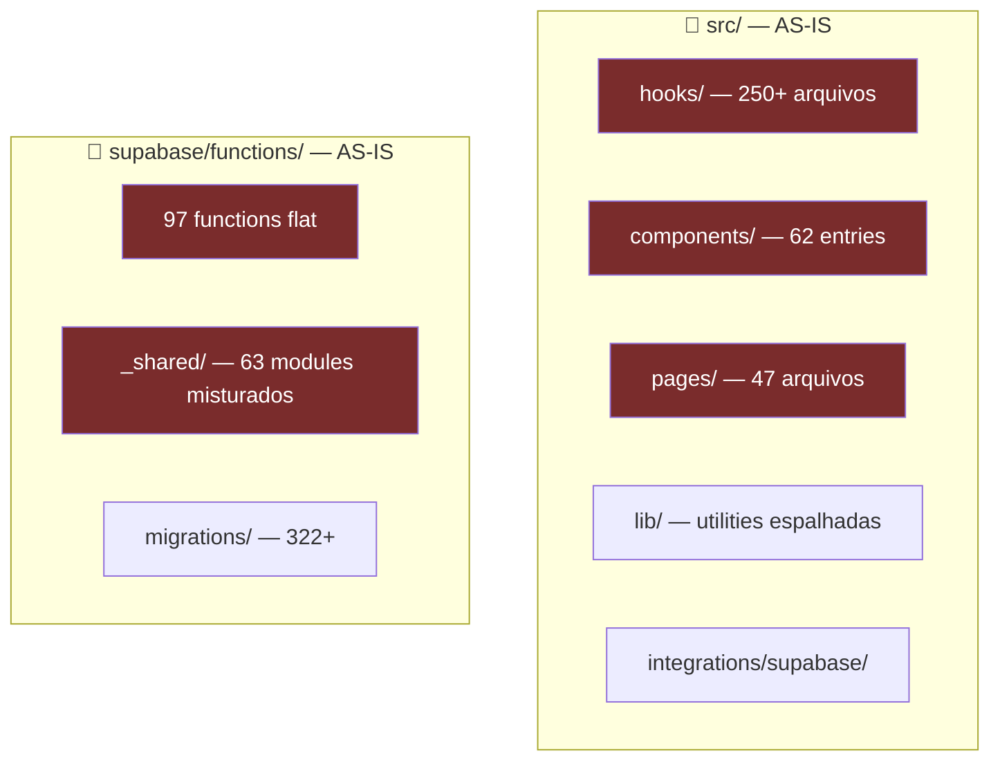
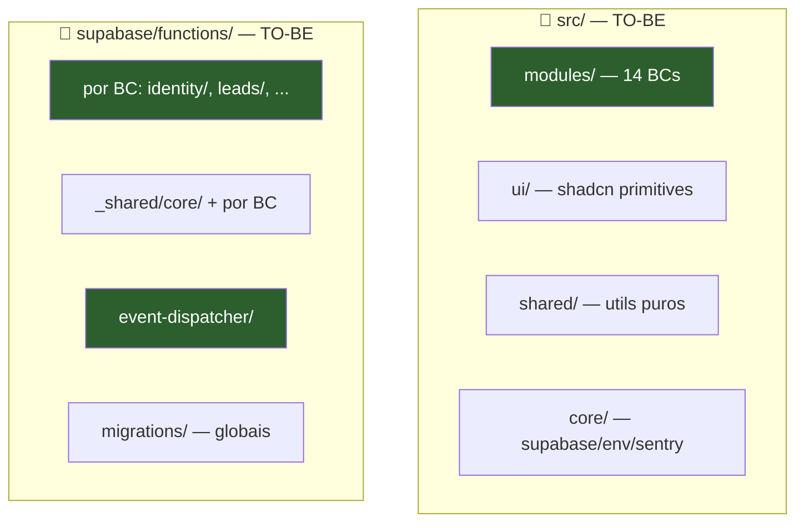
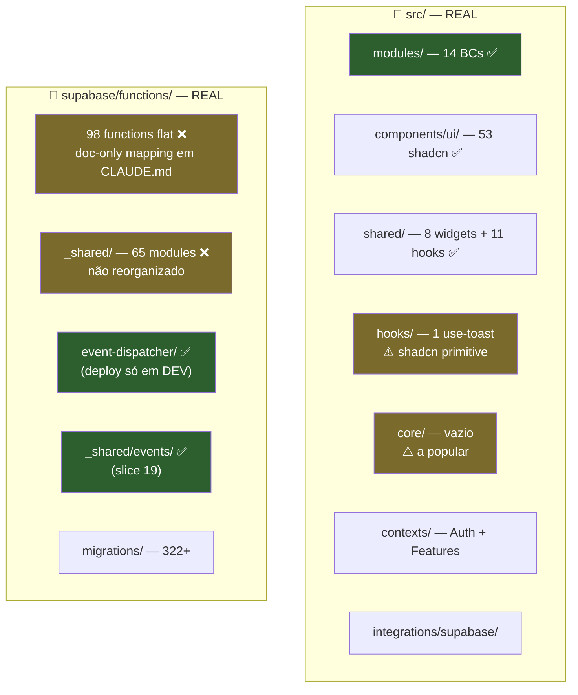
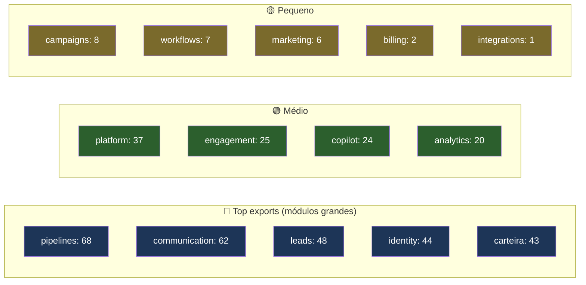
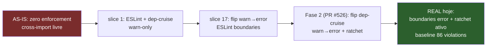
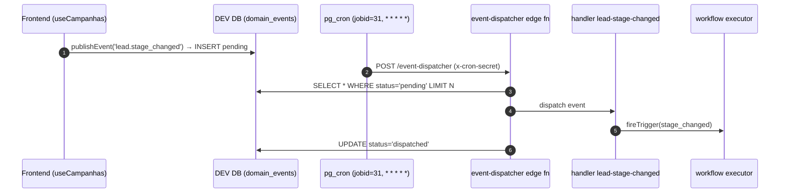
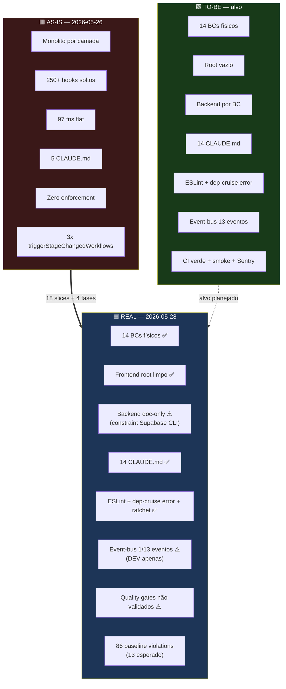

# Mapa AS-IS → TO-BE → REAL

Snapshot tridimensional da modularização Torque CRM. Doc único que mostra **de onde saímos** (as-is, 2026-05-26), **onde queríamos chegar** (to-be, planejado) e **onde chegamos** (real, 2026-05-28 pós PR #528 / Fase 4).

> [!info] Como ler
> Cada seção compara os 3 estados lado-a-lado via diagrama + tabela. Onde houver desvio entre `to-be` e `real`, há nota explicando se é trade-off explícito (✅ aceito) ou gap (⚠️ pendente).

---

## 1. Snapshot executivo

| Estado | Data | Caracterização (1 frase) |
|---|---|---|
| **AS-IS** | 2026-05-26 | Monolito por camada técnica: 250+ hooks soltos, 47 pages root, 97 edge fns flat, 5 sub-CLAUDE.md, zero boundary enforcement, `triggerStageChangedWorkflows` em 3 lugares. |
| **TO-BE** | meta | Monolito modular: 14 BCs físicos em `src/modules/<bc>/`, root vazio, backend por BC, boundary ESLint+dep-cruise+CI em error mode, event-bus com 13 eventos canônicos. |
| **REAL** | 2026-05-28 | 14 BCs físicos ✅, frontend root limpo ✅, boundary ratchet ativo ✅, backend doc-only por constraint Supabase CLI ⚠️, event-bus 1/13 eventos (piloto dev) ⚠️, 86 violations no baseline (dívida visível). |

---

## 2. Diagrama macro: estrutura do repo

### 2.1. AS-IS — Antes (2026-05-26)



### 2.2. TO-BE — Planejado



### 2.3. REAL — Hoje (2026-05-28)



> [!warning] Legenda cores
> 🟥 vermelho = problema as-is · 🟩 verde = atingido · 🟨 amarelo = trade-off ou gap

---

## 3. Tabela mestre de métricas

| Métrica | AS-IS | TO-BE | REAL | Δ vs to-be | Status |
|---|---:|---:|---:|---:|:---:|
| `src/hooks/` root (arquivos) | 250+ | 0 | 1 | +1 (`use-toast`) | ✅ |
| `src/components/` root (entries) | 62 | 0 (só `ui/`) | 1 (`ui/`) | ok | ✅ |
| `src/pages/` root | 47 | 0 | 0 | ok | ✅ |
| Hooks em `src/modules/` | 0 | ~250 | 244 | ok | ✅ |
| Components em `src/modules/` (recursive) | 0 | ~600 | 624 | ok | ✅ |
| Pages em `src/modules/` | 0 | ~47 | 57 | ok | ✅ |
| `supabase/functions/` root | 97 | 0 (por BC) | 98 | +98 | ❌ doc-only |
| `_shared/` entries | 63 | ~10 (só `core/`) | 65 | +55 | ❌ doc-only |
| Sub-CLAUDE.md (módulos) | 5 (críticos) | 14 (todos) | 14 | ok | ✅ |
| BCs físicos | 0 | 14 | 14 | ok | ✅ |
| Boundary enforcement | nenhum | ESLint+dep-cruise+CI | ESLint+dep-cruise+CI ratchet | ok | ✅ |
| ESLint boundaries mode | warn (default) | error | error (slice 17) | ok | ✅ |
| dep-cruise mode | n/a | error + ratchet | error + ratchet (Fase 2) | ok | ✅ |
| Ciclos `no-circular` no baseline | 13 (estimado) | 0 | 63 | +63 | ⚠️ dívida visível |
| Orphans `no-orphans` no baseline | indeterminado | 0 | 23 | +23 | ⚠️ dívida visível |
| `triggerStageChangedWorkflows` call sites | 3 | 1 | **0** (deletado Fase 4) | -1 | ✅ superou |
| Event-bus eventos canônicos | 0 | 13 | 1 (`lead.stage_changed`) | -12 | ⚠️ piloto |
| Tabela `domain_events` | não existe | dev + prod | dev ✅ / prod ❌ | parcial | ⚠️ Fase 5 |
| `event-dispatcher` edge fn | não existe | dev + prod | dev ✅ / prod ❌ | parcial | ⚠️ Fase 5 |
| Cron `*/1 * * * *` event-dispatcher | não | dev + prod | dev ✅ / prod ❌ | parcial | ⚠️ Fase 5 |

---

## 4. Mapa por módulo (14 BCs)

### 4.1. Definição AS-IS → TO-BE → REAL

| # | BC | AS-IS (origem) | TO-BE (alvo) | REAL (slice) | Status |
|---|----|----------------|--------------|--------------|:---:|
| 1 | **identity** | `auth.ts`, `user-auth.ts`, `master-*`, 9 admin fns | `modules/identity/` (Org+Team+Role+Permission) | slice 3 — 44 exports | ✅ |
| 2 | **leads** | `hooks/lead/`, `lead-detail/`, 4 hooks histórico | `modules/leads/` (Lead) | slice 4 — 48 exports | ✅ |
| 3 | **pipelines** | 6 pastas duplicadas + 16 hooks `usePipe*` | `modules/pipelines/` (Pipeline+Stage+Entry) | slice 5 — 68 exports | ✅ (dual model mantido) |
| 4 | **communication** | `chat/`, `chat-meta/`, mass send espalhado | `modules/communication/` (Conversation+Message+Instance) | slice 6 — 62 exports | ✅ |
| 5 | **copilot** | 12 fns + 5 `_shared/` + hooks dispersos | `modules/copilot/` (Agent+Pause+Oraculo) | slice 7 — 24 exports | ✅ |
| 6 | **workflows** | DAG components + 3 sites `triggerStageChangedWorkflows` | `modules/workflows/` (DAG+Triggers) | slice 8 — 7 exports | ✅ |
| 7 | **campaigns** | `campanhas/` (PT) + `pages/campaigns/` (EN) | `modules/campaigns/` (Campaign+Mass Send) | slice 9 — 8 exports | ✅ |
| 8 | **carteira** | 4 pastas (`client`, `upsell`, `proposal`, `deal`) | `modules/carteira/` (Client+Order+Upsell) | slice 10 — 43 exports | ✅ |
| 9 | **engagement** | 8 sub-pastas distintas | `modules/engagement/` (Checklist+Activity+...) | slice 11 — 25 exports | ✅ |
| 10 | **analytics** | 6 pastas duplicadas (Analytics/Dashboard) | `modules/analytics/` (Dashboard+Metric+Cohort) | slice 12 — 20 exports | ✅ |
| 11 | **billing** | `subscription/`, `useCouponValidation`, `lib/subscription.ts` | `modules/billing/` (Subscription+Asaas) | slice 13 — 2 exports | ✅ (small surface) |
| 12 | **marketing** | `LeadForm*`, landing | `modules/marketing/` (Lead Form+Landing+UTM) | slice 13 — 6 exports | ✅ |
| 13 | **integrations** | espalhado em edge fns | `modules/integrations/` (provider adapters) | slice 13 — 1 export | ✅ (small surface) |
| 14 | **platform** | onboarding, settings, features, observability dispersos | `modules/platform/` (Onboarding+Settings+...) | slice 14 — 37 exports | ✅ |

### 4.2. Surface real por módulo



> [!note] Tamanho ≠ saúde
> `workflows` tem 7 exports porque types ficam em `@/types/workflow` (consolidação prevista slice 16). `billing` e `integrations` pequenos por decisão "alvo de expansão" registrada na fase 4.

---

## 5. Mapa backend (edge functions)

### 5.1. AS-IS → TO-BE → REAL

| Categoria | AS-IS | TO-BE | REAL |
|---|---|---|---|
| Layout `supabase/functions/` | flat, 97 fns root | por BC: `identity/`, `leads/`, ... | flat, 98 fns root + **CLAUDE.md doc-only mapping** ⚠️ |
| `_shared/` | 63 modules misturados | `core/` + por BC | 65 entries, não reorganizado ⚠️ |
| Slice 19 piloto | n/a | `event-dispatcher/` + `_shared/events/` | ✅ ambos existem |

### 5.2. Razão do trade-off

> [!important] Por que backend ficou doc-only
> Supabase CLI exige flat layout em `supabase/functions/` — não suporta subpastas por BC. Mover physically quebra `supabase functions deploy <fn>`. Slice 15 decidiu fazer mapping doc-only em `supabase/functions/CLAUDE.md` mostrando qual fn pertence a qual BC. **Trade-off explícito**, não bug. Revisitar quando Supabase suportar nested layout.

### 5.3. Distribuição doc-only por BC

| BC               |                              Edge fns mapeadas |
| ---------------- | ---------------------------------------------: |
| identity         |                9 (master, admin, invite, etc.) |
| communication    |          ~20 (whatsapp, meta, mass-send, etc.) |
| copilot          |         13 (agent-message, oraculo, ai-action) |
| workflows        |          3 (process-workflow-executions, etc.) |
| campaigns        |               3 (campaign-rule-dispatch, etc.) |
| carteira         |                               3 (tinyerp sync) |
| integrations     | ~13 (google-calendar, asaas, elevenlabs, etc.) |
| platform         |                      ~10 (cron, observability) |
| event-dispatcher |                                   1 (slice 19) |
| Total            |                    96 mapeadas + 2 outras = 98 |

---

## 6. Boundary enforcement

### 6.1. Evolução AS-IS → TO-BE → REAL



### 6.2. Baseline de violations (REAL)

| Regra | Count | Categoria principal |
|---|---:|---|
| `no-circular` | 63 | identity intra-BC (26), communication intra-BC (17), leads intra-BC (8), 9 cross-module |
| `no-orphans` | 23 | arquivos sem importadores |
| **Total** | **86** | |

> [!warning] Plano subestimou ciclos
> `02-solucao/boundary-enforcement.md` mencionava "13 ciclos pré-existentes". Real medido = 63. Diferença provável: movimentação de arquivos durante slices 3-16 criou ciclos transitórios. Ratchet bloqueia regressão, redução incremental documentada em [[04-execucao/reducao-deep-imports]].

---

## 7. Event-bus

### 7.1. Evolução AS-IS → TO-BE → REAL

| Item | AS-IS | TO-BE | REAL |
|---|---|---|---|
| Eventos canônicos | 0 | 13 (`lead.*`, `message.*`, `workflow.*`, ...) | **1** (`lead.stage_changed`) |
| Tabela `domain_events` | não existe | DEV + PROD | DEV ✅ / PROD ❌ |
| Edge `event-dispatcher` | não existe | deployada DEV + PROD | DEV ✅ / PROD ❌ |
| Cron `*/1 * * * *` | n/a | DEV + PROD | DEV ✅ jobid=31 / PROD ❌ |
| `_shared/events/` (types + publish + dispatch + registry + handlers) | n/a | criado | ✅ 5 arquivos |
| `publishEvent()` wrapper client | n/a | criado | ✅ `src/integrations/supabase/events.ts` |
| Call sites migrados | 0 | 30-50 | 1 (`useCampanhas:823`) |
| `triggerStageChangedWorkflows` | 3 lugares (bug backlog) | 1 lugar | **0** (deletado Fase 4) |

### 7.2. Pipeline operacional REAL (DEV)



> [!note] Smoke validado
> INSERT manual → `status=dispatched` em ~11s. Cron 100% succeeded nos primeiros 13 runs. Doc completo em [[04-execucao/event-bus-dev-validation]].

### 7.3. Eventos pendentes (12)

```
lead.created, lead.updated, lead.assigned, lead.tag_added, lead.tag_removed
message.received, message.sent
workflow.step_executed, workflow.completed, workflow.failed
campaign.dispatched, campaign.completed
conversation.read, instance.session_died
order.created, order.approved
human_pause.requested, human_pause.released
```

Expansão = projeto separado pós-modularização. Sem ETA.

---

## 8. Dedup AS-IS → TO-BE → REAL

| Item | AS-IS | TO-BE | REAL | Δ |
|---|---|---|---|:---:|
| `useLeadHistory` + `useLeadTimeline` + `useFieldChangelog` + `useFieldChanges` | 4 hooks divergentes | consolidar em `useLeadTimeline` | migrados pra `leads/hooks/` mas **coexistem** | ⚠️ parcial |
| `useCopilotToggle*` (3) | 3 toggles | 1 composable | ❓ não validado | ⚠️ |
| `useRealtimeChannel*` (3) | 3 hooks | 1 canônico (`useRealtimeSubscription`) | ✅ canônico em `shared/realtime` | ✅ |
| Auth helpers | espalhados | consolidados em `identity` | ✅ | ✅ |
| `usePipe*` vs `usePipeline*` (16) | dual mexido | unificar | **mantido dual** (decisão CLAUDE.md pipelines) | ✅ trade-off |
| `MockupChat*` (4 variantes + filename corrompido) | duplicatas órfãs | deletar | ❓ status indeterminado | ⚠️ |
| Pages órfãs | espalhadas | deletadas | ✅ slice 5 | ✅ |
| Dev/test edge fns | `test-workflow-system` etc. | deletar | ⚠️ `test-workflow-system` ainda existe | ⚠️ |

---

## 9. Documentação

| Doc | AS-IS | TO-BE | REAL |
|---|:---:|:---:|:---:|
| `CLAUDE.md` raiz | ✅ | ✅ | ✅ |
| `AGENTS.md` raiz | ❌ | ✅ | ✅ |
| `llms.txt` raiz | ❌ | ✅ | ✅ |
| Sub-CLAUDE.md módulos | 5/14 | 14/14 | 14/14 ✅ |
| Vault `02 — Arquitetura/Modulos.md` | ❌ | ✅ | ✅ |
| MOC `10 — Remodelagem` status | em curso | concluido | concluido ✅ |
| ADR de conclusão | n/a | criado | ✅ `ADR-2026-05-28-modularizacao-conclusao` |
| Roadmap pós-modularização | n/a | criado | ✅ 6 fases mapeadas |

---

## 10. Qualidade

| Critério to-be | Real | Status |
|---|---|:---:|
| CI verde (lint + typecheck + unit + integration + e2e) | Lint+Build ✅ / Unit 42 red / Integration red / E2E red / Edge red | ❌ (pré-existentes) |
| Bundle delta ±5% vs main | ❓ não medido | ❓ |
| Smoke end-to-end (8 fluxos) | checklist existe, **não executado** | ❌ |
| Sentry sem aumento error rate | ❓ não monitorado dedicadamente | ❓ |
| Não-regressão pixel | ✅ | ✅ |
| Zero schema DB | ✅ (até Fase 4) | ✅ |
| Zero mudança provider | ✅ | ✅ |

---

## 11. Mapa visual final — onde estamos



---

## 12. Pendências (gap to-be → real)

### Fechado nesta sessão

- [x] CI baseline destravado (Fase 1, PR #525)
- [x] Boundary enforcement real via ratchet (Fase 2, PR #526)
- [x] Event-bus setup + smoke em DEV (Fase 3, PR #527 draft)
- [x] Dead code `triggerStageChangedWorkflows` deletado (Fase 4, PR #528)
- [x] Integrations + Billing CLAUDE.md com decisão "mantido separado"

### Pendente (roadmap pós-modularização)

- [ ] Fase 3 monitoria 24h fechar (2026-05-29 ~16:30 UTC)
- [ ] Fase 5 deploy prod (migration + edge fn + cron + frontend)
- [ ] Fase 6 PR `develop → main` (release modularização inteira)
- [ ] Smoke E2E `smoke-pre-develop-to-main.md` executar
- [ ] Sentry capture no `publishEvent.catch` (1 linha)
- [ ] Bundle delta medir

### Fora do roadmap atual (projetos separados)

- [ ] Reduzir 86 violations do baseline (sprints A-E em [[reducao-deep-imports]])
- [ ] Expansão event-bus 12 eventos restantes
- [ ] `events.ts` por módulo (princípio 5 do to-be)
- [ ] Backend physical reorg (aguarda Supabase suportar nested layout)
- [ ] Consolidar `useLeadHistory` + `useLeadTimeline` + `useFieldChangelog`
- [ ] Auditar `MockupChat*` órfãos
- [ ] Deletar `test-workflow-system` edge fn dev
- [ ] CI red baseline (27 files / 42 tests) — reabilitar gates

---

## 13. Veredicto final

| Camada | Assertividade | Comentário |
|---|---:|---|
| Estrutura física frontend | **95%** | Quase perfeita |
| Estrutura física backend | **30%** | Doc-only por constraint técnico válido |
| Tooling boundaries | **100%** | Stack completo + ratchet |
| Event-bus | **15%** | Piloto OK, 12 eventos pendentes |
| Dedup | **70%** | Maioria absorvida, exceções documentadas |
| Documentação | **100%** | Vault + ADR + MOC |
| Quality gates | **40%** | CI vermelho pré-existente + smoke não executado |
| **Global** | **~75-85%** | Sólida com dívidas visíveis |

> [!success] Tese central entregue
> 14 BCs físicos com boundary enforcement real = `monolito-modular.md` materializado. Onde furou (event-bus expansão, backend reorg, smoke) está **visível e rastreado**, não escondido. Caminho de redução documentado em todas as áreas com dívida.

---

## Refs

- [[01-as-is/panorama-atual]] — diagnóstico inicial
- [[01-as-is/problemas-criticos]] — problemas listados
- [[01-as-is/duplicatas-mapeadas]] — inventário duplicatas
- [[02-solucao/monolito-modular]] — decisão arquitetural
- [[02-solucao/bounded-contexts]] — definição dos 14 BCs
- [[02-solucao/boundary-enforcement]] — stack tooling
- [[02-solucao/event-bus]] — design event-bus
- [[03-to-be/estrutura-final]] — alvo físico
- [[03-to-be/principios-modulo]] — 10 princípios
- [[03-to-be/criterios-sucesso]] — critérios de sucesso
- [[04-execucao/analise-pos-modularizacao]] — análise pragmática pós-slices
- [[04-execucao/reducao-deep-imports]] — processo de redução do baseline
- [[04-execucao/event-bus-dev-validation]] — smoke e monitoria DEV
- [[04-execucao/roadmap-pos-modularizacao/_INDEX]] — roadmap 6 fases
- [[04-execucao/smoke-pre-develop-to-main]] — checklist smoke pré-prod
