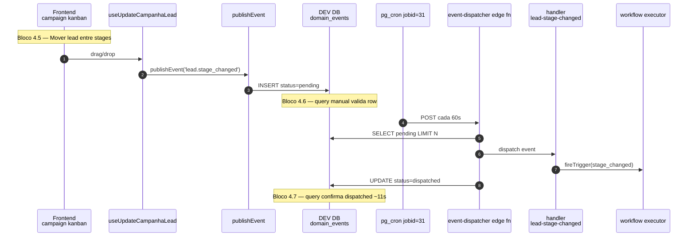
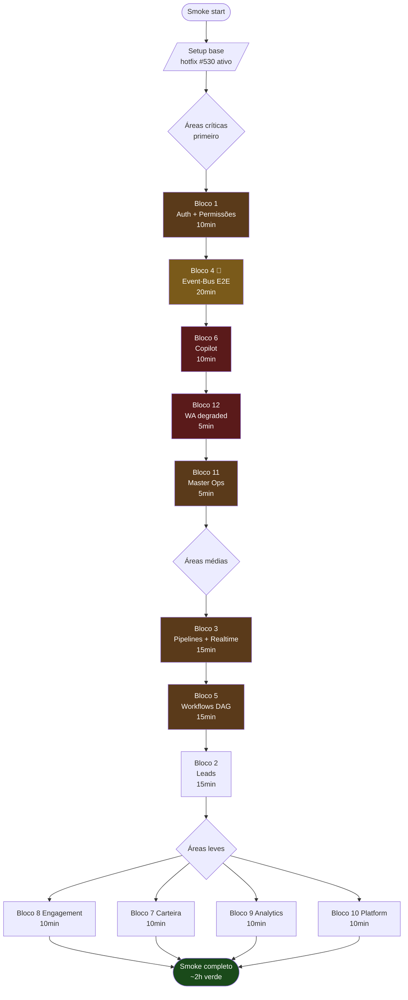
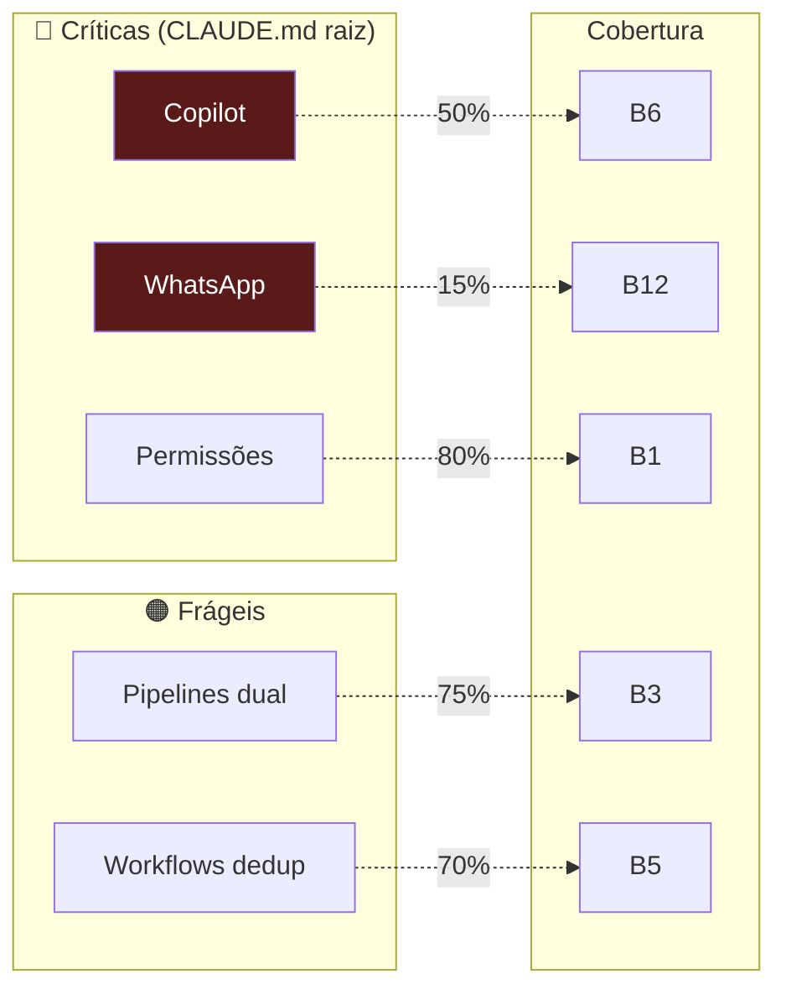

# Smoke roteiro sem WhatsApp — mapa visual

Roteiro de smoke pré-Fase-5 (deploy prod) **sem Uazapi conectada**. Cobre 11/14 bounded contexts em ~2h. WhatsApp validado apenas em modo degradado (empty states).

> [!info] Quando usar
> Smoke local antes de promover frontend prod (EasyPanel). Bug encontrado em qualquer bloco crítico → adiar Fase 5. Sexta 17h prod continua não.

---

## 1. Mapa principal — blocos × módulos

```mermaid
graph TB
    subgraph IDENTITY["🟠 identity — área frágil"]
        B1["Bloco 1<br/>━━━━━━━━<br/>Auth + Permissões<br/>3 camadas<br/>━━━━━━━━<br/>10min"]
        B11["Bloco 11<br/>━━━━━━━━<br/>Master Ops<br/>(testa fix #530)<br/>━━━━━━━━<br/>5min"]
    end

    subgraph LEADS["🟢 leads"]
        B2["Bloco 2<br/>━━━━━━━━<br/>CRUD + Tags<br/>Import + Bulk<br/>━━━━━━━━<br/>15min"]
    end

    subgraph PIPELINES["🟠 pipelines — dual model"]
        B3["Bloco 3<br/>━━━━━━━━<br/>Kanban<br/>Realtime multi-tab<br/>━━━━━━━━<br/>15min"]
    end

    subgraph COMMUNICATION["🔴 communication — crítico"]
        B12["Bloco 12<br/>━━━━━━━━<br/>WA Degraded<br/>(sem instance)<br/>━━━━━━━━<br/>5min"]
    end

    subgraph COPILOT["🔴 copilot — crítico"]
        B6["Bloco 6<br/>━━━━━━━━<br/>Agentes CRUD<br/>Oráculo<br/>━━━━━━━━<br/>10min"]
    end

    subgraph WORKFLOWS["🟠 workflows — frágil"]
        B5["Bloco 5<br/>━━━━━━━━<br/>DAG Editor<br/>Execuções<br/>━━━━━━━━<br/>15min"]
    end

    subgraph CAMPAIGNS["🟢 campaigns — event-bus piloto"]
        B4["Bloco 4<br/>━━━━━━━━<br/>🎯 Event-Bus E2E<br/>publishEvent<br/>━━━━━━━━<br/>20min"]
    end

    subgraph CARTEIRA["🟢 carteira"]
        B7["Bloco 7<br/>━━━━━━━━<br/>Clientes + Upsell<br/>━━━━━━━━<br/>10min"]
    end

    subgraph ENGAGEMENT["🟢 engagement"]
        B8["Bloco 8<br/>━━━━━━━━<br/>Agenda + Metas<br/>Gamificação<br/>━━━━━━━━<br/>10min"]
    end

    subgraph ANALYTICS["🟢 analytics"]
        B9["Bloco 9<br/>━━━━━━━━<br/>Dashboards<br/>TV view<br/>━━━━━━━━<br/>10min"]
    end

    subgraph PLATFORM["🟢 platform"]
        B10["Bloco 10<br/>━━━━━━━━<br/>Settings<br/>CMD+K<br/>━━━━━━━━<br/>10min"]
    end

    subgraph GAP["⚠️ Sem bloco dedicado"]
        GAP1["billing<br/>(2 exports)"]
        GAP2["marketing<br/>(6 exports)"]
        GAP3["integrations<br/>(1 export)"]
    end

    subgraph CROSS["🔍 Cross-cutting contínuo"]
        B13["Bloco 13<br/>━━━━━━━━<br/>Bug Hunt<br/>Console + Network<br/>━━━━━━━━<br/>durante todos"]
    end

    style IDENTITY fill:#5a3a1a,color:#fff
    style PIPELINES fill:#5a3a1a,color:#fff
    style COMMUNICATION fill:#5a1a1a,color:#fff
    style COPILOT fill:#5a1a1a,color:#fff
    style WORKFLOWS fill:#5a3a1a,color:#fff
    style LEADS fill:#1a4a1a,color:#fff
    style CAMPAIGNS fill:#1a4a1a,color:#fff
    style CARTEIRA fill:#1a4a1a,color:#fff
    style ENGAGEMENT fill:#1a4a1a,color:#fff
    style ANALYTICS fill:#1a4a1a,color:#fff
    style PLATFORM fill:#1a4a1a,color:#fff
    style GAP fill:#3a3a1a,color:#fff
    style CROSS fill:#1a3a4a,color:#fff
```



> [!warning] Legenda criticidade
> 🔴 crítica (área frágil CLAUDE.md raiz) · 🟠 área frágil declarada no módulo · 🟢 normal

---

## 2. Fluxo event-bus (Bloco 4 — o mais crítico)



---

## 3. Ordem de execução recomendada (criticidade)



---

## 4. Cobertura por módulo

| BC | Bloco(s) | Tempo | Cobertura % | Gap |
|----|----------|------:|------------:|-----|
| **identity** | 1 + 11 | 15min | 80% | Sem signup novo, sem org-claim invite |
| **leads** | 2 | 15min | 70% | Sem enrichment automático |
| **pipelines** | 3 | 15min | 75% | Custom pipelines superficial |
| **communication** | 12 | 5min | **15%** | Sem chat real, sem mass send, sem webhook inbound |
| **copilot** | 6 | 10min | 50% | Sem conversa real (depende Uazapi) |
| **workflows** | 5 | 15min | 70% | Sem trigger ativo end-to-end |
| **campaigns** | 4 | 20min | 85% | Bloco mais coberto (event-bus crítico) |
| **carteira** | 7 | 10min | 60% | Sem TinyERP push real |
| **engagement** | 8 | 10min | 70% | OK |
| **analytics** | 9 | 10min | 75% | OK |
| **billing** | — | — | **0%** | ⚠️ não testado |
| **marketing** | — | — | **0%** | ⚠️ não testado |
| **integrations** | — | — | **0%** | ⚠️ não testado |
| **platform** | 10 | 10min | 70% | OK |

**Cross-cutting**: Bloco 13 (bug hunt) ativa durante todos.

---

## 5. Áreas frágeis × cobertura



> [!warning] Gap principal
> WhatsApp **15%** (Uazapi off). Risco residual pra Fase 5 = **alto** se algum bug WA específico só aparecer com instance real conectada.

---

## 6. Sugestões de gaps a fechar (se tempo permitir)

| # | Bloco extra | O que testar | Tempo |
|---|-------------|--------------|------:|
| 14 | **billing** | `/configuracoes` tab assinatura, OverdueBanner em org sem plano, cupom validation | 5min |
| 15 | **marketing** | `/marketing` (redirect dashboard), criar Lead Form (se rota existir), UTM tracking | 5min |
| 16 | **integrations** | Google Calendar sync (`useGoogleCalendar` se conectado), TinyERP order push (dry-run) | 10min |
| 17 | **WhatsApp 50%** | Conectar Uazapi sandbox antes do prod = cobertura 50% (não 15%) | 30min setup + 30min test |

---

## 7. Detalhamento dos blocos

### Setup base (5min)

- [ ] App carregando em `localhost:8080` (hotfix #530 aplicado)
- [ ] Login com user **admin** da Milennials (`6030520a-2ca7-477d-be89-55758e2cd808`) OU org de teste
- [ ] Console DevTools aberto pra capturar erros runtime
- [ ] Network tab pra ver requests Supabase/edge fns

### Bloco 1 — Identity + Auth (10min)

Cobre área frágil 🟠 permissões 3 camadas.

| # | Rota | Ação | Esperado |
|---|------|------|----------|
| 1.1 | `/auth` | Login admin | redirect `/dashboard`, header com nome+org |
| 1.2 | `/dashboard` | Verificar widgets | KPIs renderizam, zero console error |
| 1.3 | Sidebar | Clicar OrgSwitcher (se múltiplas orgs) | troca org, queries refetcham |
| 1.4 | `/equipe` | Lista team members | tabela renderiza, master flag visível |
| 1.5 | `/equipe` | Editar permissões de membro | save persiste, role matrix carrega |
| 1.6 | logout → login membro | Tentar `/master` | 403/redirect (gate funciona) |
| 1.7 | login membro | Tentar `/equipe/edit` | botões edit hidden |

### Bloco 2 — Leads (15min)

| # | Rota | Ação | Esperado |
|---|------|------|----------|
| 2.1 | `/leads` | Lista carrega | scroll virtual funciona, paginação OK |
| 2.2 | `/leads` | Criar lead novo | modal abre, save → realtime list update |
| 2.3 | `/leads/:id` | Abrir detail | tabs (info/timeline/tags/checklist) carregam |
| 2.4 | detail | Adicionar tag | tag aparece sem F5 (realtime) |
| 2.5 | detail | Editar campo | autosave persiste |
| 2.6 | `/leads` | Bulk select 3 leads | bulkbar aparece, ações funcionam |
| 2.7 | `/leads` | Import CSV (template) | upload + preview + import |
| 2.8 | `/lixeira` | Restaurar lead deletado | restore + back na lista |
| 2.9 | `/duplicatas` | Lista duplicatas | merge funciona |

### Bloco 3 — Pipelines (15min) — **🔑 área frágil 🟠 dual model**

| # | Rota | Ação | Esperado |
|---|------|------|----------|
| 3.1 | `/pipe-whatsapp` | Kanban renderiza | colunas por stage_key, leads visíveis |
| 3.2 | kanban | Drag lead entre stages | mutate persiste, kanban update realtime |
| 3.3 | **2 abas + kanban** | Mover em aba A, ver aba B | propagação <3s (realtime test) |
| 3.4 | `/pipe-confirmacao` | Idem | idem |
| 3.5 | `/pipe-propostas` | Mover lead pra "vendido" | trigger automação follow-up |
| 3.6 | `/funis` | Custom pipeline list | CRUD custom pipeline |
| 3.7 | custom pipe detail | Configurar stages | reorder DnD, save persiste |
| 3.8 | `/negocios` | Tabela negócios | filtros, ordenação |

### Bloco 4 — Campaigns + Event-bus (20min) — **🔑 exercita publishEvent**

| # | Rota | Ação | Esperado |
|---|------|------|----------|
| 4.1 | `/campanhas` | Lista | renderiza |
| 4.2 | `/campanhas` | Criar campanha qualificacao | modal wizard completo (objetivo+agente+stages+meta) |
| 4.3 | `/campanhas/:id` | Kanban da campanha | stages + viewers panel |
| 4.4 | campanha detail | Adicionar lead | lead aparece em "novo" |
| 4.5 | campanha detail | **Mover lead entre stages** | exerce `useUpdateCampanhaLead` → `publishEvent('lead.stage_changed')` em `domain_events` DEV |
| 4.6 | dev DB query | Validar evento inserido | INSERT new row em `domain_events` (org/lead/payload corretos) |
| 4.7 | aguardar 60s | Cron processa | row `status='dispatched'`, `dispatched_at` populado |
| 4.8 | campanha detail | Configurar dispatch rules | save persiste (não dispara — Uazapi off) |
| 4.9 | campanha detail | Tab analytics | métricas carregam |

**Query monitoria evento-bus:**

```sql
SELECT id, event_type, aggregate_type, status, dispatched_at, last_error
FROM public.domain_events
WHERE event_type = 'lead.stage_changed'
ORDER BY published_at DESC LIMIT 5;
```

### Bloco 5 — Workflows (15min) — **🔑 área frágil 🟠**

| # | Rota | Ação | Esperado |
|---|------|------|----------|
| 5.1 | `/automacoes` | Lista workflows | tabela carrega |
| 5.2 | `/automacoes` | Criar novo | editor xyflow abre |
| 5.3 | editor | Drag trigger `stage_changed` | node aparece |
| 5.4 | editor | Conectar action (delay+send_template) | edge desenha |
| 5.5 | editor | Save | persiste DB |
| 5.6 | workflow list | Toggle on/off | status muda |
| 5.7 | `/automacoes/:id/execucoes` | Execuções recentes | lista, drill-down steps |
| 5.8 | `/templates` | Templates workflows | clone funciona |

### Bloco 6 — Copilot (10min) — **🔑 área 🔴 crítica**

Sem chat real (Uazapi off), testar CRUD + UI.

| # | Rota | Ação | Esperado |
|---|------|------|----------|
| 6.1 | `/copilot` | Lista agentes | renderiza |
| 6.2 | `/copilot` | Criar agente qualificador | wizard completo |
| 6.3 | agent detail | Editar personality + business_context | save persiste |
| 6.4 | agent detail | Tab capabilities | toggles funcionam |
| 6.5 | agent detail | Tab kanban rules | regras editáveis |
| 6.6 | agent detail | Toggle on | status active |
| 6.7 | Oraculo Comercial | Abrir consulta | UI renderiza (resposta IA pode demorar) |

### Bloco 7 — Carteira (10min)

| # | Rota | Ação | Esperado |
|---|------|------|----------|
| 7.1 | `/upsell` | Lista clientes upsell | renderiza |
| 7.2 | client detail | Tab orders | TinyERP sync OK ou empty state |
| 7.3 | client detail | Criar upsell campaign | wizard |
| 7.4 | sidebar carteira | Filtros + ordenação | persiste |

### Bloco 8 — Engagement (10min)

| # | Rota | Ação | Esperado |
|---|------|------|----------|
| 8.1 | `/agenda` | Calendar view | reuniões aparecem |
| 8.2 | `/agenda` | Criar reunião | save persiste |
| 8.3 | `/follow-ups` | Lista follow-ups | filtros funcionam |
| 8.4 | `/checklists` | Templates checklist | CRUD |
| 8.5 | `/ranking` | Gamificação | ranking renderiza |
| 8.6 | `/metas` | Setar meta | save persiste |
| 8.7 | `/comissoes` | Cálculo comissão | valores corretos |
| 8.8 | `/gestao-metas` | Admin metas | edit funciona |

### Bloco 9 — Analytics (10min)

| # | Rota | Ação | Esperado |
|---|------|------|----------|
| 9.1 | `/dashboard` | KPIs principais | carregam <5s |
| 9.2 | `/performance` | Performance view | gráficos renderizam |
| 9.3 | `/tv` | TV dashboard | full-screen, rotação cards |
| 9.4 | `/premiacoes` | Lista premiações | renderiza |

### Bloco 10 — Platform (10min)

| # | Rota | Ação | Esperado |
|---|------|------|----------|
| 10.1 | `Cmd+K` | Command palette abre | busca funciona, navega |
| 10.2 | `/configuracoes` | Tabs (geral/billing/features/api keys) | todas carregam |
| 10.3 | configuracoes | Toggle feature flag | persiste |
| 10.4 | sidebar | Saved views | CRUD |
| 10.5 | `/produtos` | Catálogo | CRUD |
| 10.6 | header | Bell/Alerts | dropdown abre |

### Bloco 11 — Master (se admin master) (5min)

| # | Rota | Ação | Esperado |
|---|------|------|----------|
| 11.1 | `/master` | Layout master | sidebar específica |
| 11.2 | `/master/organizations` | Lista orgs | renderiza |
| 11.3 | `/master/operations` | **🔑 testa o hook que quebrou** | dashboard ops carrega (jobs+runtime logs) — confirma fix do PR #530 |
| 11.4 | `/master/users` | Lista users | renderiza |
| 11.5 | `/master/plans` | Edit plano | save persiste |
| 11.6 | `/master/audit` | Audit log | filtros |

### Bloco 12 — WhatsApp degraded (5min)

Sem instance ativa, mas UI deve não quebrar.

| # | Rota | Ação | Esperado |
|---|------|------|----------|
| 12.1 | `/chat-whatsapp` | Lista conversas | empty state ou conversas históricas |
| 12.2 | chat | Tentar enviar msg | UI bloqueia OU erro graceful (não white screen) |
| 12.3 | `/configuracoes/whatsapp` | Tab WhatsApp | mostra "instância não conectada" |
| 12.4 | qualquer hook `useWhatsAppInstance` | UI consumer | empty state, sem crash |

### Bloco 13 — Bug hunt sistemático (cross-cutting)

Marcar **toda** ocorrência:

- [ ] Console error não-esperado (anotar URL + erro)
- [ ] Network 4xx/5xx (anotar endpoint)
- [ ] White screen em qualquer rota (anotar URL)
- [ ] React error boundary acionou
- [ ] Realtime não propagou (anotar contexto)
- [ ] Permissão fail-open (membro vendo coisa de admin)
- [ ] Lazy chunk load error (`ChunkLoadError`)
- [ ] Sentry capture (vai estar bloqueado em dev — ver hotfix #530 colateral)

---

## 8. Critério de aprovação Fase 5

- [ ] Blocos 1-11: ≥90% verde
- [ ] Bloco 12 (WhatsApp degraded): 100% — UI não quebra mesmo sem instance
- [ ] Bug hunt: zero white screen, zero unhandled error que quebre fluxo
- [ ] Bloco 4 (event-bus): evento INSERTed + dispatched <60s em dev DB
- [ ] Permissões: admin/membro/master comportam diferente onde devem

> [!danger] Bug encontrado durante smoke = não vai prod
> Mesmo bug "pequeno" em smoke = atrasar Fase 5. Sexta 17h continua não. Prefira terça/quarta mesmo que demore.

---

## 9. Resumo executivo

- **~2h smoke principal** (blocos 1-13)
- **Crítico**: blocos 4 + 6 + 12 (event-bus + copilot + WA degraded)
- **Gap real**: WhatsApp (15%) — risco Fase 5
- **Gap secundário**: billing/marketing/integrations zero — pequeno surface, baixo risco
- **Ordem**: críticas → médias → leves
- Bug em qualquer crítico = **bloqueia Fase 5**

---

## 10. Refs

- [[smoke-pre-develop-to-main]] — checklist oficial pré PR develop→main
- [[mapa-as-is-to-be-real]] — contexto de onde estamos vs planejado
- [[event-bus-dev-validation]] — runbook monitoria 24h do event-bus
- [[roadmap-pos-modularizacao/fase-5-deploy-prod]] — fase a habilitar após smoke
- Hotfix do bug stale export: PR #530
