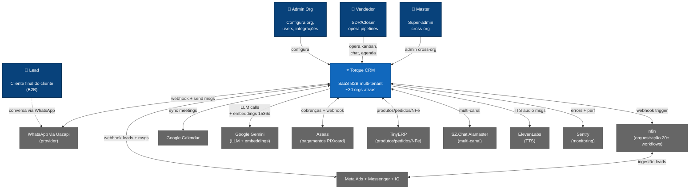

# Architecture — Level 1: System Context

C4 model nível 1. Torque CRM no mundo. Atores externos + sistemas adjacentes.

## Diagram

## Atores

| Ator | Papel |
|---|---|
| **Admin Org** | Configura organização: usuários, permissões, integrações |
| **Vendedor (SDR/Closer)** | Opera pipelines, chat, agenda |
| **Master** | Super-admin cross-org (Milennials staff) |
| **Lead** | Cliente final do cliente — interage via WhatsApp |

## Sistemas externos

| Sistema | Função | Tipo de relação |
|---|---|---|
| Uazapi | Provider WhatsApp multi-device | Bidirecional (webhook + send) |
| Meta | Ads + Messenger + Instagram | Bidirecional (lead ingestion + chat) |
| n8n | Orquestração de ingestão | Outbound webhook trigger |
| Google Calendar | Sync de meetings | Bidirecional OAuth |
| Google Gemini | LLM + embeddings | Outbound HTTP |
| Asaas | Pagamentos | Outbound + webhook inbound |
| TinyERP | ERP do cliente B2B | Bidirecional sync |
| SZ.Chat | Multi-canal (não-WhatsApp) | Bidirecional |
| ElevenLabs | TTS para audio msgs | Outbound |
| Sentry | Monitoring | Outbound (errors + perf) |

## Próximo nível

[02-containers.md](./02-containers.md) — zoom em containers do Torque.
