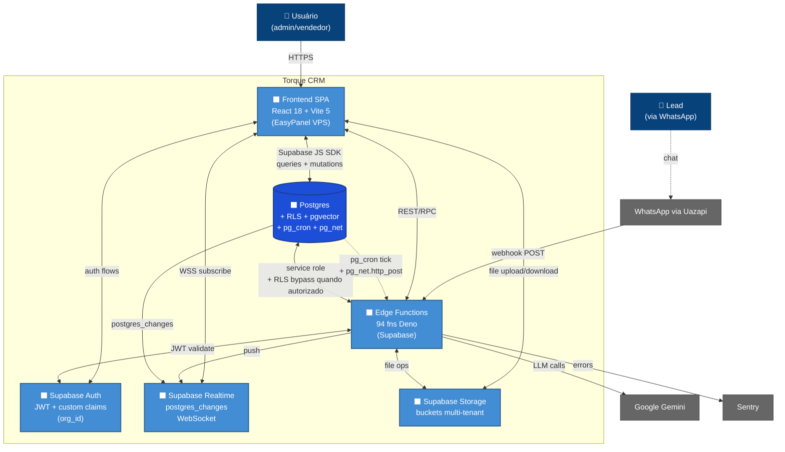

# Architecture — Level 2: Containers

C4 model nível 2. Containers do Torque CRM (front, back, DB, cron, realtime).

## Diagram

## Containers

### Frontend SPA
- **Tecnologia**: React 18 + TypeScript 5.8 + Vite 5 (SWC)
- **UI**: shadcn/ui (Radix) + Tailwind 3 + Lucide
- **State**: TanStack Query v5 + React Context
- **Forms**: React Hook Form + Zod
- **Deploy**: Docker + EasyPanel (VPS Hostinger)
- **Responsabilidade**: UI, validação client-side, cache de queries, WS subscribe

### Edge Functions
- **Tecnologia**: Deno + TypeScript
- **Quantidade**: 94 funções
- **Padrão**: `Deno.serve(withSentry('nome', handler))` + CORS + OPTIONS early return
- **Auth**: maioria `verify_jwt=false`, valida via headers custom
- **Responsabilidade**: lógica de negócio que requer service role / validação custom / integrações externas

### Postgres
- **Tecnologia**: Supabase Postgres + extensions (RLS, pgvector, pg_cron, pg_net)
- **Tables**: ~50 principais
- **Migrations**: 322+
- **RLS**: enforced em toda tabela com `organization_id`
- **Responsabilidade**: source of truth, multi-tenant isolation, cron scheduling

### Supabase Auth
- **JWT**: com custom claims (`organization_id`)
- **Função SQL**: `auth.org_id()` extrai claim
- **Responsabilidade**: signup, login, password reset, JWT management

### Supabase Realtime
- **Mecanismo**: postgres_changes via WS
- **Respeita RLS**: sim
- **Debounce**: 2s no cliente (`useRealtimeSubscription`)

### Supabase Storage
- **Buckets**: multi-tenant via path `org_id/...`
- **RLS**: enforced no bucket policy

## Flows críticos

Ver [03-data-flow.md](./03-data-flow.md).
