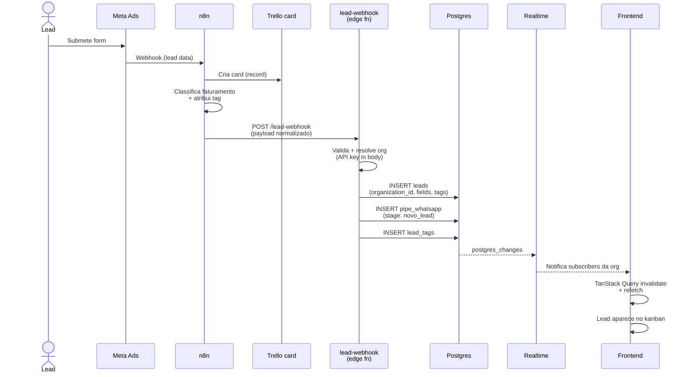
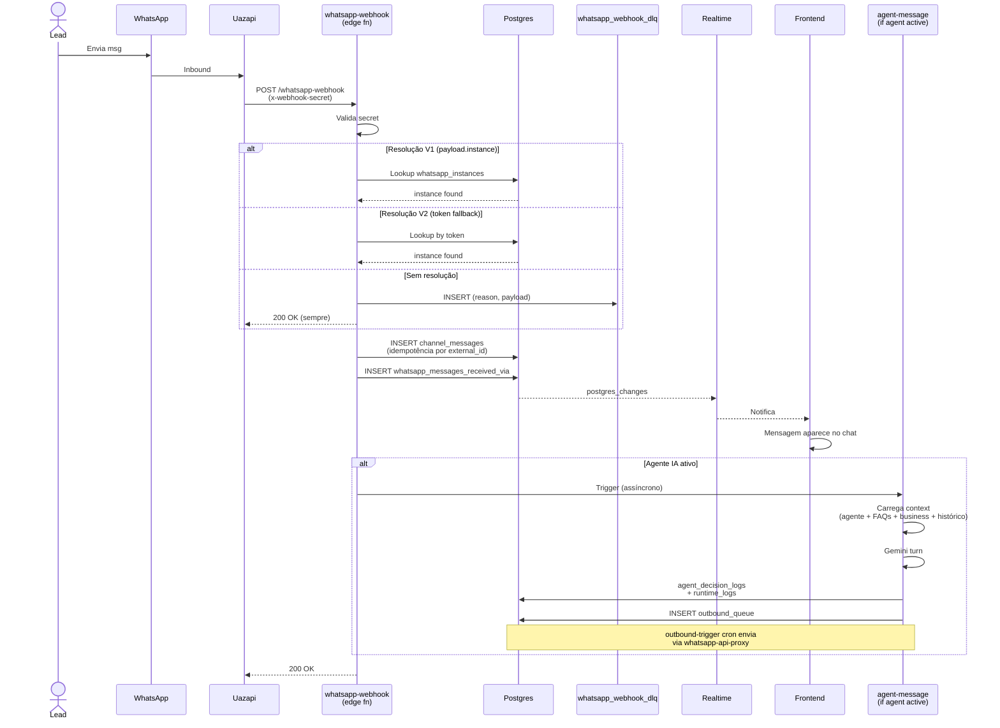
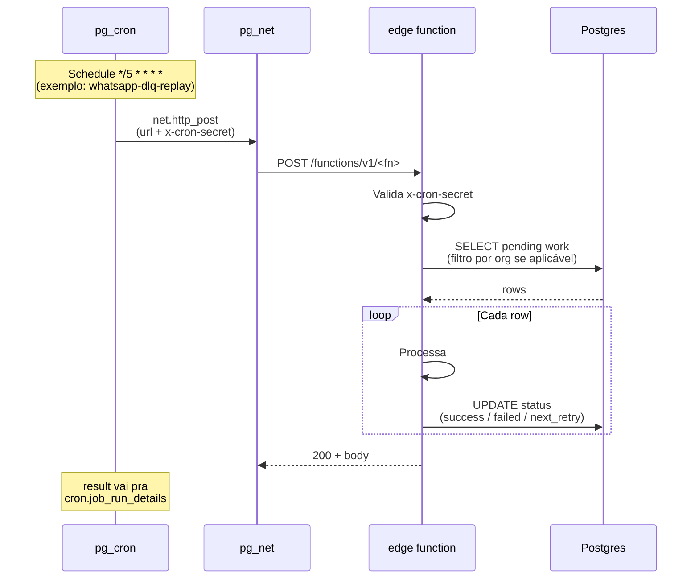
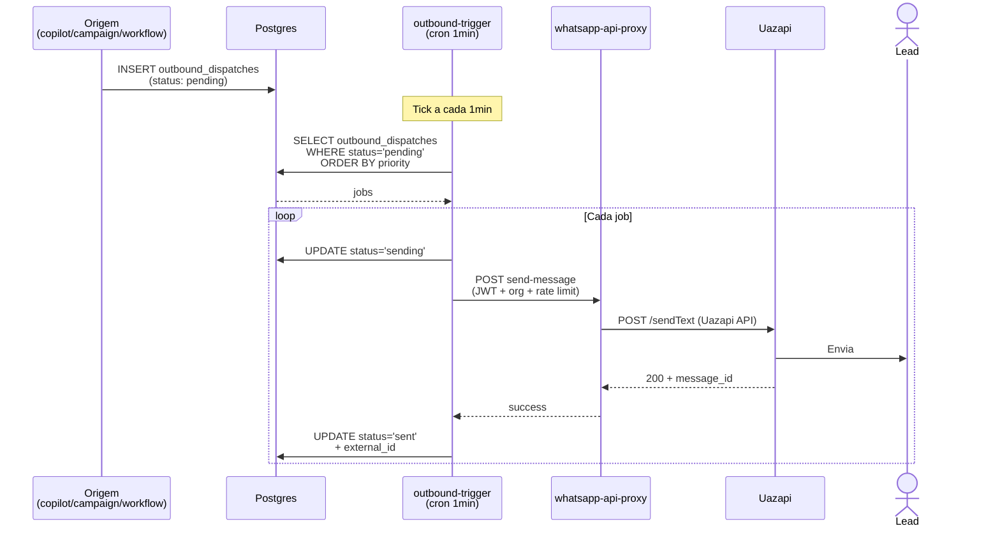

# Architecture — Level 3: Data Flows

Fluxos críticos end-to-end. Sequence diagrams para os 3 mais importantes.

## Flow 1: Lead ingestion (Meta Ads → Torque)

Meta Ads campaign captura lead → n8n processa + classifica → POST `lead-webhook`
→ Torque cria lead + coloca em pipe.



Payload `lead-webhook`:
```json
{
  "source": "meta_ads",
  "organization_id": "uuid",
  "fields": {
    "name": "...",
    "phone": "...",
    "email": "...",
    "company": "..."
  },
  "tags": ["Ouro"],
  "place_in_pipe": {
    "pipe": "whatsapp",
    "stage": "novo_lead"
  },
  "assigned_user_id": "uuid",
  "update_existing_if_match": true
}
```

## Flow 2: WhatsApp inbound (Lead → DB → UI)

Lead manda msg WhatsApp → Uazapi → webhook → resolução defensiva → DB → realtime → UI.



Patch defensivo: ver
[`Obsidian/.../supabase/functions/whatsapp-webhook/CLAUDE.md`](../../supabase/functions/whatsapp-webhook/CLAUDE.md).

## Flow 3: Cron tick → Edge function

`pg_cron` dispara → `pg_net.http_post` → edge fn → faz trabalho → atualiza estado.



Auth: header `x-cron-secret` validado contra env var na edge fn.

Cron jobs ativos: ver [`Obsidian/.../03 — Reference/Cron Jobs.md`](../../Obsidian/Segundo%20Cerebro/Claude%20Code%20—%20Torque%20CRM/03%20—%20Reference/Cron%20Jobs.md).

## Flow 4: Outbound msg (Torque → Lead via WhatsApp)

Edge fn enqueue → outbound-trigger cron → whatsapp-api-proxy → Uazapi → Lead.



## Gotchas comuns

- **Realtime onUpdate** retorna só campos alterados — dados aninhados vêm do cache do TanStack Query
- **postgres_changes respeita RLS** — frontend sem auth correto não recebe nada
- **pg_net é assíncrono** — `cron.job_run_details` mostra resultado depois
- **outbound rate limit** por org/instância — proxy enforça
- **Idempotência inbound** via `external_message_id` UNIQUE
